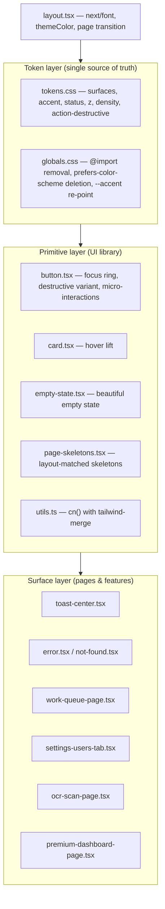
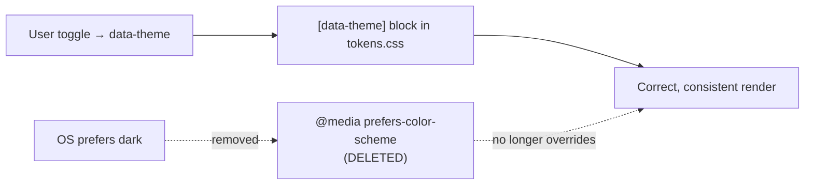
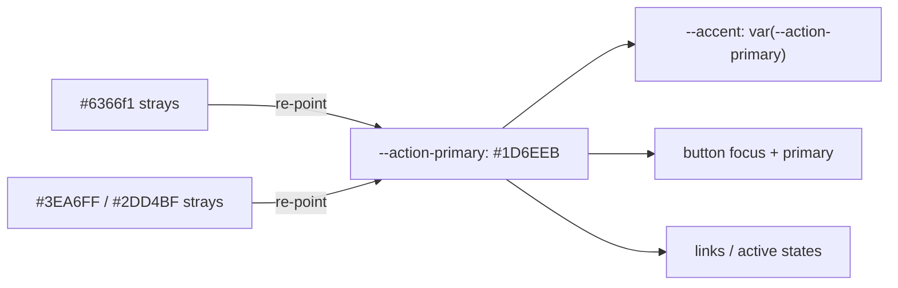

# Technical Design Document

## Feature: Frontend Critical Fixes & Beauty Sprint 4

## Overview

Sprint 4 is a **direct remediation sprint**. Unlike Sprint 3 (audit-driven reconnaissance), Sprint 4
works from a completed manual audit: the broken areas are already identified, and this sprint applies
the fixes in four ordered phases. The goal is to take the DPR.ai web frontend
(`web/` — Next.js 16 + React 19 + Tailwind v4) from a state with critical theming bugs, hardcoded
colors, and inconsistent aesthetics to a beautiful, modern, internally-consistent SaaS surface that
renders correctly in both light and dark mode.

The work is organized so that **correctness comes before consistency, and consistency comes before
polish**:

1. **Phase 1 — Critical bug fixes**: theming conflicts and hardcoded colors that produce visibly
   broken UI (half-dark light mode, white-on-white text, wrong focus colors, a destructive button
   that looks like a primary button).
2. **Phase 2 — Design system consistency**: converge on a single accent, fix the light-mode surface
   hierarchy, reskin two "cyberpunk-aesthetic" pages, delete dead code, and make `cn()` merge-safe.
3. **Phase 3 — Beauty & modern aesthetics**: `next/font` typography, micro-interactions, beautiful
   empty/loading states, page-transition polish, and a unified `lucide-react` icon system.
4. **Phase 4 — Final polish & quality**: replace `window.confirm`, fix z-index/image/`any`-type
   issues, run a final sweep (`text-white`, raw hex, `font-mono`, `uppercase`), and verify with
   `tsc --noEmit` and `npm run build`.

Each phase ends with a TypeScript compile gate (`npx tsc --noEmit`, zero errors) before the next
phase begins. Phases 1, 2, and 4 additionally end with a `npm run build` gate where applicable.

### Relationship to existing specs

- **Sprint 2** (completed): delivered Inter typography intent, density tokens, dark-mode surface
  tokens, status tokens, AI-panel styling, and accessibility passes.
- **Sprint 3** (`frontend-modernization-sprint-3`, not yet executed): an audit-engine + remediation
  spec whose remediation scope overlaps this sprint (accent convergence, typography, dark-mode
  contrast, fragmentation cleanup). Sprint 4 is the **pragmatic, hand-authored remediation** of the
  highest-impact issues. Where the two specs conflict, this document records the decision explicitly
  (see "Accent Decision" below).

### Accent Decision (conflict resolution, recorded intentionally)

Sprint 3 governance (`.mcp/governance/design-system/color-philosophy.md`) names indigo `#6366f1` as
the single accent. The Sprint 4 plan instead designates `--action-primary` (`#1D6EEB`, blue) as the
single source of truth, because `--action-primary` is already the most widely wired token across the
actual component tree (buttons, links, focus, active states all resolve through it in both light and
dark `tokens.css`). Re-pointing the few `#6366f1`/`#3EA6FF` strays at `--action-primary` is a smaller,
lower-risk change than re-pointing every `--action-*` token at indigo.

**Decision: `--action-primary` (`#1D6EEB`) is the single accent for Sprint 4.** `--accent` is
re-pointed to `var(--action-primary)`. This is a deliberate, documented divergence from Sprint 3
governance; if Sprint 3 is later executed, it must reconcile against this decision rather than silently
reverting it.

### Grounding observations (verified against the codebase)

These were confirmed by reading the actual files, and they anchor the design:

- `web/src/app/globals.css` lines ~158–183 contain a live `@media (prefers-color-scheme: dark) { :root { … } }`
  block that overrides `--surface-*` and `--text-*` for dark-OS users. Because the app toggles theme via
  `[data-theme]` on `<html>`, a dark-OS user who selects light mode gets a broken half-dark UI. There is a
  parallel `@media (prefers-color-scheme: dark)` block in `web/src/styles/professional-enhancements.css`
  (shadow overrides).
- `web/src/components/ui/button.tsx`: the `base` const hardcodes `focus-visible:ring-[#6366f1]`, and the
  `destructive` variant maps to primary styles (and `resolveVariant` collapses `destructive → primary`).
- `tokens.css` **already defines** `--action-destructive: hsl(var(--_prim-red-500))` and
  `--action-destructive-hover: hsl(var(--_prim-red-700))` in `:root` (light) — so Phase 1.5 references
  existing tokens; it does NOT need to add `hsl(0 72% 51%)`.
- `tokens.css` light-mode surfaces are **non-monotonic**: `--surface-app: hsl(210 17% 96%)`,
  `--surface-shell: hsl(210 13% 93%)` (darker than app), `--surface-panel: 97%`, `--surface-card: 98%`,
  `--surface-elevated: 99%`. This confirms the Phase 2.2 surface-ramp fix.
- All `--status-*`, `--z-toast: 70`, `--border-focus`, and `--action-destructive*` tokens exist, so the
  toast and button fixes reference existing tokens cleanly.
- `web/src/lib/utils.ts` `cn()` is a plain `filter(Boolean).join(" ")` with no `tailwind-merge`.
- `globals.css` line ~11 has a render-blocking `@import url("https://fonts.googleapis.com/...Inter...")`.

## Architecture

### Layered remediation model

Sprint 4 touches three layers. Changes are kept in the lowest layer that achieves the goal so that one
edit propagates everywhere:



### Theming model correction (Phase 1.1)

The app's theming contract is: **`<html data-theme="light|dark">` is the single source of truth.** The
`@media (prefers-color-scheme: dark)` blocks violate this contract by reacting to the OS preference
independently of the explicit toggle. The fix is deletion, not modification — the `[data-theme="dark"]`
block in `tokens.css` already supplies all dark-mode values, so removing the media-query overrides
restores correct behavior for dark-OS users who select light mode.



### Accent unification model (Phase 2.1)



### Verification gates

| Gate | Command | When |
|------|---------|------|
| Type gate | `cd web && npx tsc --noEmit` | End of every phase |
| Build gate | `cd web && npm run build` | End of Phase 4 (and after dependency installs) |
| Manual dual-theme check | dev server, toggle light/dark on `/`, `/work-queue`, `/settings`, dashboard | Phase 4.6 |

## Components and Interfaces

### Phase 1 — Critical bug fixes

**1.1 `globals.css` + `professional-enhancements.css` — delete `prefers-color-scheme` blocks**
- Delete the `@media (prefers-color-scheme: dark) { :root { … } }` block (lines ~158–183) in `globals.css`.
- Delete the parallel `@media (prefers-color-scheme: dark)` shadow block in `professional-enhancements.css`
  (note: `professional-enhancements.css` is itself slated for deletion in Phase 2.5; if 2.5 runs first this
  is moot, but the block must not survive).
- No replacement needed — `[data-theme="dark"]` in `tokens.css` is authoritative.

**1.2 `toast-center.tsx` — tokenize tones + z-index + text**
- `toneClasses()`: map success → `border-status-success-border bg-status-success-bg text-status-success-fg`,
  error → `…-danger-…`, default → `…-info-…`.
- Replace residual `text-white` / `text-white/80` with `text-text-secondary`.
- Replace `z-[70]` with `z-[var(--z-toast)]`.

**1.3 `error.tsx`, `not-found.tsx`, `page-skeletons.tsx` — tokenize dark-only hardcodes**
- `bg-[rgba(20,24,36,…)]` → `bg-surface-card`; `text-white` → `text-text-primary`;
  `text-slate-300` → `text-text-secondary`; `text-slate-400` → `text-text-tertiary`;
  `border-white/10` → `border-border-subtle`.
- `page-skeletons.tsx`: skeleton blocks use `bg-surface-card animate-pulse`; replace `rounded-[2rem]`
  with `rounded-xl` (card radius).

**1.4 `button.tsx` — tokenize focus ring**
- `focus-visible:ring-[#6366f1]` → `focus-visible:ring-[color:var(--border-focus)]`.

**1.5 `button.tsx` — fix destructive variant**
- `destructive` variant → `border-transparent bg-[var(--action-destructive)] text-[var(--action-primary-text)] hover:bg-[var(--action-destructive-hover)] active:bg-[var(--action-destructive-hover)]`.
- `--action-destructive` / `--action-destructive-hover` already exist in `tokens.css` — do NOT add new
  `hsl(0 72% …)` values (would introduce a second red). Update `resolveVariant` so `destructive` no longer
  collapses to `primary` for the `data-variant` attribute.

### Phase 2 — Design system consistency

**2.1 `globals.css` — single accent**
- `--accent: #6366f1` → `--accent: var(--action-primary)` with comment
  `/* SINGLE ACCENT — never use #6366f1 or #3EA6FF directly */`.
- Re-point `--accent-strong`/`--accent-soft`/`--accent-quiet` derivations as needed so they no longer
  embed raw `#6366f1`.

**2.1 `premium-dashboard-page.tsx` — remove gradient/teal strays**
- `bg-[linear-gradient(90deg,#3EA6FF,#2DD4BF)]` → `bg-[var(--action-primary)]`; replace remaining
  `#3EA6FF` / `#2DD4BF` with the appropriate token.

**2.2 `tokens.css` — monotonic light surface ramp**
- Replace the five light-mode surface values with a clean light-to-light ramp so cards are the lightest
  surface (cards pop off the background):
  `--surface-app: hsl(210 16% 94%)`, `--surface-shell: hsl(210 16% 96%)`,
  `--surface-panel: hsl(210 17% 98%)`, `--surface-card: hsl(0 0% 100%)`,
  `--surface-elevated: hsl(0 0% 100%)`.
- Architecture-critical file: this is an approved, intentional value change for this sprint.

**2.3 `work-queue-page.tsx` — de-cyberpunk reskin**
- `text-cyan-*` → `text-text-primary`/`text-text-secondary`; `bg-[#151b24]`/`bg-[#0a0e14]`/`bg-[#0d1117]`
  → `bg-surface-card`; `bg-[rgba(8,12,20,0.45)]` → `bg-surface-panel`;
  `border-cyan-900/30`/`border-cyan-800/40` → `border-border-subtle`; decorative `font-mono` removed;
  `UPPER_SNAKE` labels → sentence case; `tracking-[0.3em]` → `tracking-wide`; `text-gray-400` →
  `text-text-secondary`; `text-slate-300/400` → `text-text-secondary`/`text-text-tertiary`.
- Preserve both worker and coordinator views.

**2.4 `settings-users-tab.tsx` — same de-cyberpunk reskin** (apply 2.3 rules; cyan→`--action-primary`
for interactive elements only).

**2.5 Delete dead files** (grep-confirm zero imports first):
`ui/professional-button.tsx`, `ui/professional-card.tsx`, `styles/professional-enhancements.css`.

**2.6 `utils.ts` — `cn()` with tailwind-merge**
- `cn(...inputs: ClassValue[]) => twMerge(clsx(inputs))`; install `tailwind-merge` + `clsx` in `web/`.

### Phase 3 — Beauty & modern aesthetics

**3.1 `layout.tsx` + `globals.css` + `tokens.css` — next/font + themeColor**
- `layout.tsx`: `Inter({ subsets:['latin'], display:'swap', variable:'--font-inter', weight:['400','500','600'] })`;
  apply `inter.variable` to `<html>`.
- `globals.css`: remove the Google Fonts `@import`.
- `tokens.css`: `--font-sans: var(--font-inter), system-ui, -apple-system, sans-serif`.
- `layout.tsx` viewport `themeColor`: responsive array (dark `#09111B`, light `#f0f2f5`).

**3.2 `button.tsx` / `card.tsx` — micro-interactions**
- Button base: `transition-all duration-150 ease-out active:scale-[0.97]` (verify/add; keep existing
  `focus-visible` ring).
- Interactive cards (`group`): `hover:border-border-secondary hover:shadow-sm transition-all duration-150`.

**3.3 `empty-state.tsx` — beautiful empty state** (centered, 48px tertiary icon, 16px/500 title,
14px secondary description max-w-320, optional primary CTA, no container border).

**3.4 `page-skeletons.tsx` — layout-matched skeletons** (card radius, `bg-surface-card animate-pulse`,
header bar + 2–3 body bars, table skeletons match column count, no dimensional mismatch).

**3.5 `layout.tsx` (or providers) — page transition** (`animate-in fade-in duration-200`; install
`tailwindcss-animate` if `animate-in` unavailable).

**3.6 Icon system — standardize on `lucide-react`** (sidebar nav `size={18} strokeWidth={1.5}`, header
`size={16}`; `text-text-secondary` default, `text-action-primary` active; replace hand-authored SVGs).

### Phase 4 — Final polish & quality

**4.1 `ocr-scan-page.tsx` — `window.confirm` → `ConfirmationModal`** (state-driven `confirmOpen` +
`pendingAction`, destructive variant, "Replace existing scan?").

**4.2 `toast-center.tsx` — z-index token** (already covered by 1.2; verify `z-[var(--z-toast)]`).

**4.3 Images — dimensions / aspect-ratio** (blob previews wrapped in `aspect-[4/3]` containers; static
images → `next/image` with explicit width/height) in `ocr-scan-page.tsx`, `profile-page.tsx`, others.

**4.4 TypeScript `any` removal** (`lib/steel.ts` ~623 `items: any[]`; `ocr-scan-page.tsx` ~1289–1300
`result as any`).

**4.5 Final sweep** (grep `text-white`, raw `#hex`, decorative `font-mono`, decorative `uppercase`; then
`tsc --noEmit` and `npm run build`).

**4.6 Verify** (dev server; toggle light/dark on `/`, `/work-queue`, `/settings`, dashboard; confirm no
white-on-white, no cyan/mono, no broken layout; report changed files).

## Data Models

This sprint is visual/structural; the only typed-interface change is removing `any`:

```typescript
// lib/steel.ts ~623 — type the API response items array with its real shape
interface SteelLineItem { /* fields derived from the actual API response */ }
// items: SteelLineItem[]  (was: any[])

// ocr-scan-page.tsx ~1289–1300 — replace (result as any) with the OCR result interface
interface OcrScanResult { /* fields the code reads off `result` */ }

// ConfirmationModal usage state
const [confirmOpen, setConfirmOpen] = useState(false);
const [pendingAction, setPendingAction] = useState<(() => void) | null>(null);
```

## Error Handling

- **Theming**: deleting the media-query blocks cannot break dark mode because `[data-theme="dark"]` is
  the authoritative source; the risk is purely additive (correct light mode for dark-OS users).
- **`cn()` change**: `tailwind-merge` could in rare cases merge classes a developer expected to coexist
  (e.g. two unrelated utilities sharing a property). Mitigation: the type gate plus the manual dual-theme
  pass; spot-check button/card variants after the change.
- **Dead-file deletion**: each deletion is preceded by a zero-import grep; if any import exists, the file
  is migrated to the canonical primitive first, not blindly deleted.
- **`next/font` migration**: removing the `@import` before wiring `next/font` would briefly fall back to
  system fonts; both edits land together and are validated by the build gate.
- **`next/image` conversion**: blob/object-URL previews stay as `` inside aspect-ratio containers
  (next/image does not handle object URLs well); only static assets convert to `next/image`.

## Correctness Properties

*A property is a characteristic or behavior that should hold true across all valid executions of a
system — a formal statement about what the system should do.*

**Scope of property-based testing for Sprint 4: no randomized PBT.** This sprint contains no pure,
deterministic functional core to exercise with generated inputs. Every change is one of: a CSS/token
value edit, a className substitution, a JSX/structural edit, a dependency install, or a type
annotation. The properties below are therefore stated as **invariants verified by deterministic
compile/build gates, exact static greps, and a manual dual-theme pass** (see Testing Strategy) rather
than by `fast-check` generators. The one logic-adjacent change — `cn()` adopting `tailwind-merge` —
delegates behavior to a well-tested upstream library; we assert its integration compiles and that
button/card variants still render rather than re-testing `twMerge`.

### Property 1: Theme determinism

Rendered colors depend only on the `[data-theme]` attribute on `<html>`, never on the OS
`prefers-color-scheme` media feature.

**Validates: Requirements 1.1** — verified by grepping that no `@media (prefers-color-scheme: dark)`
block remains under `web/src`, plus the manual dual-theme pass with a dark-OS machine in light mode.

### Property 2: Single accent

Every accent surface (primary action, link, focus ring, active state) resolves to `--action-primary`;
no `#6366f1`, `#3EA6FF`, or `#2DD4BF` literal remains outside `tokens.css`.

**Validates: Requirements 2.1, 2.4** — verified by the Phase 4.5 hex sweep.

### Property 3: Monotonic surfaces

In light mode the surface lightness ordering is `app ≤ shell ≤ panel ≤ card`, with `card` the lightest
so cards visibly separate from the background.

**Validates: Requirements 2.2** — verified by reading the final `tokens.css` values and the manual pass.

### Property 4: Dual-theme parity

Every reskinned screen renders correctly in both light and dark themes (no white-on-white, no
unreadable contrast, no leftover cyberpunk decoration).

**Validates: Requirements 2.3, 5.1** — verified by the manual dual-theme pass.

### Property 5: Type soundness

`npx tsc --noEmit` reports zero errors at each phase boundary, and `npm run build` succeeds at the end
of Phase 4.

**Validates: Requirements 7.1, 7.2** — verified by the per-phase type gate and the final build gate.

## Testing Strategy

This is a controlled visual remediation; correctness is enforced by compile/build gates, targeted greps,
and a manual dual-theme pass rather than property-based tests.

- **Type gate (per phase)**: `cd web && npx tsc --noEmit` → zero errors before advancing.
- **Build gate (Phase 4, and after each dependency install)**: `cd web && npm run build` → success.
- **Static sweeps (Phase 4.5)**: grep for `text-white`, six-digit hex outside `tokens/globals/test`,
  decorative `font-mono`, decorative `uppercase`; each hit is evaluated and fixed.
- **Import-safety greps (Phase 2.5)**: confirm zero imports before deleting `professional-*` files.
- **Manual dual-theme verification (Phase 4.6)**: dev server; `/`, `/work-queue`, `/settings`, dashboard;
  toggle light/dark; confirm no white-on-white, no cyberpunk decorations, no layout breakage, and that the
  destructive button is visually distinct from primary.
- **Regression guard**: existing Vitest/Storybook suites in `web/` are run if present; no new product
  behavior is introduced, so no new unit suites are required beyond the `any`-type changes compiling.

## Constraints & Governance

- Token-first: every color references a `--surface-*`/`--text-*`/`--border-*`/`--status-*`/`--action-*`
  token; no new hardcoded hex outside `tokens.css`.
- One accent: `--action-primary` (`#1D6EEB`) — never introduce a second accent (documented divergence
  from Sprint 3 indigo).
- Typography: sentence case for UI labels; no `font-mono` except real code/data/keyboard shortcuts.
- Spacing: 4px grid (Tailwind scale).
- Components: reuse existing primitives (Button, Card, Badge, Field, EmptyState, ConfirmationModal).
- Dark mode parity and visible token-based focus rings on every interactive element.
- Architecture-critical files (`tokens.css`, `globals.css` structure, `app-shell.tsx`): Sprint 4
  intentionally edits `tokens.css` and `globals.css` per this approved design; `app-shell.tsx` scroll
  ownership is NOT touched.
