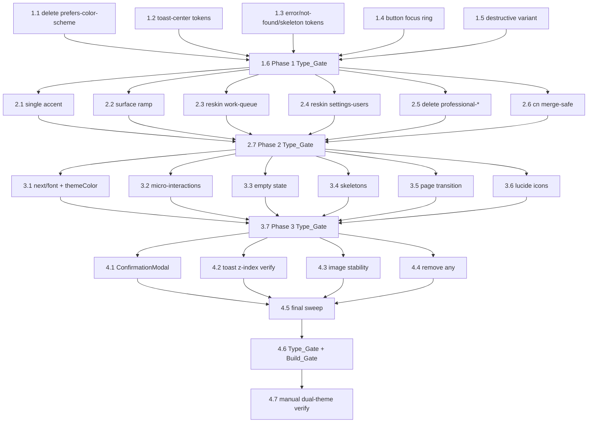

# Implementation Plan: Frontend Critical Fixes & Beauty Sprint 4

## Overview

This plan implements Sprint 4 as four ordered phases of direct, hand-authored remediation against the
DPR.ai web frontend (`web/` — Next.js 16 + React 19 + Tailwind v4). The work is grounded in a completed
manual audit and the verified codebase observations in `design.md`.

**Execution discipline:**
- Phases run strictly in order (1 → 2 → 3 → 4).
- Each phase ends with a **Type_Gate** (`cd web && npx tsc --noEmit`, zero errors) before the next phase.
- Phase 4 ends with a **Build_Gate** (`cd web && npm run build`). Dependency-install tasks also re-run
  the Build_Gate.
- This is controlled remediation, NOT a redesign. `app-shell.tsx` scroll ownership, routing,
  virtualization, and backend/API contracts MUST be preserved (Req 12).

**Accent decision:** single accent is `--action-primary` (`#1D6EEB`); `--accent` re-points to it.
Documented divergence from Sprint 3 indigo (see `design.md`).

**Verification approach:** compile/build gates, exact static greps, and a manual dual-theme pass. No
property-based tests (see `design.md` Correctness Properties — invariants are gate/grep/manual-verified).

---

## Tasks

- [x] 1. Phase 1 — Critical bug fixes
  - [x] 1.1 Delete the `prefers-color-scheme` dark blocks
    - In `web/src/app/globals.css`, delete the `@media (prefers-color-scheme: dark) { :root { … } }`
      block (≈lines 158–183) that overrides `--surface-*`, `--text-*`, `--border-*`, and shadow tokens
    - In `web/src/styles/professional-enhancements.css`, delete the parallel
      `@media (prefers-color-scheme: dark)` shadow-override block
    - Confirm `[data-theme="dark"]` in `tokens.css` still supplies all dark values (no replacement needed)
    - _Requirements: 1.1, 1.2, 1.3, 1.4_

  - [x] 1.2 Tokenize `toast-center.tsx` tones, text, and z-index
    - Replace `toneClasses()` success/error/default branches with `--status-success-*` /
      `--status-danger-*` / `--status-info-*` token classes
    - Replace residual `text-white` / `text-white/80` with `text-text-secondary`
    - Replace `z-[70]` with `z-[var(--z-toast)]`
    - _Requirements: 2.2, 10.2_

  - [x] 1.3 Tokenize `error.tsx`, `not-found.tsx`, `page-skeletons.tsx` dark-only hardcodes
    - Replace `bg-[rgba(20,24,36,…)]` → `bg-surface-card`, `text-white` → `text-text-primary`,
      `text-slate-300` → `text-text-secondary`, `text-slate-400` → `text-text-tertiary`,
      `border-white/10` → `border-border-subtle`
    - In `page-skeletons.tsx`, use `bg-surface-card animate-pulse` for skeleton blocks and replace
      `rounded-[2rem]` with `rounded-xl`
    - _Requirements: 2.3_

  - [x] 1.4 Tokenize the button focus ring
    - In `web/src/components/ui/button.tsx`, replace `focus-visible:ring-[#6366f1]` with
      `focus-visible:ring-[color:var(--border-focus)]`
    - _Requirements: 3.1, 3.4_

  - [x] 1.5 Fix the destructive button variant
    - Map `destructive` to
      `border-transparent bg-[var(--action-destructive)] text-[var(--action-primary-text)] hover:bg-[var(--action-destructive-hover)] active:bg-[var(--action-destructive-hover)]`
      using the existing `--action-destructive*` tokens (do NOT add new red literals)
    - Update `resolveVariant` so `destructive` no longer collapses to `primary` for `data-variant`
    - _Requirements: 3.2, 3.3_

  - [x] 1.6 Phase 1 Type_Gate
    - Run `cd web && npx tsc --noEmit`; fix any errors before Phase 2
    - _Requirements: 11.5_

- [x] 2. Phase 2 — Design system consistency
  - [x] 2.1 Unify on the single accent
    - In `web/src/app/globals.css`, set `--accent: var(--action-primary)` with the comment
      `/* SINGLE ACCENT — never use #6366f1 or #3EA6FF directly */`; re-point `--accent-strong`/
      `--accent-soft`/`--accent-quiet` derivations off raw `#6366f1`
    - In `web/src/components/premium-dashboard-page.tsx`, replace
      `bg-[linear-gradient(90deg,#3EA6FF,#2DD4BF)]` with `bg-[var(--action-primary)]` and any remaining
      `#3EA6FF`/`#2DD4BF` with the appropriate token
    - _Requirements: 2.4, 2.5, 2.6_

  - [x] 2.2 Fix the light-mode surface ramp
    - In `web/src/styles/tokens.css`, set the light-mode surfaces to a monotonic ramp:
      `--surface-app: hsl(210 16% 94%)`, `--surface-shell: hsl(210 16% 96%)`,
      `--surface-panel: hsl(210 17% 98%)`, `--surface-card: hsl(0 0% 100%)`,
      `--surface-elevated: hsl(0 0% 100%)`
    - _Requirements: 4.1_

  - [x] 2.3 Reskin `work-queue-page.tsx` (de-cyberpunk)
    - Apply the substitution rules: cyan text → `--text-*`; near-black hardcoded bg → `--surface-card` /
      `--surface-panel`; cyan borders → `--border-subtle`; remove decorative `font-mono`; UPPER_SNAKE →
      sentence case; `tracking-[0.3em]` → `tracking-wide`; `text-gray-400` → `text-text-secondary`;
      `text-slate-300/400` → `text-text-secondary`/`text-text-tertiary`
    - Verify worker view and coordinator view both still render correctly
    - _Requirements: 4.2, 4.3, 4.5, 5.2_

  - [x] 2.4 Reskin `settings-users-tab.tsx` (de-cyberpunk)
    - Apply the same substitution rules; UPPER_SNAKE → sentence case; cyan → `--action-primary` for
      interactive elements only
    - _Requirements: 4.2, 4.3, 4.4, 5.2_

  - [x] 2.5 Delete dead `professional-*` files
    - Grep-confirm zero imports, then delete `ui/professional-button.tsx`, `ui/professional-card.tsx`,
      and `styles/professional-enhancements.css`
    - _Requirements: 6.1_

  - [x] 2.6 Make `cn()` merge-safe
    - Install `tailwind-merge` and `clsx` in `web/`; implement
      `cn(...inputs: ClassValue[]) => twMerge(clsx(inputs))` in `web/src/lib/utils.ts`
    - _Requirements: 6.2, 6.3_

  - [x] 2.7 Phase 2 Type_Gate
    - Run `cd web && npx tsc --noEmit`; fix any errors before Phase 3
    - _Requirements: 11.5_

- [x] 3. Phase 3 — Beauty & modern aesthetics
  - [x] 3.1 Migrate typography to `next/font` and fix theme color
    - In `layout.tsx`, add `Inter({ subsets:['latin'], display:'swap', variable:'--font-inter', weight:['400','500','600'] })`
      and apply `inter.variable` to `<html>`
    - In `globals.css`, remove the Google Fonts `@import` line
    - In `tokens.css`, set `--font-sans: var(--font-inter), system-ui, -apple-system, sans-serif`
    - In `layout.tsx`, set viewport `themeColor` to the responsive dark `#09111B` / light `#f0f2f5` array
    - _Requirements: 7.1, 7.2, 7.3, 7.4_

  - [x] 3.2 Add button/card micro-interactions
    - Button base: ensure `transition-all duration-150 ease-out` and `active:scale-[0.97]` (preserve focus ring)
    - Interactive (`group`) cards: add `hover:border-border-secondary hover:shadow-sm transition-all duration-150`
    - _Requirements: 8.1, 8.2_

  - [x] 3.3 Beautify the empty state
    - In `web/src/components/ui/empty-state.tsx`, apply the centered pattern: 48px tertiary icon,
      16px/500 `--text-primary` title, 14px `--text-secondary` description (max-w 320px, centered),
      optional primary CTA, no container border
    - _Requirements: 8.3_

  - [x] 3.4 Match loading skeletons to real layout
    - In `page-skeletons.tsx`, use card radius + `bg-surface-card animate-pulse`; card skeletons show a
      header bar + 2–3 body bars; table skeletons match the real column count; no dimensional mismatch
    - _Requirements: 8.4_

  - [x] 3.5 Add page-transition polish
    - Wrap routed page content in `animate-in fade-in duration-200`; install `tailwindcss-animate` and
      wire it into the Tailwind config if `animate-in` is unavailable
    - _Requirements: 8.5_

  - [x] 3.6 Unify the icon system on `lucide-react`
    - Replace hand-authored sidebar/header/nav SVGs with `lucide-react` icons at the standard sizes
      (sidebar `size={18} strokeWidth={1.5}`, header `size={16} strokeWidth={1.5}`); default
      `text-text-secondary`, active `text-action-primary`
    - _Requirements: 9.1, 9.2, 9.3_

  - [x] 3.7 Phase 3 Type_Gate
    - Run `cd web && npx tsc --noEmit`; fix any errors before Phase 4
    - _Requirements: 11.5_

- [x] 4. Phase 4 — Final polish & quality
  - [x] 4.1 Replace `window.confirm` with `ConfirmationModal`
    - In `ocr-scan-page.tsx` (~line 1293), introduce `confirmOpen`/`pendingAction` state and render
      `ConfirmationModal` with the `destructive` variant, "Replace existing scan?" title, and the
      overwrite description
    - _Requirements: 10.1_

  - [x] 4.2 Verify the toast z-index token
    - Confirm `toast-center.tsx` uses `z-[var(--z-toast)]` (covered by 1.2; verify no `z-[70]` remains)
    - _Requirements: 10.2_

  - [x] 4.3 Stabilize images
    - Wrap blob/object-URL previews in `ocr-scan-page.tsx`, `profile-page.tsx`, and any other raw-``
      files in `relative aspect-[4/3] w-full overflow-hidden rounded-lg bg-surface-panel` with the image
      `absolute inset-0 h-full w-full object-contain`
    - Convert static images to `next/image` with explicit `width`/`height`
    - _Requirements: 10.3, 10.4_

  - [x] 4.4 Remove `any` types
    - Type `items` in `lib/steel.ts` (~623) with the real API response shape; replace `(result as any)`
      in `ocr-scan-page.tsx` (~1289–1300) with the correct OCR result interface
    - _Requirements: 10.5_

  - [x] 4.5 Final static sweep
    - Sweep and fix: `text-white` (→ `--text-*`), six-digit hex outside tokens/globals/test (→ nearest
      token), decorative `font-mono` (remove), decorative `uppercase` (→ sentence case)
    - _Requirements: 11.1, 11.2, 11.3, 11.4_

  - [x] 4.6 Final Type_Gate and Build_Gate
    - Run `cd web && npx tsc --noEmit` (zero errors) then `cd web && npm run build` (success); fix every
      reported error
    - _Requirements: 11.5, 11.6_

  - [x] 4.7 Manual dual-theme verification
    - Start the dev server; on `/`, `/work-queue`, `/settings`, and the dashboard, toggle light/dark and
      confirm no white-on-white, no cyan/monospace decoration, no broken layout, and a visibly distinct
      destructive button; report every changed file and modification
    - _Requirements: 5.1, 5.2, 12.1, 12.2, 12.3, 12.4_

## Task Dependency Graph

```json
{
  "waves": [
    { "id": 0, "tasks": ["1.1", "1.2", "1.3", "1.4", "1.5"] },
    { "id": 1, "tasks": ["1.6"] },
    { "id": 2, "tasks": ["2.1", "2.2", "2.3", "2.4", "2.5", "2.6"] },
    { "id": 3, "tasks": ["2.7"] },
    { "id": 4, "tasks": ["3.1", "3.2", "3.3", "3.4", "3.5", "3.6"] },
    { "id": 5, "tasks": ["3.7"] },
    { "id": 6, "tasks": ["4.1", "4.2", "4.3", "4.4"] },
    { "id": 7, "tasks": ["4.5"] },
    { "id": 8, "tasks": ["4.6"] },
    { "id": 9, "tasks": ["4.7"] }
  ]
}
```

Phases are strictly sequential; each phase's Type_Gate gates the next phase. Within a phase, leaf
tasks are independent (different files) unless noted, and converge on the phase's Type_Gate.



## Notes

- **Optional tasks** are marked with `*` (only 4.7 manual dual-theme verification). All other tasks are
  required.
- **Architecture safety (Req 12):** `app-shell.tsx` is intentionally untouched; `tokens.css` and
  `globals.css` edits are the only architecture-critical changes and are pre-approved by the design.
- **Accent divergence:** `--action-primary` (`#1D6EEB`) is the single accent by deliberate decision,
  overriding Sprint 3 indigo governance. Do not silently revert.
- **Phase 1.5 caveat:** `--action-destructive` / `--action-destructive-hover` already exist in
  `tokens.css`; reuse them — do NOT add `hsl(0 72% 51%)` (would create a second red).
- **Dependency installs** (`tailwind-merge`, `clsx` in 2.6; `tailwindcss-animate` in 3.5 if needed)
  re-run the Build_Gate to confirm the install is healthy.
- **next/font ordering (3.1):** the `@import` removal and `next/font` wiring land together so the UI
  never falls back to system fonts in a committed state.
