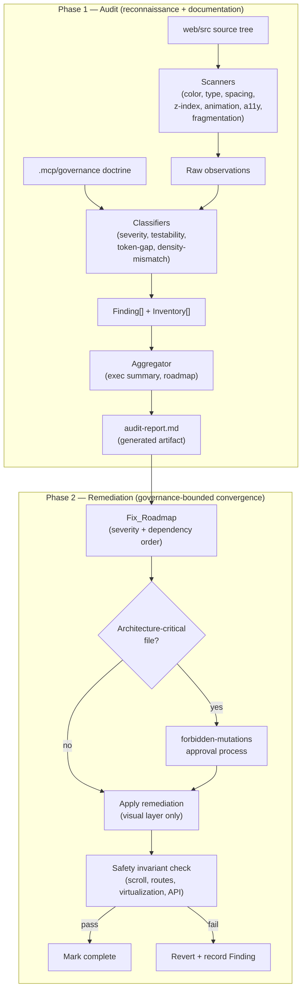

# Technical Design Document

## Feature: Frontend Modernization Sprint 3 — Audit-Driven Convergence

## Overview

Sprint 3 is an **audit-driven** modernization of the DPR.ai (FactoryNerve OS) frontend
(`web/src`). Unlike Sprints 1 and 2, which shipped foundation and component-level changes
directly, Sprint 3 first produces a **structured, severity-ranked audit report**, and then
drives **governance-bounded remediation** from that evidence. The two goals are coupled: the
audit defines _what is wrong_ and _how bad it is_; the remediation target state defines _what
"fixed" means_ in measurable, governance-aligned terms.

This design treats the audit itself as software. The report is not free-form prose — it is a
**generated artifact backed by structured data**: a set of `Finding` records, several
`Inventory` collections (token gap, fragmentation, accessibility, z-index, font, spacing,
animation), an executive summary table, and an ordered `Fix_Roadmap`. The reconnaissance is
performed by a set of **scanners** (color, typography, spacing, z-index, animation, ARIA,
fragmentation) that walk `web/src`, plus **classifiers** that assign severity and testability.
Because these are pure functions over file content, they are the property-testable core of
this feature. The remediation layer is the visual/architectural convergence work, which is
verified by snapshot, integration, and manual governance checks rather than property tests.

### Relationship to Sprint 1 & Sprint 2

- **Sprint 1** delivered the global style foundation: Inter typography, sentence case, indigo
  accent migration (warm orange `#c56d2d` → indigo `#6366f1`), surface simplification, and
  `globals.css` modernization.
- **Sprint 2** (see `.kiro/specs/frontend-modernization-sprint-2/design.md`) delivered
  component-level token additions, interaction polish, dark-mode surface tokens, three density
  modes, AI-native panel styling (`smart-insights-panel.tsx`, `confidence-badge.tsx`),
  accessibility passes (focus rings, ARIA on icon-only buttons, keyboard nav, alt text), and
  performance tokens.
- **Sprint 3 does NOT redo that work.** It audits what remains fragmented, off-token,
  inconsistent, or non-compliant and drives convergence on the established design system. The
  audit explicitly inventories the residue: surviving hardcoded values, off-scale spacing,
  divergent breakpoints, duplicate component variants, and accessibility gaps.

### Continuity of Approach (from Sprint 2)

This design keeps Sprint 2's core discipline:
1. **Preserve architecture** — no changes to AppShell scroll ownership, routing, virtualization,
   or backend contracts.
2. **Token-first** — every visual change references a Design_Token; new tokens are additive.
3. **Safe boundaries** — modify the visual layer (CSS, classes, tokens), not logic.
4. **Incremental, reversible rollout** — remediation is sequenced by the Fix_Roadmap and
   verified against safety invariants before being marked complete.

### Critical Constraint

This is **controlled modernization, NOT a redesign.** Remediation MUST NOT break AppShell
scroll ownership (`.factory-workstation-frame` keeps `overflow-y-auto`), routing, list
virtualization (TanStack Virtual in `data-table.tsx`), or backend/API contracts. Any change to
an architecture-critical file (`app-shell.tsx`, the design token layer `web/src/styles/tokens.css`,
or `globals.css` structure) requires the approval process in
`.mcp/governance/engineering/forbidden-mutations.md` and must be flagged as such in the report.

### Grounding Observations (already visible in the codebase)

These confirm the audit will find real, actionable signal — they are recorded here to anchor the
design, not as the audit output itself:

- **Token-layer accent divergence**: `tokens.css` defines `--action-primary: #1D6EEB` (blue),
  while governance (`color-philosophy.md`) mandates indigo `#6366f1` as the single accent. The
  audit must reconcile the action/accent token naming against the governance accent.
- **Font stack divergence**: `tokens.css` `--font-sans` leads with `"IBM Plex Sans"`, which
  `typography-rules.md` lists as forbidden; Inter must lead the UI stack.
- **Density threshold divergence**: `tokens.css` compact `--density-row-height: 28px`, but
  Requirement 4.4 and `spacing-rhythm.md` require 36px compact / 40px default / 48px comfortable.
- **Virtualization threshold divergence**: `data-table.tsx` virtualizes at `rows.length > 100`,
  while Requirements 6.9 and 15.4 require virtualization above 50 items.
- **Z-index scale exists**: `tokens.css` already defines a named scale (`--z-raised: 10`,
  `--z-sticky: 20`, `--z-overlay-bg: 30`, `--z-overlay: 40`, `--z-modal: 50`, `--z-command: 60`,
  `--z-toast: 70`, `--z-tooltip: 80`). The audit standardizes on this and finds raw numeric
  divergences (e.g. inline `z-index: 1`/`2`/`4` in `globals.css`).

These observations seed the inventories but are not exhaustive; the scanners produce the full set.

## Architecture

### Two-Phase Strategy



### Audit Engine Architecture

The audit engine is a set of **pure, deterministic functions** that consume file content and the
governance ruleset and emit structured records. Keeping them pure makes the audit reproducible
(the same source tree always yields the same report) and property-testable.

```mermaid
flowchart LR
    subgraph Scanners
        CS["colorScanner"]
        TS["typographyScanner"]
        SS["spacingScanner"]
        ZS["zIndexScanner"]
        AS["animationScanner"]
        A11Y["a11yScanner"]
        FS["fragmentationScanner"]
    end
    subgraph Classifiers
        SEV["severityClassifier"]
        GAP["tokenGapDetector"]
        DM["densityMismatchDetector"]
        TEST["testabilityClassifier"]
    end
    subgraph Aggregators
        SUM["executiveSummaryBuilder"]
        ROAD["fixRoadmapOrderer"]
        EMIT["reportEmitter"]
    end
    Scanners --> Classifiers --> Aggregators
```



**Pipeline stages:**
1. **Scan** — Each scanner walks the relevant subset of `web/src` and emits raw observations
   (a literal value, a format category, a file path, a line reference, a dimension tag).
2. **Classify** — Classifiers turn observations into `Finding` records with exactly one severity,
   detect `Token_Gap`s (a hardcoded pattern in ≥2 files or ≥3 occurrences with no token), detect
   density mismatches, and flag architecture-critical recommendations.
3. **Aggregate** — Build the executive summary (one row per dimension across all 16), order the
   Fix_Roadmap (severity precedence, then prerequisite-before-dependent), and emit `audit-report.md`.

The engine and its supporting scripts live under `.tmp/` (consistent with existing audit tooling
such as `.tmp/a11y-label-scan.mjs`, `.tmp/a11y-heading-scan.mjs`) and/or a dedicated
`web/scripts/audit/` module. The generated artifact lands at
`.kiro/specs/frontend-modernization-sprint-3/audit-report.md`.

### Remediation Architecture

Remediation reuses Sprint 2's component-impact tiering and applies the Fix_Roadmap order:

**Low-risk (visual-only, no approval):**
- `web/src/components/ui/*` primitives (badge, button, card, input, select, textarea, field)
- Page components under `web/src/components/*-page.tsx` (spacing, surface, typography classes)
- AI surfaces: `dashboard/smart-insights-panel.tsx`, `ui/confidence-badge.tsx`, `ocr/*`

**Medium-risk (interaction/layout refinement, mention but proceed):**
- `app-sidebar.tsx` (nav states, label typography, width)
- `data-table/*` (sticky header, hover/selected states, empty/loading states, tabular numbers)
- `confirmation-modal.tsx`, `operational-drawer.tsx` (focus, backdrop, size variants, stacking)

**Architecture-critical (approval required — `forbidden-mutations.md`):**
- `app-shell.tsx` (`.factory-workstation-frame` scroll ownership)
- `web/src/styles/tokens.css` (token value changes, accent reconciliation, density values)
- `web/src/app/globals.css` structure (global rules, scrollbar, animations)

### Architecture Preservation Guarantees (carried from Sprint 2)

- **Scroll ownership**: `.factory-workstation-frame` retains `overflow-y-auto`; pages create no
  competing page-level scroll container; scrolling flex children keep `min-h-0`; scroll containers
  keep explicit height. (See `app-shell.tsx`, `appshell-doctrine.md`, `scroll-ownership.md`.)
- **Routing**: every pre-remediation route resolves to the same destination component afterward.
- **Virtualization**: TanStack Virtual behavior in `data-table.tsx` is preserved; any change to
  it is approval-gated.
- **Backend/API contracts**: no endpoint, request parameter, or response field changes.

### Out of Scope

- New product features, routes, or backend changes.
- `web/src-v2/*` (separate token system `factory-nerve.tokens.css`) except where flagged as
  fragmentation.
- Visual redesign, new color palettes, or new typography systems.

## Components and Interfaces

### 1. Audit Report Artifact (Req 1)

**Deliverable**: `audit-report.md` — a generated Markdown artifact with a fixed section structure.

**Sections**:
- Executive summary table — exactly 16 rows (one per Audit_Dimension), each with a health rating
  ∈ {Healthy, Needs Attention, At Risk, Critical} and per-severity Finding counts.
- Findings by severity — four sections (Critical, High, Medium, Low); each Finding appears in the
  section matching its severity.
- Inventories — token gap, fragmentation map, accessibility violations, z-index, font, spacing,
  animation.
- Fix_Roadmap — ordered by severity precedence, then prerequisites before dependents.
- Approval-required appendix — Findings touching architecture-critical files, flagged for the
  `forbidden-mutations.md` process.

**Finding record fields** (Req 1.6): unique id, dimension, file path / component name, severity,
violated governance rule or Enterprise_Reference standard, recommended remediation, and an
`approvalRequired` flag (Req 1.7).

### 2. Color / Token Scanner + Token-Gap Detector (Req 2)

**Responsibility**: Inventory every hardcoded color (hex, rgb(a), hsl(a), named colors, arbitrary
Tailwind bracket color values, inline `style` color properties) across `web/src`; record literal,
format category, and occurrence file paths. Detect `Token_Gap`s and forbidden-accent usage.

**Interfaces**:
- `scanColors(files): ColorObservation[]`
- `detectTokenGaps(observations): TokenGap[]` — a gap is a hardcoded color pattern with no token,
  occurring in **≥2 distinct files OR ≥3 total occurrences**.
- `flagForbiddenAccents(observations): Finding[]` — warm orange `#c56d2d`, amber `#ffb868`, teal
  `#1f8a78` applied to an interactive accent property → severity High (Req 2.5).

**Target state**: every color references a surface/text/border/status/accent token (Req 2.3, 2.7);
indigo `#6366f1` is the single accent for primary actions, links, focus, active states (Req 2.4).
Reconcile `--action-primary` (`#1D6EEB`) and `--accent` (`#6366f1`) against the governance accent.

### 3. Typography Scanner (Req 3)

**Responsibility**: Inventory every font-family, font-size, font-weight in `web/src`. Flag
monospace on UI labels/buttons/headings (High), UPPERCASE outside permitted exceptions (High),
off-scale sizes, forbidden weights (≠ 400/500/600), and forbidden font families (≠ Inter / JetBrains
Mono).

**Interfaces**:
- `scanTypography(files): FontObservation[]`
- `classifyFontFinding(obs, governance): Finding | null`

**Target state**: Inter for all UI text; JetBrains Mono only for code/IDs/timestamps; sentence
case; tabular numbers in Data_Tables; sizes from the operational scale {10,11,12,13,14,16,18,22,28};
weights ∈ {400,500,600}. (Mirrors `typography-rules.md` and the `--type-*` tokens.)

### 4. Spacing Scanner + Classifier (Req 4)

**Responsibility**: Inventory every padding/margin/gap/row-height in component files; classify each
value as **system-aligned** (on the 4px scale in `spacing-rhythm.md`) or **arbitrary**. Detect
density mismatches between Data_Table density and adjacent card density.

**Interfaces**:
- `scanSpacing(files): SpacingObservation[]`
- `classifySpacingValue(value, scale): "system-aligned" | "arbitrary"`
- `detectDensityMismatch(tableMetrics, cardMetrics, density): Finding | null`

**Target state**: all spacing on the 4px scale; Data_Table row heights 40/36/48px
(default/compact/comfortable); card/panel padding 20–24px default, 16px compact, 24–32px
comfortable; section gaps 24–32px. Reconcile `tokens.css` compact row height (`28px`) to `36px`.

### 5. Dark Mode Auditor (Req 5)

**Responsibility**: Detect hardcoded light-mode colors in place of dark-mode tokens (High),
dark-mode contrast failures (Critical, with measured ratio), insufficient adjacent-surface lightness
delta (target 2–3%), colored radial gradients / glow (High), and pure-black `#000000` backgrounds
(High).

**Target state**: dark-mode surface tokens (`--surface-app`…`--surface-overlay` in `tokens.css`,
`[data-theme="dark"]`), 4.5:1 body / 3:1 large-and-UI contrast, same indigo accent, no cyberpunk
gradients/glow, no pure black.

### 6. Data Table Auditor (Req 6)

**Responsibility**: Inventory every Data_Table (`operational-table.tsx`, `data-table/*`, OCR review
tables) for sticky headers, column alignment, hover/selected states, sort indicators, empty/loading
states, virtualization, tabular numbers, and overflow handling.

**Target state** (governance-aligned): sticky header using a Z_Index_Scale level; numeric columns
right-aligned, text left-aligned; row hover 5–15% background change in 80–120ms; selected state an
indigo-derived background distinct from default and hover; tri-state sort indicators; guidance-rich
empty states; skeletons matching final row dimensions (no layout shift); virtualization above 50
rows; truncation/wrap instead of horizontal page overflow.

**Preservation**: existing virtualization is preserved; the `> 100` threshold reconciliation to
`> 50` (Req 6.9 / 15.4) is approval-gated because it touches `data-table.tsx` logic.

### 7. Sidebar / Navigation Auditor (Req 7)

**Responsibility**: Inventory `app-sidebar.tsx` visual weight, active/hover states, alignment,
grouping, expanded width, and label typography against Enterprise_Reference standards.

**Target state**: expanded width 220–260px; labels 13–14px Inter, sentence case; exactly one active
item indicated with indigo accent + weight 500/600; non-active hover 5–10% background in 80–120ms;
uniform icon size; labels aligned to a common left text-start edge; visible focus indicator ≥3:1.

### 8. AppShell / Layout Auditor (Req 8)

**Responsibility**: Verify `.factory-workstation-frame` retains `overflow-y-auto`; detect competing
page-level scroll containers (Critical); verify `min-h-0` on scrolling flex children; verify sticky
elements live in explicitly-sized scroll containers; verify sticky header uses a Z_Index_Scale
level; verify surface layers differ by ≥2% lightness; verify no horizontal overflow at 375/768/1440px.

**Approval**: any recommendation modifying AppShell scroll architecture is flagged for
`forbidden-mutations.md`.

### 9. Forms / Inputs Auditor (Req 9)

**Responsibility**: Inventory `input.tsx`, `textarea.tsx`, `select.tsx`, `field.tsx`, `button.tsx`
for height, focus/error/disabled/loading coverage. Flag icon-only buttons without accessible labels
(High).

**Target state**: input/select heights 32–36px default; focus indicator ≥2px and ≥3:1; error state
with red `#ef4444` + field-identifying message and value retention; disabled at 40–60% opacity with
not-allowed cursor and no interaction; loading submit shows indigo spinner and blocks resubmission;
primary/secondary/destructive visually distinct, primary = indigo.

### 10. AI Components Auditor (Req 10)

**Responsibility**: Inventory AI surfaces (`smart-insights-panel.tsx`, `confidence-badge.tsx`,
`ocr/*`) for confidence indicators, processing/error styling, AI-vs-human distinction, accent
consistency. Flag pulsing/looping/glow (High).

**Target state**: confidence as text label (High/Medium/Low) + color dot (green `#22c55e` / amber
`#f59e0b` / slate `#64748b`) — matches the existing `ConfidenceBadge`; processing = static/single-cycle
indigo `#4338ca`, no pulse/loop/glow; error = red indicator + actionable message + content retention;
AI content distinguished via surface differentiation (`ai-processing` tokens); indigo `#6366f1`
accent consistently.

### 11. Modals / Dialogs Auditor (Req 11)

**Responsibility**: Inventory `confirmation-modal.tsx`, `operational-drawer.tsx`, and other overlays
for focus trap, backdrop, escape/click-outside close, scroll lock, entrance duration, size variants,
and stacking.

**Target state**: focus confined to topmost modal (Tab cycles first↔last); Escape and backdrop click
close (unless documented otherwise); background scroll locked (`document.body.style.overflow = hidden`,
already present); entrance ≤150ms; exactly one named size variant per modal (no off-set hardcoded
widths); modal + backdrop use Z_Index_Scale (`--z-modal`, `--z-overlay`); initial focus set on open,
focus returned on close (already present); no entrance animation under `prefers-reduced-motion`.

### 12. Loading / Empty States Auditor (Req 12)

**Responsibility**: Inventory loading and empty states across all data views; record skeleton vs
spinner vs none. Flag layout shift > 4px on data arrival.

**Target state**: skeleton placeholders matching final region dimensions reserving layout space
(`ui/skeleton.tsx`, `page-skeletons.tsx`); spinners only for indeterminate ops < 1s; empty states
with condition message + ≥1 actionable next step (`ui/empty-operational-state.tsx`, `empty-state.tsx`,
`guidance-block.tsx`); error boundaries with retry that reloads the region without a full page reload
(`api-error-boundary.tsx`, `ui/loading-boundary.tsx`, `ui/recovery-banner.tsx`).

### 13. Animation / Interaction Auditor (Req 13)

**Responsibility**: Inventory all transitions/animations (duration, easing, trigger). Flag
bounce/spring/infinite-pulse (High), state changes without visual feedback within 200ms (Medium),
and JS-driven animation where CSS suffices.

**Target state**: state-change transitions ≤200ms; expand/collapse ≤150ms; CSS transitions, not JS;
under `prefers-reduced-motion`, decorative/looping motion disabled and any remaining motion ≤100ms.
(Mirrors the `--motion-*` tokens, which already cap at 150ms and zero out under reduced motion.)

### 14. Accessibility Auditor (Req 14)

**Responsibility**: Inventory keyboard inaccessibility, missing ARIA/semantic HTML, missing alt text,
and contrast failures. Reuse/extend existing scanners (`.tmp/a11y-*.mjs`).

**Target state**: `onClick` elements focusable + Enter/Space activatable (else Critical); semantic
HTML for controls; descriptive alt text for informative images, decorative images marked decorative;
4.5:1 body / 3:1 large-and-UI contrast (else Critical); full keyboard operability; visible focus
≥3:1; non-semantic interactive elements get role + tab order + key activation.

### 15. Performance Auditor (Req 15)

**Responsibility**: Inventory bundle composition (record each third-party dep > 50KB gzipped); flag
animation libraries replaceable by CSS; flag inline object/array/function-literal props allocated per
render; verify list virtualization above 50 items; flag JS animation; verify interaction response
begins < 100ms.

**Approval**: performance remediations altering virtualization or data-fetching are approval-gated.

### 16. Consistency / Fragmentation Auditor (Req 16)

**Responsibility**: Build a fragmentation map (groups of ≥2 implementations serving the same UI
purpose; record shared purpose, every variant's path, variant count); document one naming convention
for components and props and record deviations; build a z-index inventory (every stacking value + path)
and propose the standardized Z_Index_Scale; record the standard breakpoint set and divergences;
recommend a single canonical component per duplicate group with all call sites to migrate.

**Seed groups**: card variants (`ui/card.tsx`, `ui/professional-card.tsx`,
`ui/section-panel.tsx`); button variants (`ui/button.tsx`, `ui/professional-button.tsx`); empty-state
variants (`ui/empty-state.tsx`, `ui/empty-operational-state.tsx`); table wrappers
(`ui/operational-table.tsx` over `data-table/*`).

### 17. Specific Screen Audits (Req 17)

Deep end-to-end audits of representative screens, each evaluated in populated/loading/empty/error
states, with per-dimension Findings or explicit "no Finding"/"not applicable", a workflow note, a
health rating, and per-severity counts:
- **Dashboard/overview**: `dashboard-home.tsx` / `dashboard/industrial-factory-dashboard.tsx`.
- **Data entry / forms**: `steel-production-record-page.tsx` or `settings-factory-tab.tsx`.
- **Table / list**: `steel-batches-page.tsx` or `steel-invoices-page.tsx`.
- **OCR verification side-by-side**: `ocr/verification-v2/*` (review workspace + queue table).

### 18. Remediation Safety Harness (Req 18)

**Responsibility**: Enforce governance boundaries on every remediation. Before marking complete,
verify the four safety invariants (scroll ownership, route preservation, virtualization preservation,
API-contract preservation). On violation, revert and record a Finding. Reject any remediation that
would introduce an `anti-patterns.md` / `forbidden-mutations.md` pattern, recording an alternative.

**Interfaces**:
- `checkSafetyInvariants(before, after): SafetyResult` — returns pass/fail per invariant.
- `isApprovalRequired(remediation): boolean` — true when touching an architecture-critical file.

## Data Models

The audit engine is organized around a small set of typed records. These are the structures the
scanners, classifiers, and aggregators produce and consume, and the structures the property tests
exercise.

```typescript
// ---- Enumerations ----
type Severity = "Critical" | "High" | "Medium" | "Low";

type HealthRating = "Healthy" | "Needs Attention" | "At Risk" | "Critical";

type AuditDimensionId =
  | "token-system" | "typography" | "spacing" | "dark-mode" | "data-tables"
  | "sidebar" | "appshell" | "forms" | "ai-components" | "modals"
  | "loading-empty-states" | "animation" | "accessibility" | "performance"
  | "consistency-fragmentation" | "screen-audits"; // exactly 16

type Testability = "property" | "example" | "edge-case" | "integration" | "smoke" | "none";

type ColorFormat =
  | "hex" | "rgb" | "rgba" | "hsl" | "hsla" | "named"
  | "tailwind-arbitrary" | "inline-style";

// ---- Core Finding ----
interface Finding {
  id: string;                       // unique, e.g. "F-TOK-001"
  dimension: AuditDimensionId;      // Req 1.6
  location: string;                 // file path or component name (Req 1.6)
  lineRef?: string;                 // optional line reference (Req 7.8, 12.6)
  severity: Severity;               // exactly one (Req 1.8)
  violatedStandard: string;         // governance rule or Enterprise_Reference (Req 1.6)
  recommendation: string;           // recommended remediation (Req 1.6)
  approvalRequired: boolean;        // true for architecture-critical files (Req 1.7)
  measuredValue?: string;           // e.g. contrast ratio (Req 5.3, 14.9), off-scale value
  dependsOn?: string[];             // prerequisite Finding ids (Fix_Roadmap ordering, Req 1.5)
}

// ---- Inventories (Req 1.4) ----
interface ColorObservation {
  literal: string;                  // e.g. "#c56d2d"
  format: ColorFormat;
  files: string[];                  // distinct file paths where it occurs
  occurrences: number;              // total occurrence count
  appliedToAccentProperty: boolean; // foreground/bg/border/focus/active/hover
}

interface TokenGap {
  pattern: string;                  // the recurring hardcoded value
  format: ColorFormat;
  files: string[];                  // >=2 distinct files OR ...
  occurrences: number;              // >=3 total occurrences
  proposedTokenName: string;        // aligned with color/typography/spacing doctrine (Req 2.6)
  proposedTokenValue: string;
}

interface FontObservation {
  family?: string;
  size?: string;                    // raw value as written
  weight?: number;
  files: string[];
  context: "label" | "button" | "heading" | "body" | "code" | "id" | "timestamp" | "other";
}

interface SpacingObservation {
  property: "padding" | "margin" | "gap" | "row-height";
  value: string;                    // raw value (px, rem, bracket, inline)
  pixels: number | null;            // resolved px, or null if non-resolvable
  classification: "system-aligned" | "arbitrary";
  files: string[];
}

interface ZIndexEntry {
  value: string;                    // raw stacking value (named token or numeric literal)
  isNamedLevel: boolean;            // references --z-* level
  files: string[];
}

interface AnimationEntry {
  duration: string;                 // e.g. "120ms"
  easing: string;
  trigger: "hover" | "focus" | "active" | "expand" | "load" | "decorative" | "other";
  files: string[];
  forbiddenKind?: "bounce" | "spring" | "infinite-pulse" | "glow";
}

interface AccessibilityViolation {
  kind: "keyboard" | "aria" | "semantic-html" | "alt-text" | "contrast";
  location: string;
  severity: Severity;
  measuredValue?: string;           // e.g. measured contrast ratio
}

interface FragmentationGroup {
  purpose: string;                  // shared UI purpose
  variants: string[];               // file path of every variant
  variantCount: number;             // == variants.length, >= 2
  canonical: string;                // recommended single component (Req 16.6)
  callSitesToMigrate: string[];     // Req 16.6
}

// ---- Z-Index Scale (Req 16.3) ----
interface ZIndexScale {
  levels: { name: string; value: number }[]; // one named level per stacking context
}

// ---- Executive Summary (Req 1.2) ----
interface DimensionSummaryRow {
  dimension: AuditDimensionId;
  health: HealthRating;
  counts: Record<Severity, number>; // Critical/High/Medium/Low counts
}
type ExecutiveSummary = DimensionSummaryRow[]; // length === 16, one row per dimension

// ---- Screen Audit (Req 17) ----
interface ScreenAudit {
  screenPath: string;
  workflow: string;                                  // Req 17.7
  perDimension: Record<AuditDimensionId, Finding[] | "no Finding" | "not applicable">;
  statesEvaluated: ("populated" | "loading" | "empty" | "error")[]; // Req 17.8
  health: HealthRating;                              // Req 17.6
  counts: Record<Severity, number>;                  // Req 17.6
}

// ---- Fix Roadmap (Req 1.5) ----
interface RoadmapItem {
  findingId: string;
  severity: Severity;
  dependsOn: string[];              // prerequisite finding ids
}
type FixRoadmap = RoadmapItem[];    // ordered: severity precedence, then deps-before-dependents

// ---- Remediation Safety (Req 18) ----
interface SafetySnapshot {
  scrollFrameHasOverflowAuto: boolean;
  competingPageScrollContainers: string[]; // should stay empty
  routes: Record<string, string>;          // path -> destination component
  virtualizedLists: Record<string, boolean>; // id -> virtualized?
  apiContractFingerprint: string;          // endpoints + params + response fields
}
interface SafetyResult {
  scrollOwnershipPreserved: boolean;
  routesPreserved: boolean;
  virtualizationPreserved: boolean;
  apiContractsPreserved: boolean;
  passed: boolean;                  // AND of the four
}
```

**Report artifact relationship**: `audit-report.md` is a deterministic rendering of
`{ ExecutiveSummary, Finding[], inventories, ScreenAudit[], FixRoadmap }`. The same input model
always renders the same artifact (a serialization concern — see Correctness Properties).

**Severity precedence** for roadmap ordering: `Critical (0) < High (1) < Medium (2) < Low (3)`.

## Correctness Properties

*A property is a characteristic or behavior that should hold true across all valid executions of
a system — essentially, a formal statement about what the system should do. Properties serve as
the bridge between human-readable specifications and machine-verifiable correctness guarantees.*

**Scope of property-based testing for Sprint 3.** Property-based testing applies to the
**audit-engine core** — the pure scanners, classifiers, aggregators, and the remediation safety
guard. These are deterministic functions over file content, structured observations, and the
governance ruleset, so "for all inputs X, property P(X) holds" statements are meaningful and
cheap to run 100+ times. Property-based testing does **NOT** apply to the **remediation/target-state
layer** — the actual DOM/CSS behavior of remediated components (table interactions, modal focus
behavior, contrast of rendered screens, no-horizontal-overflow at breakpoints, virtualization in
the real `data-table.tsx`). Those are verified by snapshot, integration, and manual governance
checks per the Testing Strategy. The properties below were derived from the prework analysis after
deduplication (the prework consolidated ~60 testable criteria into the focused set below).

### Property 1: Finding well-formedness

*For all* generated Findings, the Finding records a non-empty unique id, a valid `AuditDimensionId`,
a non-empty location, a non-empty violated-standard string, a non-empty recommendation, and exactly
one severity drawn from {Critical, High, Medium, Low}.

**Validates: Requirements 1.6, 1.8, 17.5**

### Property 2: Severity partition is total and exclusive

*For all* sets of Findings, partitioning them into the Critical/High/Medium/Low report sections
yields a partition: the union of the four sections equals the input set, and every Finding appears
in exactly the one section matching its severity (none dropped, none duplicated).

**Validates: Requirements 1.3**

### Property 3: Executive-summary aggregation is faithful

*For all* sets of Findings, the executive summary contains exactly one row per Audit_Dimension
(16 rows at report scope; the same aggregation at screen scope), each row's per-severity counts
equal the true tally of Findings of that severity in that dimension, and each row's health rating
is a member of {Healthy, Needs Attention, At Risk, Critical}.

**Validates: Requirements 1.2, 17.6**

### Property 4: Fix_Roadmap respects severity precedence and dependencies

*For all* sets of Findings with an acyclic `dependsOn` graph, the ordered Fix_Roadmap is a
permutation of the input in which no item appears before an item of strictly higher severity
(Critical ≺ High ≺ Medium ≺ Low), and every prerequisite appears before each item that depends
on it.

**Validates: Requirements 1.5**

### Property 5: Approval-required predicate and apply-guard

*For all* Findings/remediations, `approvalRequired` is true if and only if the target location is
an architecture-critical file (`app-shell.tsx`, the design token layer, or `globals.css`
structure); and a remediation may be applied if and only if it is not approval-required or its
approval has been recorded.

**Validates: Requirements 1.7, 6.11, 8.6, 15.5, 18.5**

### Property 6: Scanner completeness and round-trip recovery

*For all* synthetic source files seeded with a known multiset of values of a given kind (color
literals, font declarations, spacing values, z-index values, or animation declarations), the
corresponding scanner recovers exactly that multiset, each with its correct attributes (e.g. color
format category, named-vs-numeric z-index) and the set of files in which it occurs.

**Validates: Requirements 2.1, 3.1, 13.1, 16.3**

### Property 7: Token-gap detection threshold

*For all* color observations, a pattern is reported as a `Token_Gap` if and only if it has no
corresponding Design_Token and it occurs in at least 2 distinct files or has at least 3 total
occurrences; and every reported gap carries a non-empty proposed token name and value whose name
follows the governance naming convention.

**Validates: Requirements 2.2, 2.6**

### Property 8: Forbidden-accent classification

*For all* color observations, a High-severity Finding is recorded if and only if a forbidden accent
(warm orange `#c56d2d`, amber `#ffb868`, or teal `#1f8a78`) is applied to an interactive accent
property (foreground, background, border, focus, active, or hover).

**Validates: Requirements 2.5**

### Property 9: Typography classifier records offending values

*For all* font/text observations, a Finding is recorded exactly for each of: a monospace family on
UI label/button/heading text (High), UPPERCASE text outside the permitted exceptions
(acronym / technical constant / keyboard shortcut) (High), an off-scale font-size, a forbidden font
weight (not 400/500/600), and a forbidden font family (not Inter or JetBrains Mono); and each such
Finding records the offending value and the file path (or line reference).

**Validates: Requirements 3.4, 3.7, 3.10, 3.11, 3.12, 7.8**

### Property 10: Spacing classification and off-scale findings

*For all* spacing observations, a value is classified as system-aligned if and only if it resolves
to a value on the 4px base scale, and every value classified as arbitrary yields a Finding that
records the file path, the arbitrary value, and exactly one severity.

**Validates: Requirements 4.1, 4.3**

### Property 11: Density-mismatch detection

*For all* (Data_Table metrics, adjacent card metrics, density) triples, a density-mismatch Finding
(with exactly one severity) is recorded if and only if the table's row height or cell vertical
padding is below the value defined for that density while the adjacent card padding conforms to
that density.

**Validates: Requirements 4.6**

### Property 12: Contrast computation and contrast classification

*For all* foreground/background color pairs, the computed contrast ratio is symmetric, lies in the
closed range [1, 21], and equals 1 for identical colors; and *for all* (ratio, element-category)
pairs, a Critical Finding recording the measured ratio is produced if and only if a body-text
element is below 4.5:1 or a large-text/UI element is below 3:1.

**Validates: Requirements 5.3, 14.9**

### Property 13: Forbidden-visual / forbidden-motion classification

*For all* style and animation declarations, a High-severity Finding is recorded if and only if the
declaration is a colored radial gradient, a glow effect (shadow blur radius > 4px or opacity > 30%),
a pure-black `#000000` dark-mode background, a bounce or spring animation, or an infinite/looping
pulse.

**Validates: Requirements 5.6, 5.8, 10.8, 13.4**

### Property 14: Hardcoded light-mode color in dark context

*For all* color observations evaluated in a dark-mode context, a High-severity Finding with the
file path is recorded if and only if the observation uses a hardcoded light-mode color instead of
a dark-mode surface/text Design_Token.

**Validates: Requirements 5.1**

### Property 15: Exactly one active navigation item per route

*For all* navigation item sets and any active route that matches exactly one item, exactly one
navigation item is marked active (the matching one), and the active item is styled with the indigo
accent token and a font weight of 500 or 600.

**Validates: Requirements 7.4**

### Property 16: Page-level competing scroll-container detection

*For all* page container trees, a Critical Finding is recorded if and only if the page contains a
page-level scroll container (a container with `overflow-y-auto`/`overflow-y-scroll` spanning the
page content region) that is not one of the permitted nested containers (Data_Table, Modal,
drawer, dropdown).

**Validates: Requirements 8.2**

### Property 17: Icon-only button accessible-label classification

*For all* button descriptors, a High-severity Finding with the file path is recorded if and only if
the button is icon-only and lacks an accessible label.

**Validates: Requirements 9.8**

### Property 18: Confidence mapping is monotonic and well-formed

*For all* numeric confidence scores, the derived confidence level is monotonically non-decreasing in
the score (higher scores never map to a lower level) and every level maps to its correct
(text label, indicator color) pair — High→green `#22c55e`, Medium→amber `#f59e0b`, Low→slate
`#64748b`.

**Validates: Requirements 10.2**

### Property 19: Modal size-variant membership

*For all* modal descriptors, a Finding is recorded if and only if the modal's width is not one of
the finite set of named modal size variants (i.e. a hardcoded width outside the named set).

**Validates: Requirements 11.7**

### Property 20: Inaccessible interactive-element classification

*For all* element descriptors, a Critical Finding is recorded if and only if the element has an
`onClick` handler but cannot be focused via Tab or cannot be activated via Enter or Space.

**Validates: Requirements 14.2**

### Property 21: Missing-alt-text classification

*For all* image descriptors, a High-severity Finding with the file path is recorded if and only if
the image conveys information and lacks descriptive alt text.

**Validates: Requirements 14.10**

### Property 22: Per-render inline-literal prop detection

*For all* JSX prop descriptors, a Finding recording the component and prop name is reported if and
only if the prop value is a newly-allocated inline object, array, or function literal passed on
every render (a stable reference is never flagged).

**Validates: Requirements 15.3**

### Property 23: Fragmentation grouping and canonical selection

*For all* sets of component descriptors tagged by UI purpose, the fragmentation map contains a group
exactly for each purpose served by 2 or more implementations; each group's `variantCount` equals the
number of its variants, each variant is listed once, and each group designates exactly one canonical
component together with the full list of non-canonical call sites to migrate.

**Validates: Requirements 16.1, 16.6**

### Property 24: Naming-convention and breakpoint-divergence detection

*For all* component/prop names and responsive-breakpoint usages, a deviation is recorded (with the
affected file path, and for breakpoints the divergent value) if and only if the name violates the
documented naming convention or the breakpoint is not a member of the documented standard set.

**Validates: Requirements 16.2, 16.5**

### Property 25: Screen-audit completeness

*For all* screen audits, every applicable Audit_Dimension has a determination that is either a list
of Findings, an explicit "no Finding", or an explicit "not applicable" (no applicable dimension is
left undetermined); the screen's primary workflow is recorded; and all four screen states
(populated, loading, empty, error) are evaluated.

**Validates: Requirements 17.1, 17.2, 17.3, 17.4, 17.7, 17.8**

### Property 26: Missing-state classification

*For all* screen state-coverage descriptors, a Finding recording the file path and a severity is
reported if and only if a required loading, empty, or error state is missing or is presented
inconsistently with the relevant dimension criteria.

**Validates: Requirements 17.9**

### Property 27: Remediation safety harness preserves invariants

*For all* before/after `SafetySnapshot` pairs, the `SafetyResult.passed` flag is true if and only if
all four invariants hold — scroll ownership preserved (`.factory-workstation-frame` keeps
`overflow-y-auto` and no competing page-level scroll container appears), every pre-remediation route
resolves to the same destination component, every previously-virtualized list/table remains
virtualized, and the backend/API contract fingerprint is unchanged — and any pair that fails an
invariant triggers a revert and the recording of a Finding.

**Validates: Requirements 18.1, 18.2, 18.3, 18.4, 18.7, 18.8**

### Property 28: Forbidden-pattern remediation guard

*For all* proposed remediations, a remediation whose change set introduces a pattern forbidden by
`anti-patterns.md` or `forbidden-mutations.md` is rejected (not applied) and an alternative is
recorded; a remediation with no forbidden pattern is not rejected on that basis.

**Validates: Requirements 18.6**

## Error Handling

### Audit-Engine Error Handling

The scanners process many files; one malformed or unreadable file must not abort the whole audit.

- **Unreadable / unparseable file**: the scanner records a `scan-error` entry (path + reason) in a
  diagnostics list, skips the file, and continues. The audit completes with a "scan coverage"
  note rather than failing.
- **Non-resolvable value**: spacing/color/z-index values that cannot be resolved to a canonical
  form (e.g. a CSS `calc()` or a variable with no definition) are recorded with
  `pixels: null` / `isNamedLevel: false` and classified conservatively as "arbitrary" / "numeric"
  so they surface for human review rather than being silently dropped.
- **Empty source set**: an empty `web/src` (or an empty seeded input in tests) yields a valid,
  empty report — 16 summary rows all `Healthy` with zero counts, empty inventories, empty roadmap.
  This is the identity/edge case the aggregation properties must hold for.
- **Cyclic dependency in roadmap input**: the roadmap orderer detects a cycle in `dependsOn`,
  breaks it deterministically (severity-then-id order), and records a diagnostic; it never loops
  or drops items (the permutation guarantee in Property 4 still holds).

### Remediation Error Handling

- **Safety-invariant violation** (Property 27): the remediation is reverted to its pre-change state
  and a Finding is recorded describing which invariant failed; the roadmap continues with the next
  independent item.
- **Forbidden pattern introduced** (Property 28): the remediation is rejected before application,
  an alternative is recorded in the report, and no source change is written.
- **Approval-required without recorded approval** (Property 5): the apply-guard blocks the change;
  the item stays in the roadmap flagged `awaiting approval`.

### UI-Level Error Handling (remediation target state)

Carried from Sprint 2 and audited by Requirement 12:
- **Inline validation errors**: red `#ef4444` indicator + field-identifying message; the user's
  entered value is retained (Req 9.4, 9.9).
- **AI failure**: error state with red indicator + actionable message; user content retained
  (Req 10.4, 10.5).
- **Region load failure**: error boundary (`api-error-boundary.tsx`, `ui/loading-boundary.tsx`,
  `ui/recovery-banner.tsx`) renders a failure message + a retry control that reloads only the
  region (Req 12.5, 12.7).

## Testing Strategy

This feature uses a **dual testing approach**: property-based tests for the pure audit-engine core,
and example/integration/snapshot tests for the remediation target state and configuration.

### Property-Based Testing (audit-engine core)

- **Library**: `fast-check` with Vitest (the project's existing TS test stack). Property-based
  testing is **not** implemented from scratch.
- **Iterations**: each property test runs a minimum of **100** generated cases
  (`fc.assert(..., { numRuns: 100 })` or higher).
- **Tagging**: each property test is tagged with a comment referencing its design property in the
  form **`Feature: frontend-modernization-sprint-3, Property {number}: {property_text}`**.
- **One test per property**: each of the 28 correctness properties is implemented by a single
  property-based test, with generators that exercise the relevant boundaries (token-gap 2-file /
  3-occurrence thresholds, contrast threshold crossings, severity-precedence and dependency edges,
  on/off the 4px scale, named vs numeric z-index, acronym/shortcut exceptions, empty inputs).
- **Generators**: build domain generators for `Finding`, `ColorObservation`, `FontObservation`,
  `SpacingObservation`, `AnimationEntry`, modal/button/image/element descriptors, route maps,
  virtualization maps, and `SafetySnapshot` pairs. Edge cases (empty sets, all-same severity,
  whitespace/uppercase-only text, `#000000`, identical fg/bg colors) are folded into the generators
  so the property runs cover them.

### Example / Unit Tests

For the discrete configuration and single-scenario criteria identified in the prework as EXAMPLE:
- Accent token equals indigo `#6366f1` and primary/link/focus/active map to it (Req 2.4).
- Density tokens resolve to 40/36/48px row heights and card-padding ranges per density
  (Req 4.4, 4.5, 4.8, 4.9, 4.7).
- Adjacent dark-surface tokens differ by 2–3% lightness; dark accent equals light accent
  (Req 5.4, 5.5).
- Sticky header / modal / backdrop z-index reference named `--z-*` levels (Req 8.5, 11.8).
- Report contains all seven named inventories and renders deterministically (Req 1.4).
- Inventory builders populate all fields for the sidebar, form controls, AI components, modals, and
  loading/empty states (Req 6.1, 7.1, 9.1, 10.1, 11.1, 12.1, 14.1).

### Integration Tests (remediation target state)

For the INTEGRATION criteria — real component behavior that does not vary meaningfully with
generated input and is too coupled to the DOM/CSS for PBT — use Vitest + Testing Library
(jsdom) and Playwright where a real browser is needed:
- **Data tables**: sticky header, column alignment, hover (5–15% in 80–120ms), selected state,
  tri-state sort, empty/loading states, no-layout-shift skeletons, truncation, virtualization above
  the threshold (Req 6.2–6.10, 6.12, 15.4).
- **Modals/drawers**: focus trap cycling, Escape/backdrop close, scroll lock, ≤150ms entrance,
  initial focus, focus return, reduced-motion suppression (Req 11.2–11.6, 11.9–11.11) — exercised
  against `confirmation-modal.tsx` and `operational-drawer.tsx`.
- **Forms**: control heights, focus indicator (≥2px, ≥3:1), error/disabled/loading states, value
  retention, button variant distinction (Req 9.2–9.7, 9.9).
- **AppShell/layout**: scroll-ownership preserved, no horizontal overflow at 375/768/1440px, sticky
  scroll context, `min-h-0` conventions (Req 8.1, 8.3, 8.4, 8.8–8.10) — Playwright at fixed widths.
- **Accessibility**: keyboard operability, semantic HTML, visible focus, alt/decorative marking,
  rendered-screen contrast via axe-core/Lighthouse (Req 14.3–14.7, 5.2, 14.5) — reusing/extending
  the existing `.tmp/a11y-*.mjs` scanners.
- **Animation/interaction**: state-change feedback within 200ms, response within 100ms, CSS-not-JS,
  reduced-motion caps (Req 13.2, 13.3, 13.5–13.8, 15.6, 15.7).
- **AI surfaces**: processing styling, surface differentiation, failure handling + content retention
  (Req 10.3–10.7).

### Snapshot / Visual Regression Tests

Per Sprint 2 continuity: Storybook stories already exist for the highest-blast-radius primitives
(button, card, badge, confidence-badge, smart-insights-panel, data-table, modal/drawer, OCR
review/queue). Snapshot/visual-regression checkpoints guard against unintended visual regressions
during remediation, especially for token-driven color/spacing/typography changes.

### Smoke Tests

For one-time setup/configuration criteria (SMOKE):
- The audit report is generated at `.kiro/specs/frontend-modernization-sprint-3/audit-report.md`
  (Req 1.1).
- `.factory-workstation-frame` retains `overflow-y-auto` as the single page scroll owner
  (Req 8.1, 8.9, 18.1) — a single architectural assertion run once.

### Bundle / Performance Analysis

For Req 15.1/15.2: run the bundle analyzer to record third-party dependencies > 50KB gzipped and
flag animation libraries replaceable by CSS. These are integration/analysis checks, not properties.

### Test Execution Notes

- Run unit and property tests with the single-run flag (e.g. `vitest --run`) rather than watch mode.
- Playwright and bundle-analysis steps are run manually / in CI, not in the inner unit loop.
- The existing CI quality gates (`.github/workflows/quality-gate.yml`, `ux-smoke.yml`) are the
  integration harness for the remediation safety invariants.
