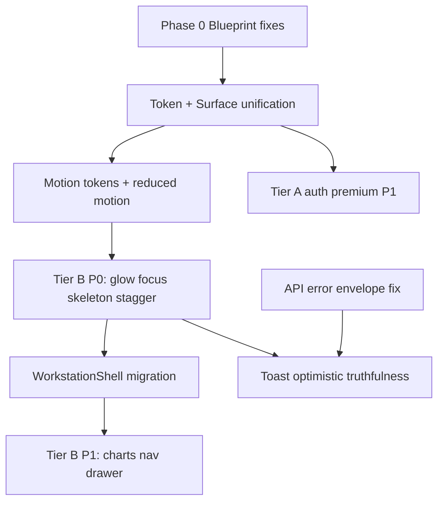

# FactoryNerve OS — Premium UI Enhancement Specification

> **Status:** Implementation-ready | **Version:** 1.0 | **Date:** June 2026  
> **Audience:** Frontend engineers, design systems, AI agents  
> **Governs:** `web/` Next.js application

---

## Document lineage and constraints

This specification extends — it does **not** replace — the following sources of truth:

| Document | What it constrains |
|----------|-------------------|
| [FRONTEND_AUDIT_REPORT.md](./FRONTEND_AUDIT_REPORT.md) | Two visual languages; 400+ token violations; motion/GPU risks on factory tablets |
| [FRONTEND_MODERNIZATION_EXECUTION_BLUEPRINT.md](./FRONTEND_MODERNIZATION_EXECUTION_BLUEPRINT.md) | **≤150ms** operational motion; no decorative parallax on workstations; neutral-first color |
| [PRODUCT_WORKSPACE_TOPOLOGY.md](./PRODUCT_WORKSPACE_TOPOLOGY.md) | 12 workspace types; which routes are P0 realtime vs immersive vs queue |
| [PLATFORM_STABILIZATION_AUDIT.md](../PLATFORM_STABILIZATION_AUDIT.md) | Error envelope masking, CSRF bootstrap race — polish blocked until API errors are granular |
| [PROJECT_CONTEXT.md](../PROJECT_CONTEXT.md) | Mobile-first, slow networks, factory-floor devices; active app is `web/` |

### The two-layer premium model (mandatory)

FactoryNerve is **not** a marketing site with an ERP attached. Premium effects apply in **two tiers**:

```
┌─────────────────────────────────────────────────────────────────┐
│  TIER A — BRAND & ACQUISITION (unrestricted motion budget)      │
│  Routes: /login, /register, /access, /forgot-password,          │
│          /verify-email, /onboarding/*, marketing landings         │
│  Budget: up to 600ms transitions; 3D hero optional; particles   │
│  Goal: first-impression trust for owners evaluating the product │
└─────────────────────────────────────────────────────────────────┘
                              │
                              ▼
┌─────────────────────────────────────────────────────────────────┐
│  TIER B — OPERATIONAL WORKSTATION (strict industrial contract)   │
│  Routes: dashboard, work-queue, attendance/*, entry, OCR        │
│          verify/history, steel/*, approvals, settings, billing    │
│  Budget: ≤150ms (tokens.css); functional motion only            │
│  Goal: calm density, scan speed, trust signals — not spectacle    │
└─────────────────────────────────────────────────────────────────┘
```

**Blueprint alignment (non-negotiable on Tier B):**

- Forbidden: page-entry hero animations, route dissolve transitions, 24s ambient loops, `will-change` on scroll surfaces, backdrop-blur on static panels, neon accent floods on data tables.
- Required: surface elevation hierarchy, semantic status glow (point-of-use only), skeleton/shimmer loaders, row-state flashes (120ms), `prefers-reduced-motion` via existing tokens.

**Audit alignment:** Complete **surface unification** (Phase 0–3 blueprint) before Tier A spectacle or Tier B “premium chrome.” Otherwise premium effects amplify the two-language fracture.

---

## Priority legend

| Tier | Meaning | When |
|------|---------|------|
| **P0** | Immediate perceived quality + blueprint compliance | Next 2–3 sprints |
| **P1** | High value after P0 foundation | Sprints 4–8 |
| **P2** | Polish layer; optional; often Tier A only | Post Phase 3 migration |

---

## Design token extensions (add to `tokens.css`)

Cross-reference: blueprint §4.3–4.5; audit “dual-source pollution”; profile reference `#3d7fff`, surfaces `#0f1117` → `#181c28`.

```css
/* === PREMIUM LAYER TOKENS (append after motion tokens) === */

/* Easing library — operational (Tier B) */
--ease-snappy: cubic-bezier(0.2, 0, 0, 1);
--ease-smooth: cubic-bezier(0.4, 0, 0.2, 1);
--ease-decelerate: cubic-bezier(0, 0, 0.2, 1);
--ease-overshoot: cubic-bezier(0.34, 1.4, 0.64, 1); /* micro-interactions only */

/* Easing — brand (Tier A only) */
--ease-elastic: cubic-bezier(0.68, -0.55, 0.265, 1.55);
--ease-premium-enter: cubic-bezier(0.16, 1, 0.3, 1);

/* Depth / 3D (Tier B: subtle only) */
--perspective-workstation: 1200px;
--tilt-max-deg: 4deg; /* never exceed on data surfaces */

/* Glow — semantic only (Tier B) */
--glow-success: 0 0 0 1px var(--status-success-border),
  0 0 12px color-mix(in srgb, var(--status-success-fg) 25%, transparent);
--glow-warning: 0 0 0 1px var(--status-warning-border),
  0 0 12px color-mix(in srgb, var(--status-warning-fg) 22%, transparent);
--glow-danger: 0 0 0 1px var(--status-danger-border),
  0 0 14px color-mix(in srgb, var(--status-danger-fg) 28%, transparent);
--glow-processing: 0 0 0 1px var(--status-processing-border),
  0 0 14px color-mix(in srgb, var(--status-processing-fg) 24%, transparent);
--glow-focus-input: inset 0 0 0 1px var(--border-focus),
  0 0 0 3px color-mix(in srgb, var(--action-primary) 20%, transparent);

/* Glass — overlays/drawers only (Tier B) */
--glass-blur: 12px;
--glass-bg: color-mix(in srgb, var(--surface-overlay) 88%, transparent);
--glass-border: color-mix(in srgb, var(--border-default) 60%, transparent);

/* Ambient (Tier A hero / Tier B: static radial behind shell, no animation) */
--ambient-primary: radial-gradient(
  ellipse 80% 50% at 50% -20%,
  color-mix(in srgb, var(--action-primary) 12%, transparent),
  transparent 70%
);

/* Stagger */
--stagger-step: 40ms;
--stagger-max: 320ms;
```

**Color system note:** Primary accent remains **`--action-primary` (#3d7fff)** per profile modernization — not generic “electric violet #7c3aed” unless white-labeling. Semantic glows use **status tokens**, not arbitrary neon (blueprint §4.4).

---

## 1. 3D Motion & Depth System

### 1.1 Scope

| Technique | Tier A (auth) | Tier B (workstation) |
|-----------|---------------|----------------------|
| CSS `perspective` card tilt | ✓ Hero cards | ✓ **Metric cards only**, max 4° |
| `preserve-3d` panel flip | ✓ Marketing panels | ✗ |
| Three.js / Spline hero | ✓ Optional lazy-loaded | ✗ |
| Parallax scroll layers | ✓ | ✗ |
| 3D route transitions (`rotateY`) | ✓ Sub-routes in auth | ✗ |
| Floating drift orbs | ✓ Background | ✗ (use static ambient gradient) |

**Topology:** Immersive scanner `/ocr/scan` stays flat — camera workflow (Type 6). Queue workspaces `/ocr/verify`, `/approvals` forbid tilt on rows (scan speed).

### 1.2 CSS depth stack (Tier B — P0)

```css
/* globals.css — workstation scope only */
.factory-workstation-scope {
  perspective: var(--perspective-workstation);
}

.premium-card-tilt {
  transform-style: preserve-3d;
  transition: transform var(--motion-base) var(--ease-smooth);
  will-change: auto; /* never persistent will-change on tables */
}

.premium-card-tilt:hover {
  transform: translateY(-2px) rotateX(var(--rx, 0deg)) rotateY(var(--ry, 0deg));
  box-shadow: var(--shadow-md);
}

@media (prefers-reduced-motion: reduce) {
  .premium-card-tilt:hover {
    transform: translateY(-1px);
  }
}
```

```tsx
// hooks/use-card-tilt.ts — Tier B, pointer-fine only
"use client";
import { useRef, useCallback } from "react";

const MAX = 4; // degrees — blueprint industrial cap

export function useCardTilt() {
  const ref = useRef<HTMLDivElement>(null);
  const onMove = useCallback((e: React.MouseEvent) => {
    if (!ref.current || window.matchMedia("(prefers-reduced-motion: reduce)").matches) return;
    const r = ref.current.getBoundingClientRect();
    const rx = ((e.clientY - r.top) / r.height - 0.5) * -MAX;
    const ry = ((e.clientX - r.left) / r.width - 0.5) * MAX;
    ref.current.style.setProperty("--rx", `${rx}deg`);
    ref.current.style.setProperty("--ry", `${ry}deg`);
  }, []);
  const onLeave = useCallback(() => {
    ref.current?.style.setProperty("--rx", "0deg");
    ref.current?.style.setProperty("--ry", "0deg");
  }, []);
  return { ref, onMove, onLeave };
}
```

**Apply to:** `MetricStrip` cards on `attendance-live-page`, `RouteHeader` status chips — **not** `DataTable` rows (audit: micro-jitter on dense tables).

### 1.3 Three.js / Spline hero (Tier A — P2)

```tsx
// components/marketing/hero-scene.tsx — dynamic import, no SSR
import dynamic from "next/dynamic";

const HeroScene = dynamic(() => import("./hero-scene-canvas"), {
  ssr: false,
  loading: () => <div className="hero-scene-fallback" aria-hidden />,
});
```

- Lazy-load after `requestIdleCallback` or first paint + 1s.
- Fallback: static PNG/SVG from `factorynerve-profile.html` palette.
- **P2** — only after auth pages use `AuthWorkstationShell` + token compliance (conversation summary).

### 1.4 Parallax (Tier A — P2)

```css
.hero-parallax {
  --scroll: 0;
}
.hero-parallax__bg { transform: translateY(calc(var(--scroll) * 0.15)); }
.hero-parallax__mid { transform: translateY(calc(var(--scroll) * 0.35)); }
.hero-parallax__fg { transform: translateY(calc(var(--scroll) * 0.55)); }
```

```ts
// Tier A only — respect reduced motion
if (!window.matchMedia("(prefers-reduced-motion: reduce)").matches) {
  window.addEventListener("scroll", () => {
    document.documentElement.style.setProperty("--scroll", String(window.scrollY));
  }, { passive: true });
}
```

### 1.5 Page transitions (Tier A — P1)

```tsx
// app/(auth)/template.tsx — Framer Motion, auth layout only
"use client";
import { motion, AnimatePresence } from "framer-motion";

const authTransition = {
  initial: { opacity: 0, rotateY: -6, scale: 0.98 },
  animate: { opacity: 1, rotateY: 0, scale: 1, transition: { duration: 0.4, ease: [0.16, 1, 0.3, 1] } },
  exit: { opacity: 0, rotateY: 6, scale: 0.98, transition: { duration: 0.28 } },
};

export default function AuthTemplate({ children }: { children: React.ReactNode }) {
  return (
    <AnimatePresence mode="wait">
      <motion.div key={typeof window !== "undefined" ? location.pathname : "auth"} {...authTransition}>
        {children}
      </motion.div>
    </AnimatePresence>
  );
}
```

**Tier B:** Use instant route changes; optional 80ms cross-fade on **shell content zone only** (not full page).

| Item | Priority |
|------|----------|
| Subtle metric card tilt + elevation | **P0** Tier B |
| Auth route motion template | **P1** Tier A |
| Three.js hero | **P2** Tier A |
| Parallax marketing | **P2** Tier A |

---

## 2. Glow & Bloom Effects

### 2.1 Principles (blueprint §4.4)

- Glow = **operational state**, not decoration.
- Max 2 layered shadows on interactive elements; tables use **left-border accent** (existing `DataTable` row states) before box-glow.

### 2.2 Token-mapped glows (P0)

```css
.btn-primary-glow:focus-visible {
  box-shadow: var(--glow-focus-input), var(--shadow-sm);
}

.status-glow-success { box-shadow: var(--glow-success); }
.status-glow-warning { box-shadow: var(--glow-warning); }
.status-glow-danger { box-shadow: var(--glow-danger); }
.status-glow-processing { box-shadow: var(--glow-processing); }

@keyframes glow-pulse-processing {
  0%, 100% { box-shadow: var(--glow-processing); }
  50% { box-shadow: 0 0 0 1px var(--status-processing-border),
    0 0 20px color-mix(in srgb, var(--status-processing-fg) 35%, transparent); }
}

.live-pulse-dot {
  animation: glow-pulse-processing 2s var(--ease-smooth) infinite;
}
```

**Wire to:** `attendance-live-page` live indicator (audit: “exactly right” pattern); `--ai-processing-*` on OCR scan processing state (blueprint Phase 6).

### 2.3 Input focus inner glow (P0)

```css
.factory-auth-input:focus-visible,
.field-control:focus-visible {
  box-shadow: var(--glow-focus-input);
  border-color: var(--border-focus);
}
```

Replaces ad-hoc rings; aligns with password visibility toggle focus (recent fix).

### 2.4 Ambient bloom behind panels (P1)

```css
.surface-ambient-glow::before {
  content: "";
  position: absolute;
  inset: -20% -10% auto;
  height: 60%;
  background: var(--ambient-primary);
  filter: blur(40px);
  opacity: 0.6;
  pointer-events: none;
  z-index: -1;
}
```

**Tier B:** Static only (no pulse). **Forbidden** on `DataTable` container (double-border audit).

### 2.5 SVG logo glow (P2 — Tier A)

```html
<filter id="logo-glow">
  <feGaussianBlur stdDeviation="3" result="blur"/>
  <feMerge><feMergeNode in="blur"/><feMergeNode in="SourceGraphic"/></feMerge>
</filter>
```

### 2.6 Cursor-reactive light (P2 — Tier A marketing only)

```tsx
// hooks/use-spotlight-vars.ts
export function useSpotlightVars<T extends HTMLElement>() {
  const ref = useRef<T>(null);
  const onMove = (e: React.MouseEvent) => {
    if (!ref.current) return;
    const b = ref.current.getBoundingClientRect();
    ref.current.style.setProperty("--spot-x", `${e.clientX - b.left}px`);
    ref.current.style.setProperty("--spot-y", `${e.clientY - b.top}px`);
  };
  return { ref, onMove };
}
```

```css
.spotlight-surface {
  background: radial-gradient(
    600px circle at var(--spot-x) var(--spot-y),
    color-mix(in srgb, var(--action-primary) 8%, transparent),
    transparent 40%
  );
}
```

| Item | Priority |
|------|----------|
| Semantic status + focus glows | **P0** |
| Live/AI processing pulse | **P0** |
| Static ambient behind shell header | **P1** |
| SVG logo / cursor spotlight | **P2** |

---

## 3. Animation & Transition System

### 3.1 Unified easing (P0)

Already specified in token extensions. **Enforce via ESLint** optional rule: ban `duration-300` Tailwind on `.factory-workstation-scope` descendants.

### 3.2 Staggered entrance (P0)

```css
@keyframes stagger-rise {
  from { opacity: 0; transform: translateY(8px); }
  to { opacity: 1; transform: translateY(0); }
}

.stagger-children > * {
  animation: stagger-rise var(--motion-moderate) var(--ease-decelerate) backwards;
}
.stagger-children > *:nth-child(1) { animation-delay: calc(var(--stagger-step) * 0); }
.stagger-children > *:nth-child(2) { animation-delay: calc(var(--stagger-step) * 1); }
/* ... up to 8 children, then cap at --stagger-max */
```

**Apply to:** `MetricStrip`, `SectionPanel` stacks on migrated dashboards — **after** `WorkstationShell` migration (blueprint Phase 2).

### 3.3 Framer Motion springs (P1 — selective)

```tsx
import { motion } from "framer-motion";

const springSnappy = { type: "spring", stiffness: 420, damping: 32 };
const springSoft = { type: "spring", stiffness: 260, damping: 28 };

// Drawer / toast only — duration still feels <150ms perceptually
<motion.aside
  initial={{ x: "100%" }}
  animate={{ x: 0 }}
  exit={{ x: "100%" }}
  transition={springSnappy}
/>
```

**Do not** spring-animate table row height (virtualization jank on `DataTable`).

### 3.4 GSAP morphing (P2 — Tier A icons only)

Use for auth marketing icon state morphs — not form controls.

### 3.5 Shared element transitions (P2)

Next.js `viewTransition` API or Framer `layoutId` for:

- Auth card → dashboard **forbidden** (different tiers).
- OCR history row → verify panel: **P2** `layoutId={`ocr-${id}`}` on thumbnail strip only.

### 3.6 Exit animations (P0)

```css
@keyframes dissolve-out {
  to { opacity: 0; transform: scale(0.98); }
}
.dissolve-exit {
  animation: dissolve-out var(--motion-fast) var(--ease-snappy) forwards;
}
```

Use for toast dismiss, row removal on live attendance (topology §8.1 realtime row diff — blueprint §7.10).

| Item | Priority |
|------|----------|
| Easing tokens + stagger CSS | **P0** |
| Drawer/toast springs | **P1** |
| layoutId / view transitions | **P2** |
| GSAP morph | **P2** |

---

## 4. Glassmorphism & Surface Design

### 4.1 Contract (audit §Surface)

| Surface level | Glass allowed? |
|---------------|----------------|
| Modal, drawer, command palette | ✓ |
| Sticky topbar on scroll | ✓ (already partially) |
| SectionPanel, DataTable, cards in page | ✗ → use opaque `--surface-*` |

### 4.2 Frosted panel (P0)

```css
.glass-panel {
  background: var(--glass-bg);
  backdrop-filter: blur(var(--glass-blur));
  -webkit-backdrop-filter: blur(var(--glass-blur));
  border: 1px solid var(--glass-border);
}

[data-runtime-tier="safe"] .glass-panel {
  backdrop-filter: none;
  background: var(--surface-overlay);
}
```

### 4.3 Noise texture (P1)

```css
.glass-panel::after {
  content: "";
  position: absolute;
  inset: 0;
  opacity: 0.04;
  pointer-events: none;
  background-image: url("data:image/svg+xml,..."); /* feTurbulence or 128px noise PNG */
  mix-blend-mode: overlay;
}
```

### 4.4 Gradient border shimmer (P2 — Tier A)

```css
.shimmer-border {
  position: relative;
  border-radius: var(--radius-panel);
}
.shimmer-border::before {
  content: "";
  position: absolute;
  inset: 0;
  padding: 1px;
  border-radius: inherit;
  background: linear-gradient(
    90deg,
    transparent,
    color-mix(in srgb, var(--action-primary) 60%, transparent),
    transparent
  );
  background-size: 200% 100%;
  animation: shimmer-slide 3s linear infinite;
  -webkit-mask: linear-gradient(#fff 0 0) content-box, linear-gradient(#fff 0 0);
  mask-composite: exclude;
}
```

### 4.5 Layered card depth (P0)

Enforce blueprint stack:

```
surface-shell → SectionPanel (surface-panel, border-subtle)
              → Card variant=operational (surface-card, shadow-xs)
              → inputs (surface-elevated)
```

Remove nested `Card` inside `Card` on `steel-command-center-page` (audit root cause).

### 4.6 Dynamic surface tinting (P1)

```css
.section-panel[data-accent="processing"] {
  background: color-mix(in srgb, var(--status-processing-bg) 6%, var(--surface-panel));
}
```

Set `data-accent` from `RouteHeader` status tone.

| Item | Priority |
|------|----------|
| Glass limited to overlays | **P0** |
| Layered surface enforcement | **P0** |
| safe-tier fallback | **P0** |
| Noise + shimmer | **P1** / **P2** |

---

## 5. Particle Systems & Ambient Backgrounds

### 5.1 Scope split

| Effect | Tier A | Tier B |
|--------|--------|--------|
| Canvas particle field | Auth hero | ✗ |
| Network mesh cursor | Marketing | ✗ |
| CSS blob morph | Auth background | ✗ |
| Slow hue gradient shift | Auth | Static `--ambient-primary` only |
| Shooting star on loader complete | Auth + global loader | **P1** one-shot |

### 5.2 CSS blob (Tier A — P2)

```css
@keyframes blob-morph {
  0%, 100% { border-radius: 60% 40% 30% 70% / 60% 30% 70% 40%; }
  50% { border-radius: 30% 60% 70% 40% / 50% 60% 30% 60%; }
}
.ambient-blob {
  background: radial-gradient(circle at 30% 30%, 
    color-mix(in srgb, var(--action-primary) 35%, transparent), transparent 70%);
  animation: blob-morph 18s ease-in-out infinite;
}
```

### 5.3 Canvas particles (Tier A — P2)

```tsx
// Lightweight ~80 particles, requestAnimationFrame, pause when tab hidden
export function ParticleField({ density = 80 }: { density?: number }) {
  // useCanvas2d hook — connect nearby nodes within 120px, opacity 0.15
  // Respect prefers-reduced-motion → render static gradient only
}
```

### 5.4 Dashboard ambient (Tier B — P1)

**No particles.** Use:

```css
.app-shell-bg {
  background-color: var(--surface-app);
  background-image: var(--ambient-primary);
}
```

### 5.5 Loader streak (P1)

```css
@keyframes loader-streak {
  0% { transform: translateX(-100%) skewX(-12deg); opacity: 0; }
  20% { opacity: 1; }
  100% { transform: translateX(200%) skewX(-12deg); opacity: 0; }
}
```

| Item | Priority |
|------|----------|
| Static ambient on app shell | **P1** |
| Loader streak | **P1** |
| Canvas particles / blobs | **P2** Tier A |

---

## 6. Micro-interactions & Feedback

### 6.1 Button press (P0)

```css
.btn-press:active:not(:disabled) {
  transform: scale(0.97);
  transition: transform var(--motion-instant) var(--ease-snappy);
}
```

```tsx
// Ripple — optional, pointer-coarse skip
function useRipple() {
  return (e: React.MouseEvent<HTMLButtonElement>) => {
    const el = e.currentTarget;
    const r = document.createElement("span");
    r.className = "btn-ripple";
    const rect = el.getBoundingClientRect();
    const size = Math.max(rect.width, rect.height);
    r.style.cssText = `width:${size}px;height:${size}px;left:${e.clientX - rect.left - size/2}px;top:${e.clientY - rect.top - size/2}px`;
    el.appendChild(r);
    r.addEventListener("animationend", () => r.remove());
  };
}
```

Extend existing `Button` `isBusy` — already blueprint-compliant.

### 6.2 Toggle liquid fill (P1)

Implement in new `Switch` primitive — spring overshoot **max 180ms**.

### 6.3 Checkbox SVG draw (P1)

```css
.check-path {
  stroke-dasharray: 24;
  stroke-dashoffset: 24;
  transition: stroke-dashoffset var(--motion-base) var(--ease-smooth);
}
input:checked + .check-path { stroke-dashoffset: 0; }
```

### 6.4 Skeleton shimmer (P0)

Align with blueprint Phase 1 — replace inline “Loading…” strings (audit: 5+ patterns).

```css
@keyframes shimmer-sweep {
  0% { background-position: -200% 0; }
  100% { background-position: 200% 0; }
}
.skeleton-shimmer {
  background: linear-gradient(
    90deg,
    var(--surface-panel) 0%,
    color-mix(in srgb, var(--surface-elevated) 80%, white) 50%,
    var(--surface-panel) 100%
  );
  background-size: 200% 100%;
  animation: shimmer-sweep 1.2s var(--ease-smooth) infinite;
}
```

### 6.5 Progress bar glow trail (P1)

OCR `OCRProgress` — map job percent to gradient + trailing box-shadow using `--status-processing-*`.

### 6.6 Toast spring (P0)

```tsx
// shared/feedback/app-toast.tsx
<motion.div
  initial={{ opacity: 0, y: 12, scale: 0.96 }}
  animate={{ opacity: 1, y: 0, scale: 1 }}
  exit={{ opacity: 0, x: 80 }}
  transition={{ duration: 0.15, ease: [0.2, 0, 0, 1] }}
/>
```

**Blocked by:** stabilization audit — toast must show **real API error detail** once envelope fix ships.

| Item | Priority |
|------|----------|
| Button press + skeleton shimmer | **P0** |
| Toast motion + MutationErrorBanner | **P0** |
| Switch/checkbox polish | **P1** |
| OCR progress glow | **P1** |

---

## 7. Premium Typography Motion

### 7.1 Contract (blueprint §4.1)

- **Forbidden** on Tier B: typewriter hero, glitch hover, wide-tracking uppercase reveals.
- **Allowed:** tabular numeric roll-up, subtle opacity reveal on `RouteHeader` title.

### 7.2 Text reveal (P1 — Tier A / P2 — RouteHeader)

```css
.reveal-line {
  clip-path: inset(0 0 100% 0);
  animation: reveal-up var(--motion-moderate) var(--ease-premium-enter) forwards;
}
@keyframes reveal-up {
  to { clip-path: inset(0 0 0 0); }
}
```

### 7.3 Gradient text (P2 — Tier A only)

```css
.text-gradient-brand {
  background: linear-gradient(135deg, var(--action-primary), var(--_prim-blue-300));
  background-clip: text;
  -webkit-background-clip: text;
  color: transparent;
}
```

### 7.4 Variable font weight (P2)

Requires font with `wght` axis — IBM Plex Sans variable if licensed; else skip.

### 7.5 Number counter (P0 for metrics)

```tsx
"use client";
import { useEffect, useState } from "react";
import { useInView } from "framer-motion";

export function AnimatedMetric({ value, format }: { value: number; format: (n: number) => string }) {
  const [display, setDisplay] = useState(0);
  const ref = useRef(null);
  const inView = useInView(ref, { once: true, margin: "-10%" });
  useEffect(() => {
    if (!inView) return;
    const duration = 400;
    const start = performance.now();
    const tick = (now: number) => {
      const t = Math.min(1, (now - start) / duration);
      setDisplay(Math.round(value * t));
      if (t < 1) requestAnimationFrame(tick);
    };
    requestAnimationFrame(tick);
  }, [inView, value]);
  return <span ref={ref} className="font-mono tabular-nums">{format(display)}</span>;
}
```

**Apply to:** `MetricStrip` only — not table cells (audit: tabular-nums trust).

| Item | Priority |
|------|----------|
| Metric counter on scroll-in | **P0** |
| RouteHeader reveal | **P1** |
| Gradient / typewriter / glitch | **P2** Tier A |

---

## 8. Scroll-Driven Animations

### 8.1 Tier B rule

Use **Intersection Observer** for reveals; avoid scroll-linked jank on tables. `animation-timeline: scroll()` — **P2** progressive enhancement only.

### 8.2 Section entrance (P0)

```tsx
// components/motion/reveal-on-view.tsx
"use client";
import { motion, useInView } from "framer-motion";

export function RevealOnView({ children }: { children: React.ReactNode }) {
  const ref = useRef(null);
  const inView = useInView(ref, { once: true, margin: "0px 0px -8% 0px" });
  return (
    <motion.div
      ref={ref}
      initial={{ opacity: 0, y: 12 }}
      animate={inView ? { opacity: 1, y: 0 } : {}}
      transition={{ duration: 0.12, ease: [0, 0, 0.2, 1] }}
    >
      {children}
    </motion.div>
  );
}
```

### 8.3 Sticky morphing navbar (P1)

```css
.topbar[data-scrolled="true"] {
  height: var(--topbar-height-compact, 48px);
  box-shadow: var(--shadow-sm);
  transition: height var(--motion-base) var(--ease-smooth);
}
```

### 8.4 Horizontal feature sections (P2 — marketing)

Not on ERP routes.

### 8.5 Scroll-snap (P2 — Tier A onboarding)

```css
.onboarding-scroll-snap {
  scroll-snap-type: y mandatory;
  scroll-behavior: smooth;
}
.onboarding-scroll-snap > section {
  scroll-snap-align: start;
  min-height: 100dvh;
}
```

| Item | Priority |
|------|----------|
| RevealOnView for SectionPanel | **P0** |
| Topbar compress on scroll | **P1** |
| scroll-timeline / snap | **P2** |

---

## 9. Cursor & Hover States

### 9.1 Custom cursor (P2 — Tier A / owner demo mode)

```css
@media (pointer: fine) {
  .cursor-premium-active,
  .cursor-premium-active * {
    cursor: none !important;
  }
  .cursor-dot {
    width: 8px; height: 8px;
    background: var(--action-primary);
    border-radius: 50%;
    box-shadow: 0 0 12px var(--action-primary);
  }
  .cursor-ring {
    width: 32px; height: 32px;
    border: 1px solid color-mix(in srgb, var(--action-primary) 40%, transparent);
    transition: transform 0.15s var(--ease-smooth);
  }
}
```

**Default factory floor:** system cursor — touch targets 44px (project context).

### 9.2 Magnetic pull (P2)

GSAP `quickTo` on CTA buttons — auth only.

### 9.3 Card hover lift (P0)

```css
.hover-lift {
  transition: transform var(--motion-base) var(--ease-smooth),
    box-shadow var(--motion-base) var(--ease-smooth);
}
.hover-lift:hover {
  transform: translateY(-4px);
  box-shadow: var(--shadow-md);
}
```

**Max -4px** on Tier B (audit card hover uses -1px — increase slightly for KPI cards only).

### 9.4 Spotlight card (P1)

Combine `useSpotlightVars` + `useCardTilt` on intelligence cards in `/premium/dashboard` **after** token migration.

| Item | Priority |
|------|----------|
| hover-lift on metric/queue cards | **P0** |
| Spotlight on owner dashboard cards | **P1** |
| Custom cursor / magnetic | **P2** |

---

## 10. Loading & Transition Experiences

### 10.1 Full-page loader (P1)

```tsx
// app/loading.tsx — brand arc + logo
export default function RootLoading() {
  return (
    <div className="loader-screen" role="status" aria-live="polite">
      <svg className="loader-arc" viewBox="0 0 48 48">
        <circle cx="24" cy="24" r="20" fill="none" stroke="var(--action-primary)" strokeWidth="2"
          strokeDasharray="80 126" strokeLinecap="round" />
      </svg>
      <span className="sr-only">Loading FactoryNerve</span>
    </div>
  );
}
```

On complete: one-shot `loader-streak` (§5.5) — **no** particle burst on Tier B entry.

### 10.2 Route transition (P0 Tier B)

Instant shell swap; content zone:

```css
.shell-content-enter {
  animation: stagger-rise var(--motion-moderate) var(--ease-decelerate);
}
```

### 10.3 Skeleton layout fidelity (P0)

Match `LoadingBoundary` to real `WorkstationShell` + table column skeleton — blueprint Phase 1 #13.

### 10.4 Staggered post-load (P0)

Apply `.stagger-children` to first `SectionPanel` group after `isLoading` false.

### 10.5 Optimistic UI (P0)

Already partially on entries/attendance — extend pattern:

```tsx
// React Query optimistic update + instant row state
onMutate: async (payload) => {
  await queryClient.cancelQueries({ queryKey });
  const prev = queryClient.getQueryData(queryKey);
  queryClient.setQueryData(queryKey, optimisticMerge(prev, payload));
  return { prev };
},
```

**Topology P0 routes:** `/attendance` punch, `/entry` create, `/steel/dispatches` create — reconcile on envelope fix.

| Item | Priority |
|------|----------|
| Layout-matched skeletons | **P0** |
| Optimistic mutations (P0 workflows) | **P0** |
| Shell content enter | **P0** |
| Branded full loader | **P1** |

---

## 11. Color & Light System

### 11.1 Dark-first base (aligned to profile)

| Token | Dark value | Role |
|-------|------------|------|
| `--surface-app` | `#0f1117` | Floor |
| `--surface-shell` | `#13151e` | App chrome |
| `--surface-panel` | `#181c28` | Sections |
| `--surface-elevated` | `#1c2030` | Inputs/popovers |
| `--action-primary` | `#3d7fff` | Primary accent |
| `--text-primary` | `#e2e6f0` | Body |
| `--text-tertiary` | `#6b7494` | Metadata |

Light mode: warm `#f7f6f4` app floor per operational design doc — not cool grey audit complaint.

### 11.2 Accent variants (P0)

```css
:root {
  --accent-primary-soft: color-mix(in srgb, var(--action-primary) 18%, transparent);
  --accent-primary-muted: color-mix(in srgb, var(--action-primary) 10%, transparent);
}
```

### 11.3 Semantic glow colors

Map 1:1 to §2 — success/warning/danger/processing/info (`--status-info-*` if added).

### 11.4 Section temperature (P1)

| Workspace domain | Ambient tint |
|------------------|--------------|
| Data/analytics (`/analytics`, `/reports`) | Cool blue `--ambient-primary` |
| AI (`/ai`, OCR processing) | Indigo `--status-processing-bg` at 8% |
| Steel commercial | Neutral — **no purple marketing wash** (audit gradient problem) |
| Auth | Slightly warmer mix with `#f7f6f4` in light mode |

### 11.5 Forbidden (audit + blueprint)

- Raw `rgba(20,24,36,0.96)` gradients on `premium-dashboard-page`
- `text-rose-300`, `border-emerald-400/35` — use status tokens

| Item | Priority |
|------|----------|
| Token compliance on surfaces | **P0** |
| Semantic glow mapping | **P0** |
| Domain ambient tints | **P1** |

---

## 12. Component-Level Premium Details

### 12.1 Modals (P0)

```tsx
// ConfirmationModal enhancement
<DialogOverlay className="glass-panel animate-in fade-in duration-100" />
<DialogContent className="animate-in zoom-in-98 duration-150" />
```

Exit: `dissolve-out` §3.6. Focus trap unchanged.

### 12.2 Dropdowns (P1)

```tsx
<DropdownMenuContent
  className="stagger-children"
  // each item: motion delay index * 30ms, max 150ms total
/>
```

Active item: `bg-surface-selected` + optional `status-glow-processing` for AI actions.

### 12.3 Tables (P0)

```css
/* Row hover — left border sweep */
.data-table-row:hover::before {
  content: "";
  position: absolute;
  left: 0; top: 0; bottom: 0;
  width: 3px;
  background: var(--border-focus);
  transform: scaleY(0);
  animation: border-sweep-in var(--motion-fast) var(--ease-snappy) forwards;
}
```

Wire `getRowState` first (blueprint Phase 4) — glow follows state color.

### 12.4 Charts (P1)

- Bar grow: `transform: scaleY(0)` → `1`, `transform-origin: bottom`, 150ms stagger
- Tooltip: `glass-panel` + tabular-nums
- Library: keep current chart lib; wrap container in `RevealOnView`

### 12.5 Navigation (P0)

```css
.nav-item-active::after {
  content: "";
  position: absolute;
  bottom: 0; left: 8px; right: 8px;
  height: 2px;
  background: var(--action-primary);
  transform: scaleX(0);
  animation: nav-underline-in var(--motion-base) var(--ease-snappy) forwards;
}
```

Active icon: `color: var(--action-primary)` — **remove icon box** per blueprint §5.2 sidebar redesign.

### 12.6 Avatars (P1)

```css
.avatar-online {
  box-shadow: 0 0 0 2px var(--surface-shell), 0 0 8px var(--status-success-fg);
}
.avatar-speaking {
  animation: glow-pulse-processing 1.5s infinite;
}
```

| Component | Priority |
|-----------|----------|
| Modal glass + enter | **P0** |
| Table row sweep + row states | **P0** |
| Nav underline + icon simplification | **P0** |
| Dropdown stagger | **P1** |
| Charts + avatars | **P1** |

---

## Implementation dependency graph



---

## Cross-reference matrix (audit → spec action)

| Audit / blueprint finding | Spec section | Priority |
|---------------------------|--------------|----------|
| Two visual languages | Enforce Tier A/B split; no gradient heroes on Tier B | P0 |
| ≤150ms motion ceiling | §3, §8 — Tier B durations | P0 |
| 400+ token violations | §11 — no raw colors; glow from semantic tokens | P0 |
| `will-change` GPU risk | §1 — `will-change: auto` on tilt | P0 |
| Card-in-card nesting | §4.5 layered depth | P0 |
| 5+ loading patterns | §6.4, §10.3 LoadingBoundary | P0 |
| DataTable row states unused | §12.3 + blueprint §7.3 | P0 |
| AI tokens unused | §2 glow-processing, §12 | P0 |
| Error envelope masks errors | §6.6, §10.5 — blocked | P0 backend |
| OCR verify complexity (topology) | No tilt/parallax; queue two-pane | P0 |
| Auth isolated animations OK | Tier A §1, §5, §7 | P1 |
| `premium-dashboard` gradients | §11.4 neutral ambient only after migration | P1 |

---

## Recommended library stack

| Concern | Choice | Notes |
|---------|--------|-------|
| Micro-interactions | CSS + existing `Button` | Default |
| Drawer/toast | `framer-motion` (already common in Next apps) | Add only if bundle budget OK |
| Heavy scroll/parallax | GSAP | Tier A only, dynamic import |
| 3D hero | `@react-three/fiber` OR Spline iframe | P2, lazy |
| Reduced motion | `tokens.css` media query | Already present — do not override |

**Bundle rule:** Tier B routes must not import Three.js/GSAP on initial JS path.

---

## Sprint allocation summary

| Sprint theme | P0 deliverables |
|--------------|-----------------|
| Foundation | Token extensions, glass contract, skeleton shimmer, focus glow, surface depth |
| Workstation | Stagger SectionPanel, metric counter, table row sweep, nav underline, hover-lift |
| Trust | Processing glow on OCR/attendance live, optimistic UI on punch/entry |
| Auth polish | Auth template motion, ambient static gradient, loader arc |
| Post-migration | Spotlight owner cards, chart grow, dropdown stagger, particles Tier A |

---

## Acceptance criteria (world-class bar)

1. **Tier B:** No animation >150ms except drawer overlay; Lighthouse CLS < 0.1 on `attendance/live` and `work-queue`.
2. **Tier B:** Every P0 workflow shows correct loading skeleton within 100ms of navigation.
3. **Tier B:** Status glow appears only on live, processing, danger, success — never on neutral chrome.
4. **Accessibility:** `prefers-reduced-motion` disables stagger, tilt, particles, counters.
5. **Topology:** OCR verify and approvals maintain two-pane layout; no scroll-jacking.
6. **Stabilization:** User-visible errors show API `detail` after envelope fix (PROJECT_CONTEXT + PLATFORM_STABILIZATION).
7. **Audit:** Token audit script baseline decreases every sprint; zero new `var(--muted)` in page components.

---

*This specification is the premium layer on top of FRONTEND_MODERNIZATION_EXECUTION_BLUEPRINT.md. Implement blueprint Phases 0–2 before Tier A spectacle. Tier B premium is subtle depth and motion that respects factory-floor hardware and shift-time cognitive load.*
