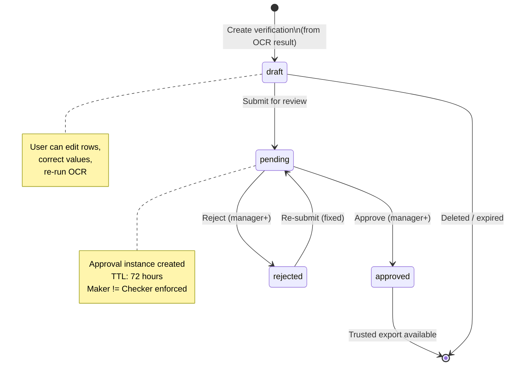

# OCR Workflow — End-to-End Architecture Report

> **Date:** June 25, 2026  
> **Scope:** Full trace from frontend camera capture → backend AI extraction → review → approval → Excel export  
> **Project:** DPR.ai / FactoryNerve

---

## 1. Executive Summary

The OCR (Optical Character Recognition) module is a core feature of DPR.ai that converts paper-based factory logbooks, ledgers, invoices, and tabular sheets into structured digital data. The system uses a **multi-provider AI pipeline** (Claude Haiku/Sonnet/Opus, Tesseract, Bytez) with **automatic fallback chains**, **image quality scoring**, **structured normalization**, **confidence analysis**, **human-in-the-loop verification** with maker-checker approvals, and **Excel export**.

```mermaid
flowchart LR
    subgraph Frontend
        A[Camera / Gallery] --> B[Image Preprocessing]\nWarp/Crop/Enhance
        B --> C[Preview & Edit]
        C --> D[Submit for OCR]
        D --> E[Review Table]
        E --> F[Submit for Approval]
    end
    subgraph Backend
        G[OCR API /ocr/logbook] --> H{Quality Check}\n>30 score?
        H -->|Yes| I[AI Provider Chain]\nClaude→Bytez→Tesseract
        I --> J[Normalize & Confidence]\nStructural scoring
        J --> K[Save Verification]\nStatus: draft
        K --> L[Submit → pending]\nReview needed
        L --> M[Approve/Reject]\nMaker-checker
        M --> N[Trusted Export\nExcel / CSV]
    end
    F --> G
    E --> K
```

---

## 2. Frontend Workflow (User Journey)

### 2.1 Entry Points

| Route | Component | Purpose |
|---|---|---|
| `/ocr/scan` | `OcrScanPage` (in `ocr-scan-page.tsx`) | Camera capture + gallery upload + image prep |
| `/ocr/verify` | `OcrVerificationV2Page` (in `ocr-verification-v2-page.tsx`) | Review, edit, approve/reject OCR results |

### 2.2 Camera Capture (`ocr-camera.ts` + `camera-capture.tsx`)

**Flow:**
1. User taps "Scan Document" → `requestRearCamera()` requests `getUserMedia` with `facingMode: "environment"` (rear camera)
2. Live video feed shown in a `<video>` element
3. Torch support detection via `canToggleTorch()` capability check
4. User taps capture button → `captureVideoFrame()`:
   - Checks `video.videoWidth`/`video.videoHeight` (throws `"capture-unavailable"` if not ready)
   - Draws frame to `<canvas>`, converts to `image/jpeg` via `canvas.toBlob()`
   - Returns a `File` object
5. User can retake or proceed to upload

**Key utilities in `ocr-camera.ts`:**
- `requestRearCamera()` — requests 1080p rear camera stream
- `stopCameraStream(stream)` — stops all tracks
- `canToggleTorch(stream)` — checks if torch is supported
- `setTorchEnabled(stream, enabled)` — toggles flashlight
- `captureVideoFrame(video)` — captures frame via canvas → JPEG blob → File

### 2.3 Image Upload & Preparation (`ocr-scan-page.tsx`)

**Allowed formats:** PNG, JPG, JPEG, TIFF, HEIC, HEIF, PDF  
**Max size:** 8 MB (enforced client-side and server-side)

**Steps after capture/upload:**
1. **Validation**: `validateOcrImageFile()` checks mime type, extension, file size
2. **Warp/Perspective correction**: Optional — calls `POST /api/ocr/warp` with corner points
3. **Language selection**: "eng", "auto", "eng+hin+mar"
4. **Template selection**: Optional — uses `OcrTemplate` with predefined column names/keywords
5. **Document type hint**: "table", "ledger", "logbook", "register", "invoice", etc.
6. **Submission**: `previewOcrLogbook()` sends multipart POST to `/ocr/logbook`

### 2.4 Preview & Edit (`ocr-scan-page.tsx`)

After the backend returns structured results, the user sees:
- **Structured table** with headers and rows
- **Confidence badges** per cell (green=high, amber=medium, red=low)
- **Edit toolbar**: Add/remove rows/columns, edit cell values, re-run OCR
- **Image preview**: Original scan alongside extracted data
- **Action buttons**: Save as draft, submit for verification

### 2.5 Verification & Approval (`ocr-verification-v2-page.tsx`)

**Four-step workflow:**
1. **Step 1** — Document list with status filters (all/draft/pending/rejected/approved)
2. **Step 2** — Side-by-side: image viewer + extracted table with editable cells
3. **Step 3** — Issue review panel showing:
   - System warnings (blur, glare, low light)
   - Low-confidence cells (red/amber highlighted inputs)
   - Rejection reason (if previously rejected)
   - Blank critical fields (date, amount, quantity)
4. **Step 4** — Approve/Reject with maker-checker

**RBAC access control** (`ocr-access.ts`):
- `canUseOcrScan()` — operator, supervisor, manager, admin, owner
- `canUseOcrWorkspace()` — supervisor, manager, admin, owner
- `canApproveOcrVerification()` — manager, admin, owner

### 2.6 Export Formats

| Format | Backend Endpoint | Content-Type |
|---|---|---|
| Excel (.xlsx) | `GET /ocr/verifications/:id/export` | `application/vnd.openxmlformats-officedocument.spreadsheetml.sheet` |
| CSV | `exportRowsToCsv()` (client-side) | text/csv |
| Markdown | `exportRowsToMarkdown()` (client-side) | text/markdown |
| PDF | Structured PDF via `buildStructuredPdfBlob()` (client-side) | application/pdf |

---

## 3. Backend API Endpoints

### 3.1 Core OCR Endpoints (`/ocr`)

| Method | Path | Purpose |
|---|---|---|
| `POST` | `/ocr/logbook` | **Main extraction endpoint** — preview structured data |
| `POST` | `/ocr/logbook-excel-async` | Async ledger Excel export (background job) |
| `POST` | `/ocr/table-excel` | Sync table → Excel download |
| `POST` | `/ocr/table-excel-async` | Async table Excel export (background job) |
| `POST` | `/ocr/warp` | Perspective correction (OpenCV) |
| `GET` | `/ocr/status` | Tesseract availability check |

### 3.2 Verification Endpoints (`/ocr/verifications`)

| Method | Path | Purpose |
|---|---|---|
| `GET` | `/ocr/verifications` | List verifications (with status filter) |
| `GET` | `/ocr/verifications/summary` | Aggregated stats (trusted rows, pending, etc.) |
| `GET` | `/ocr/verifications/:id` | Get single verification record |
| `POST` | `/ocr/verifications` | Create new verification (with source image) |
| `PUT` | `/ocr/verifications/:id` | Update draft (rows, headers, metadata) |
| `POST` | `/ocr/verifications/:id/submit` | Submit for approval (draft → pending) |
| `POST` | `/ocr/verifications/:id/approve` | Approve (pending → approved) |
| `POST` | `/ocr/verifications/:id/reject` | Reject (pending → rejected) |
| `GET` | `/ocr/verifications/:id/export` | Download trusted Excel export |
| `POST` | `/ocr/verifications/:id/share-link` | Generate time-limited share link |

### 3.3 Template Endpoints (`/ocr/templates`)

| Method | Path | Purpose |
|---|---|---|
| `GET` | `/ocr/templates` | List templates for active factory |
| `POST` | `/ocr/templates` | Create template with sample images |
| `DELETE` | `/ocr/templates/:id` | Archive template |

### 3.4 Job Endpoints (`/ocr/jobs`)

| Method | Path | Purpose |
|---|---|---|
| `GET` | `/ocr/jobs/:id` | Poll background job status |
| `GET` | `/ocr/jobs/:id/download` | Download completed job result |
| `POST` | `/ocr/jobs/:id/retry` | Retry failed job |
| `DELETE` | `/ocr/jobs/:id` | Cancel running job |

### 3.5 Feedback Endpoint (`/feedback`)

| Method | Path | Purpose |
|---|---|---|
| `POST` | `/feedback` | Submit bug report / feature request (with translation) |

---

## 4. AI Extraction Pipeline (Deep Dive)

### 4.1 `/ocr/logbook` — The Main Preview Endpoint

This is the most important endpoint. Here's the complete flow:

```
POST /ocr/logbook
  │
  ├─ 1. Image Validation
  │    ├─ _validate_image_bytes() — checks magic bytes (PNG, JPEG, GIF, BMP, TIFF, WEBP, HEIC)
  │    └─ Max 5MB size check
  │
  ├─ 2. Route Selection (ocr_routing.py)
  │    └─ choose_ocr_route() — analyzes image quality, doc type, template → selects model tier
  │
  ├─ 3. Local OCR (Tesseract) — base_result
  │    └─ extract_table_from_image() in ocr_utils.py:
  │       ├─ _require_ocr_dependencies() — checks Tesseract + pytesseract + OpenCV
  │       ├─ analyze_image_quality() — blur, brightness, glare detection
  │       ├─ _extract_words() — OCR with language config
  │       ├─ Column detection via k-means clustering on word X-centers
  │       ├─ Column keyword matching (if template provides keywords)
  │       └─ Returns OcrResult with rows, confidence, cell_boxes, warnings
  │
  ├─ 4. AI Enhancement (conditional)
  │    └─ If model_tier is "balanced" or "best", OR doc_type is table/sheet/spreadsheet:
  │       └─ extract_table_from_image() in table_scan.py (Anthropic Claude)
  │          ├─ Provider chain: anthropic → bytez → tesseract
  │          ├─ Up to MAX_RETRY passes with model upgrades (Haiku → Sonnet → Opus)
  │          ├─ JSON validation + schema correction pass
  │          └─ Falls back to tesseract if AI unavailable
  │
  ├─ 5. Document Understanding (optional)
  │    └─ classify_document() → parse_document() → normalize_understanding()
  │       └─ Classifies doc type, parses sections, normalizes structure
  │
  ├─ 6. Layout Analysis Pipeline (Phases 1-5)
  │    ├─ Phase 1: suppress_repeated_headers() — removes header rows repeated in data
  │    ├─ Phase 1: prune_empty_columns() — removes columns >80% empty
  │    ├─ Phase 2-3: analyze_layout() — bbox canonicalization, layout confidence
  │    ├─ Phase 4-5: analyze_and_group() + apply_selector_bridge() — structural grouping
  │    └─ Results in cleaned headers/rows + layout_confidence score
  │
  ├─ 7. Normalization (ocr_normalization.py)
  │    ├─ normalize_structured_payload() — standardizes headers, rows, type
  │    ├─ build_cell_confidence_matrix() — heuristics-based per-cell confidence
  │    ├─ build_confidence_enriched_rows() — wraps cells with {value, confidence, source, reviewRequired}
  │    └─ Column profiling: numeric vs date vs text classification
  │
  ├─ 8. Structural Confidence Scoring (ocr_confidence.py)
  │    ├─ Empty cell ratio (20%)
  │    ├─ Column consistency (25%)
  │    ├─ Numeric validity (15%)
  │    ├─ Row alignment (20%)
  │    ├─ Header quality (10%)
  │    └─ Anomaly penalty (10%) — duplicates, uniform columns, single row
  │    └─ Returns score 0-100 + breakdown + flags + explanation
  │
  ├─ 9. Verification Cache Check
  │    └─ find_reusable_verification() — checks for existing verified result by document_hash
  │       └─ If found → returns cached result with "reused": true
  │
  └─ 10. Response Assembly
       └─ Returns OcrPreviewResult with: headers, rows, confidence, routing_meta,
          cell_confidence, cell_boxes, warnings, language, fallback_used, layout_analysis
```

### 4.2 AI Provider Architecture

#### Provider Chain Priority

```
1. Anthropic Claude (Haiku / Sonnet / Opus)
2. Bytez AI (Google Gemma-7b default)
3. Local Tesseract (OCR engine)

Fallbacks:
- If Anthropic fails → try Bytez → try Tesseract
- Each provider has credential check before attempting
- Token usage tracking and cost limits prevent runaway spending
```

#### Model Selection by Image Quality

| Image Quality Score | Default Model | Tier | Est. Cost |
|---|---|---|---|
| ≥ 82 | Claude Haiku | Fast (fast) | ~$0.0003 |
| 58–81 | Claude Sonnet | Balanced | ~$0.003 |
| < 58 | Claude Opus | Best | ~$0.015 |

#### Retry Logic (Claude path)

```
attempt 1: Haiku → if confidence < threshold → upgrade to Sonnet
attempt 2: Sonnet → if still low → upgrade to Opus  
attempt 3: Opus final attempt
Each retry passes previous response as context for correction
```

### 4.3 Image Preprocessing (`ledger_scan.py` + `ocr_utils.py`)

**Three preprocessing profiles:**
1. **standard** — contrast 1.5x, sharpness 2.0x, resize to 1568px max width
2. **high_contrast** — contrast 2.2x, sharpness 2.3x
3. **binarize** — threshold at 170, binary black/white

**Quality analysis (`analyze_image_quality()`):**
- **Blur detection**: Laplacian variance < 75 → warning
- **Low light**: Mean brightness < 80 → warning
- **Glare detection**: >6% near-white pixels → warning

**Perspective warp (`warp_perspective()`):**
- Auto-detect document corners via Canny edge detection + contour approximation
- Warps to top-down view using OpenCV perspective transform
- Only applies if quadrilateral covers ≥45% width/height and ≥20% area

---

## 5. Database Models

### 5.1 `ocr_verifications` — Core OCR Review Table

```sql
CREATE TABLE ocr_verifications (
    id                  INTEGER PRIMARY KEY,
    org_id              VARCHAR(36),
    factory_id          VARCHAR(36) FK→factories.factory_id,
    user_id             INTEGER FK→users.id NOT NULL,
    template_id         INTEGER FK→ocr_templates.id,
    source_filename     VARCHAR(255),
    source_image_path   TEXT,              -- Path to stored source image
    columns             INTEGER DEFAULT 3 NOT NULL,
    language            VARCHAR(20) DEFAULT 'eng' NOT NULL,
    avg_confidence      FLOAT,             -- 0-100 structural confidence
    warnings            JSON,              -- System warnings array
    scan_quality        JSON,              -- quality_signals, confidence_band, etc.
    document_hash       VARCHAR(128),      -- SHA-256 for cache dedup
    doc_type_hint       VARCHAR(80),       -- "table", "ledger", "invoice"
    routing_meta        JSON,              -- Provider, model, cost, tokens
    raw_text            TEXT,              -- Raw extracted text
    headers             JSON,              -- Column headers array
    original_rows       JSON,              -- Original OCR rows
    reviewed_rows       JSON,              -- User-corrected rows
    raw_column_added    BOOLEAN DEFAULT FALSE,
    status              VARCHAR(20) DEFAULT 'draft',  -- draft|pending|approved|rejected
    reviewer_notes      TEXT,
    rejection_reason    TEXT,
    submitted_at        TIMESTAMP,
    approved_at         TIMESTAMP,
    rejected_at         TIMESTAMP,
    approved_by         INTEGER FK→users.id,
    rejected_by         INTEGER FK→users.id,
    created_at          TIMESTAMP NOT NULL,
    updated_at          TIMESTAMP NOT NULL
);
```

### 5.2 `ocr_templates` — Reusable Extraction Config

```sql
CREATE TABLE ocr_templates (
    id                  INTEGER PRIMARY KEY,
    factory_id          VARCHAR(36) FK→factories.factory_id,
    factory_name        VARCHAR(200) NOT NULL,
    name                VARCHAR(200) NOT NULL,   -- e.g., "Steel Register Page 1"
    columns             INTEGER DEFAULT 3 NOT NULL,
    header_mode         VARCHAR(20) DEFAULT 'first',  -- "first" or "named"
    language            VARCHAR(20) DEFAULT 'eng',
    column_names        JSON,              -- ["Date", "Material", "Quantity"]
    column_keywords     JSON,              -- [["date","day"], ["mat","desc"], ["qty","kg"]]
    column_centers      JSON,              -- Pre-computed X-center positions
    raw_column_label    VARCHAR(80) DEFAULT 'Raw',
    enable_raw_column   BOOLEAN DEFAULT TRUE,
    created_by          INTEGER,
    is_active           BOOLEAN DEFAULT TRUE,
    created_at          TIMESTAMP NOT NULL,
    updated_at          TIMESTAMP NOT NULL
);
```

### 5.3 Key Approval Model (`approval_instances`)

Used for `ocr.verification.approve` and `ocr.verification.reject` workflows:

- **Workflow keys**: `ocr.verification.approve`, `ocr.verification.reject`
- **Pattern**: IP-2 (single stage maker-checker)
- **TTL**: 72 hours
- **Enforces**: maker ≠ checker (actor != subject)

---

## 6. Cell Review Metadata Layer

Cells can be stored as either plain strings or structured objects:

```typescript
type OcrCell = string | {
  value: string;
  confidence?: number;        // 0.0-1.0
  bbox?: { x, y, width, height };  // normalized coordinates
  source?: "ocr" | "ai" | "corrected" | "manual" | "unknown";
  normalized?: number | null;  // Phase 3: numeric normalization
  reviewRequired?: boolean;
};
```

This is a **Phase 1 feature** gated behind `CELL_FORMAT_V2` env var.

---

## 7. Confidence Scoring System

### 7.1 Tesseract-Level Confidence
- Per-word confidence from Tesseract (0-100)
- Averaged across all words → `avg_confidence`
- Stored in `cell_confidence` matrix per row/column

### 7.2 Heuristic Confidence (`ocr_normalization.py`)
- Classifies cells as high/medium/review_required:
  - **Numbers**: Checks if value parses as number, looks for confusable digits (O→0, I→1)
  - **Dates**: Regex patterns (DD/MM/YYYY, YYYY-MM-DD, etc.)
  - **Text**: Shape signature analysis, anomaly detection, merged cell detection
- Maps tiers to scores: review_required=0.25, medium=0.65, high=0.95

### 7.3 Structural Confidence (`ocr_confidence.py`)
- **Empty cell ratio** (20%): % of blank cells
- **Column consistency** (25%): % of rows with correct column count
- **Numeric validity** (15%): % of numeric values in number-typed columns
- **Row alignment** (20%): % of rows matching modal length
- **Header quality** (10%): Non-empty + unique header score
- **Anomaly penalty** (10%): Deductions for duplicates, uniform columns, header duplication

### 7.4 Confidence Display Tiers (Frontend)

| Score Range | Display | Color |
|---|---|---|
| ≥ 0.85 | "Verified" | Emerald |
| 0.5 – 0.84 | "Check" | Amber |
| < 0.5 | "Review" | Red |

---

## 8. Verify & Approval Workflow



### Flow Details

1. **User scans document** → creates `ocr_verification` with `status: "draft"`
2. **User edits/corrects** table rows, headers, cell values
3. **User submits** → `POST /ocr/verifications/:id/submit`:
   - Status changes to `"pending"`
   - `PDP.require_permission("ocr.verification.submit")` check
4. **Approver reviews** → `POST /ocr/verifications/:id/approve`:
   - `PDP.require_permission("ocr.verification.approve")` + `canApproveOcrVerification()`
   - Approval service: `initiate_approval(workflow_key="ocr.verification.approve")`
   - Enforces maker-checker (approver ≠ submitter)
   - Status → `"approved"`, `approved_at` + `approved_by` populated
5. **Trusted export**: Only `"approved"` verifications get the `trusted_export: true` flag

### Export Validation

Before generating Excel, the server runs validation checks:
- Column count consistency across rows
- Duplicate row detection
- Critical blank cells (date, amount, qty columns)
- Ledger balance checks (DR = CR)
- Summary row math validation (total vs sum of rows)
- Impossible totals detection

---

## 9. Background Jobs System

Long-running OCR tasks (Excel generation) are processed asynchronously:

```
POST /ocr/table-excel-async  →  Returns job_id immediately
        │
        ├─ create_job(kind="ocr_table_excel")
        ├─ write_job_file(image_bytes)
        ├─ start_job(run_fn)
        │
        └─ Background: _run_ocr_excel_job()
           ├─ Calls _run_table_excel_pipeline()
           ├─ Writes result as job file
           └─ Logs AuditLog on success
```

**Retry support:** `register_retry_handler("ocr_table_excel", retry_fn)` — automatically retries with stored image

---

## 10. Security & Access Control

### Permission Checks

| Operation | Permission Key | Required Role |
|---|---|---|
| OCR scan | `ocr.template.view` | operator+ |
| Submit verification | `ocr.verification.submit` | supervisor+ |
| Approve verification | `ocr.verification.approve` | manager+ |
| Reject verification | `ocr.verification.reject` | manager+ |
| Create template | `ocr.template.create` | admin+ |
| Feedback submit | `feedback.submit` | operator+ |

All permissions go through `PDP.require_permission()` which checks:
1. Permission exists in catalog
2. Actor's role has the permission
3. Scope matches (factory-level vs platform-level)
4. Raises 403 if denied

### Submission Anonymization
- IP addresses are hashed via `hash_ip_address()` before storing in AuditLog
- Feedback messages are sanitized via `sanitize_text()` to prevent XSS/HTML injection
- Data exfiltration patterns detected in feedback (phone numbers, emails, financial amounts)

---

## 11. Share & Cache System

### Document Hash Caching
- OCR results are cached by `document_hash` (SHA-256 of image bytes)
- On re-upload of same document, returns cached result with `"reused": true`
- Cache TTL: 24h (low trust) to 168h (high trust)
- Cache trust determined by: confidence band + warnings + user corrections
- Lock file at `/tmp/ocr_reprocess_{hash}.lock` prevents concurrent reprocessing

### Share Links
- Time-limited signed URLs via `URLSafeTimedSerializer` (7-day expiry)
- Uses `AUTH_RESET_SECRET` or `JWT_SECRET_KEY` for signing
- Salt: `"ocr-share"`

---

## 12. Error Handling & Edge Cases

| Scenario | Handler | Behavior |
|---|---|---|
| Image too small/empty | `_inspect_table_excel_image()` | 400: "Image too vague or low quality" |
| Image > 5MB | `_read_validated_image_upload()` | 413: "Max 5MB image size exceeded" |
| Corrupted image | `PIL.Image.open()` | 400: "Upload a valid image file" |
| AI provider down | Provider chain fallback | Falls through providers, raises if all fail |
| Low confidence OCR | Validation warnings | Marks `review_required: true` |
| No text detected | `extract_table_from_image()` | Returns empty rows + warning |
| Self-approval attempt | `PDP` + ApprovalService | 403: "Self-approval is not allowed" |
| Expired share link | `_read_ocr_share_token()` | 410: "Share link expired" |
| Wake-up needed (cold start) | `withOcrWakeRetry()` | Retries after warming backend connection |

---

## 13. Key Metrics & Performance

| Metric | Typical Value |
|---|---|
| Image upload max | 5 MB (8 MB for mobile) |
| Local OCR (Tesseract) | 2-5 seconds |
| Claude Haiku extraction | 3-8 seconds |
| Claude Opus extraction | 8-20 seconds |
| Excel generation | < 1 second |
| Total pipeline (full) | 5-30 seconds depending on provider |
| Verification TTL | 72 hours |
| Share link expiry | 7 days |
| Max AI retries | 3 (with model upgrade) |

---

## 14. Configuration & Environment Variables

| Variable | Default | Purpose |
|---|---|---|
| `ANTHROPIC_API_KEY` | — | Anthropic Claude credentials |
| `BYTEZ_API_KEY` | — | Bytez AI credentials |
| `TESSDATA_PREFIX` | — | Tesseract language data path |
| `OCR_PROVIDER_TIMEOUT_SECONDS` | 45 | AI API timeout |
| `LEDGER_SCAN_PROVIDER` | "anthropic" | Primary AI provider |
| `TABLE_SCAN_PROVIDER_CHAIN` | — | Custom provider fallback order |
| `CELL_FORMAT_V2` | false | Enable structured cell objects |
| `IMAGE_PREPROCESS_PROFILE` | "standard" | Enhancement profile |
| `ALLOW_OCR_MOCK` | false | Enable mock OCR in production |
| `IMAGE_BINARIZE_THRESHOLD` | 170 | Binarization threshold |
| `AUTH_RESET_SECRET` | — | Share link signing key |
| `JWT_SECRET_KEY` | — | Fallback signing key |

---

## 15. Code Architecture Map

```
web/src/lib/
├── ocr.ts                  # All API client functions + types
├── ocr-access.ts           # RBAC helpers (canUseOcrScan, canApprove, etc.)
├── ocr-camera.ts           # Camera capture utilities
├── ocr-review.ts           # Review page utilities (confidence, issues, badges)
├── ocr-export.ts           # CSV/MD/PDF export helpers
├── ocr-verify-route.ts     # URL param parsing + canonical URL builder
├── ocr-guide.ts            # OCR help guide pages
├── ocr-ui-state.ts         # UI state management
├── ocr-device.ts           # Device detection utilities
├── feedback-context.ts     # Browser context for error reports
├── feedback-submit.ts      # Feedback submission with offline queue
└── offline-feedback.ts     # IndexedDB offline feedback queue

web/src/components/ocr/
├── camera-capture.tsx      # Camera UI with torch, preview, retake
├── edit-toolbar.tsx        # Row/column add/remove controls
├── export-panel.tsx        # Export format selector (Excel/CSV/MD)
├── mobile-entry.tsx        # Mobile-optimized entry component
├── upload-box.tsx          # Drag-and-drop upload zone
├── progress-indicator.tsx  # Extraction progress bar
├── keyboard-shortcut-strip.tsx  # Keyboard shortcuts help
├── share-link-generator.tsx     # Share link UI
├── OcrErrorBoundary.tsx    # Error boundary wrapper
├── RawDataView.tsx         # Raw OCR output viewer
└── ...

web/src/components/workflow/
├── ocr-scan-page.tsx       # Main scan page (camera/upload → preview → save)
├── ocr-verification-v2-page.tsx  # Verify page (list → review → approve/reject)
├── ocr-page.tsx            # Main OCR hub page
├── ocr-history-page.tsx    # OCR history/search
├── ocr-guide-card.tsx      # Help guide card
└── ...

backend/routers/
└── ocr.py                  # All OCR API endpoints + pipeline orchestration

backend/
├── ocr_utils.py            # Tesseract extraction, quality analysis, warp, column detection
├── ledger_scan.py          # Ledger-specific AI extraction (Anthropic + Bytez + Tesseract)
├── table_scan.py           # General table/form extraction (Anthropic + Bytez + Tesseract)
├── ocr_limits.py           # Rate limiting + usage tracking

backend/services/
├── ocr_document_pipeline.py     # Main orchestration (route → extract → normalize → analyze)
├── ocr_normalization.py         # Header/row normalization + cell confidence heuristics
├── ocr_confidence.py            # Structural confidence scoring
├── ocr_review_cells.py          # Cell metadata (confidence/bbox/source) through review lifecycle
├── ocr_routing.py               # AI provider route selection by image quality
├── ocr_layout_analysis.py       # Layout detection, header dedup, empty column pruning
├── ocr_structural_grouping.py   # Row grouping + selector bridge
├── ocr_cell_adapter.py          # Phase 3: numeric normalization adapter
├── approval_service.py          # Maker-checker approval workflow engine
├── background_jobs.py           # Async job queue with retry
├── anthropic_usage.py           # Token counting, cost estimation, model routing
└── feedback_translation.py      # Feedback message translation

backend/models/
├── ocr_verification.py     # OcrVerification SQLAlchemy model
├── ocr_template.py         # OcrTemplate SQLAlchemy model
├── approval_instance.py    # ApprovalInstance (maker-checker persistence)
└── ...

backend/authorization/
├── pdp.py                  # Policy Decision Point (PDP)
├── permission_catalog.py   # Permission definitions
└── ...
```

---

## 16. Summary of Data Flow

```
[Camera/Gallery] → File
    → ocr-scan-page.tsx
        → POST /ocr/logbook (multipart image + metadata)
            → ocr.py router
                → _run_table_preview_pipeline()
                    → _inspect_table_excel_image() → quality score
                    → _select_table_preview_model() → choose Claude model
                    → preprocess_image_bytes() → enhance JPEG
                    → _call_table_excel_anthropic() → Claude JSON extraction
                        → model fallback retry loop
                    → _build_table_preview_payload() → normalize JSON
                    → calculate_structural_confidence() → score
                → Returns OcrPreviewResult
        → User reviews table
    → POST /ocr/verifications (save as draft)
        → Creates OcrVerification record (status: draft)
    → User edits rows/cells
    → PUT /ocr/verifications/:id (update rows)
    → POST /ocr/verifications/:id/submit
        → Status: pending → ApprovalService initiates IP-2
    → Approver reviews
    → POST /ocr/verifications/:id/approve
        → PDP permission check
        → ApprovalService advance_approval()
        → Status: approved
    → GET /ocr/verifications/:id/export
        → Runs _verification_export_validation()
        → Generates Excel with metadata sheet
        → Returns .xlsx download
```

---

## 17. Excel Export — Visual Appearance & Behavior

### 17.1 Export Entry Points

There are **three ways** to get an Excel download, each producing identical visual output:

| Path | Method | Auth Required | Use Case |
|---|---|---|---|
| `GET /ocr/verifications/:id/export` | Direct download | Yes (JWT) | Standard user download after verify workflow |
| `POST /ocr/verifications/:id/share-link` → signed URL (7-day expiry) | Share link | Yes (to generate) / No (to consume) | Share with non-logged-in stakeholders |
| `POST /ocr/table-excel` | Sync upload & download | Yes | Instant extraction without saving to verification |
| `POST /ocr/table-excel-async` → poll `GET /ocr/jobs/:id` → `GET /ocr/jobs/:id/download` | Background job | Yes | Large documents that take >30s to process |

---

### 17.2 Table Excel Format — Visual Layout (`build_table_excel_bytes`)

This is the standard Excel output used for general tables, forms, and verification exports.

#### Sheet Structure

The workbook contains **2 sheets**:

**Sheet 1: "Verification Export" (or "Extracted Data" / "Table")**

This is the primary data sheet. Here's what it looks like visually:

```
 ┌─────────────────────────────────────────────────────────────────────────────┐
 │ A1 (frozen) Header 1          │ Header 2             │ Header 3    ...     │ ← Dark blue bg, white bold text, centered
 ├─────────────────────────────────────────────────────────────────────────────┤
 │ Row 1, Col 1                  │ 42                   │ 2024-01-15  ...     │ ← Arial 10, number-aligned right, text left
 │ Row 2, Col 1                  │ 38                   │ 2024-01-16  ...     │ ← Yellow bg if low confidence (<90%)
 │ Row 3, Col 1 (blue bg)    │ Row 3 corrected value │ 2024-01-17  ...     │ ← Light blue bg if user-corrected
 │ Row 4, Col 1 (red bg ✓)  │ Row 4, value red bg ✓ │ 2024-01-18  ...     │ ← Light red bg if very low confidence (<50%)
 ├─────────────────────────────────────────────────────────────────────────────┤
 │ Total                              │ 80 (bold, green bg)│                   │ ← Green fill (#E2F0D9), bold
 ├─────────────────────────────────────────────────────────────────────────────┤
 │ Generated At                       │ 2026-06-25T14:30:00                    │ ← Footer metadata (label bold)
 │ Total Rows                         │ 25                                     │
 │ Total Columns                      │ 3                                      │
 │ Verification Id                    │ 142                                    │
 │ Verification Status                │ approved                               │
 │ Export Source                      │ approved_review                        │
 │ Trusted Export                     │ Yes                                    │
 │ Review Required                    │ No                                     │
 └─────────────────────────────────────────────────────────────────────────────┘

      ↑ Hover over any cell with a small triangle in corner
        to see its confidence tooltip comment:
        "Confidence: 92%" and/or "Source: ai"
```

#### Visual Styling Constants

| Element | Fill | Font | Alignment |
|---|---|---|---|
| **Header row** | `#1F3864` (dark navy blue) | Arial 11, bold, white `#FFFFFF` | Center, center |
| **Data cells** | None (transparent) | Arial 10 | Left for text, Right for numbers, wrap_text=True |
| **Low confidence (< 90%)** | `#FFF2CC` (light yellow) | — | — |
| **Medium-low confidence (< 70%)** | `#FDE9D9` (light orange) | — | — |
| **Very low confidence (< 50%)** | `#F4CCCC` (light red) | — | — |
| **User-corrected cell** | `#D9EAF7` (light blue) | — | — |
| **Totals row** | `#E2F0D9` (light green) | Arial 10, bold | Right for numbers, Left for labels |
| **Footer labels** | — | Arial 10, bold | Left |
| **Footer values** | — | Arial 10 | Left (or Right if numeric) |
| **Borders** | Thin, `#D9D9D9` (light gray) on all sides | — | — |
| **Freeze panes** | Row 1 fixed (`A2`) | — | Header always visible on scroll |

#### Per-Cell Confidence Tooltips

Every cell that has confidence metadata gets an **Excel comment** (visible as a red triangle in the corner). Hovering reveals:

```
Confidence: 92%
Source: ai
```

If the cell was manually corrected:
```
Confidence: 100%
Source: corrected
```

These comments are stored in a second sheet — **Sheet 2: "OCR Metadata"**:

```
 ┌────────────────────────────────────────────────────────────────────┐
 │ Row     │ Column │ Value        │ Confidence  │ Source            │
 ├────────────────────────────────────────────────────────────────────┤
 │ 2       │ 1      │ Row 1 text   │ 92          │ ai                │
 │ 3       │ 2      │ 42           │ 65          │ ocr               │
 │ 4       │ 1      │ Corrected    │ 100         │ corrected         │
 └────────────────────────────────────────────────────────────────────┘
      ↑ Same dark blue header style, thin gray borders
```

This metadata sheet is **only created when at least one cell has** confidence or source information.

#### Column Width Behavior

- Auto-calculated: max(10, min(len(longest_value) + 2, 50))
- The second column gets a minimum width of 18

#### Formula Safety

Cells starting with `=`, `+`, `-`, or `@` are prefixed with a single quote `'` to prevent Excel injection attacks.

---

### 17.3 Ledger Excel Format — Visual Layout (`build_excel_bytes`)

Used specifically for ledger/logbook extractions with Dr/Cr format.

#### Sheet 1: "Ledger"

```
 ┌────────────────────────────────────────────────────────────────┐
 │ A1: Particulars    │ B1: Dr. (₹)        │ C1: Cr. (₹)        │ ← Dark blue header
 ├────────────────────────────────────────────────────────────────┤
 │ Cash in hand (alt) │ 26,000 ✓           │                    │ ← Alternating gray rows (#F2F2F2)
 │ Sundry Creditors   │                    │ 4,30,000 ✓         │ ← Dr font: dark blue, Cr font: dark red
 │ Purchase - Steel   │ 1,25,000           │                    │ ← Yellow bg = low confidence rows
 │ ? (yellow bg)      │                    │                    │ ← Unknown/uncertain values highlighted
 ├────────────────────────────────────────────────────────────────┤
 │ TOTAL              │ 1,51,000           │ 4,30,000           │ ← Blue fill (#D9E1F2), bold
 │ ✓ Balanced         │                                            │ ← Green fill (#00B050) or
 │   or               │                                            │    Red fill (#C00000) if unbalanced
 │ ✗ Difference: ₹2,79,000                                        │    White bold text, merged across 3 cols
 └────────────────────────────────────────────────────────────────┘
```

#### Visual Styling Differences from Table Excel

| Element | Style |
|---|---|
| **Column A (Particulars)** | Width 40, left-indented |
| **Column B (Dr)** | Width 18, font `#00008B` dark blue, number format `#,##0`, right-aligned |
| **Column C (Cr)** | Width 18, font `#8B0000` dark red, number format `#,##0`, right-aligned |
| **Alternating rows** | Even rows get `#F2F2F2` (light gray) fill |
| **Low confidence rows** | Yellow fill `#FFFF00` with Comment "Low confidence - please verify" |
| **TOTAL row** | `#D9E1F2` blue fill, bold font, **uses Excel SUM formulas** (`=SUM(B2:Bn)`) |
| **Balance status** | Merged across A-C, white bold text on green/red background |

#### Sheet 2: "Summary"

| Label | Value |
|---|---|
| Extraction timestamp | `2026-06-25T14:30:00` |
| Total rows extracted | 25 |
| Total Dr amount | 151000 |
| Total Cr amount | 430000 |
| Balance status | `Difference: ₹2,79,000` (or `Balanced`) |
| Low confidence rows | 3 |

---

### 17.4 Formula Behavior (Ledger)

The ledger Excel uses **live Excel formulas** for the totals row:

```
B(total_row) = SUM(B2:B{total_row - 1})  → Comma-separated integer format
C(total_row) = SUM(C2:C{total_row - 1})  → Same
```

This means the totals will automatically **recalculate** if the user changes cell values in Excel — a useful feature for factory accountants who do manual adjustments.

---

### 17.5 Export Validation Behavior

Before the Excel file is generated, the server runs `_verification_export_validation()`. This can produce two types of issues:

#### Blocking Issues (409 Conflict — Export Denied)

These errors prevent the download entirely. The user must fix them in the verify page first:

| Validation | Example Message |
|---|---|
| Column count mismatch in a non-empty row | `"Row 5 has 2 columns, expected 3. Data might be shifted."` |
| Both Debit AND Credit filled in same row on a ledger | `"Row 7 contains both debit and credit values."` |

#### Non-blocking Warnings (Export Allowed, but flagged)

These add warnings to the metadata sheet but don't block the download:

| Validation | Example Message |
|---|---|
| Duplicate rows | `"3 duplicate row(s) detected in the reviewed export."` |
| Critical column >50% blank (date/amount/qty) | `"Column 'Quantity' is more than 50% blank. Is this the correct column mapping?"` |
| Critical column has some blank cells | `"Column 'Date' has 2 blank critical cell(s)."` |
| Summary row missing numeric total | `"Summary row 12 ('Total') is missing a numeric total."` |
| Total != sum of rows | `"Total in column 'Amount' (5000) does not match the sum of individual rows (4850.00)."` |

---

### 17.6 Response Headers (Direct Download)

Every export response includes these custom headers:

```http
HTTP/1.1 200 OK
Content-Type: application/vnd.openxmlformats-officedocument.spreadsheetml.sheet
Content-Disposition: attachment; filename="steel-register-page1-approved.xlsx"
Cache-Control: no-store
Pragma: no-cache
X-Ocr-Verification-Id: 142
X-Ocr-Export-Source: approved_review        # "approved_review" | "draft_review" | "pending_review" | "rejected_review"
X-Ocr-Trusted-Export: true                  # true only if status == "approved"
X-Ocr-Review-Required: false                # true if validation warnings or scan issues exist
X-Total-Rows: 25
X-Total-Columns: 3
```

#### Trusted Export Behavior

| Verification Status | Trusted Export | Header Value | Filename Pattern |
|---|---|---|---|
| `draft` | ❌ No | `false` | `{filename}-draft.xlsx` |
| `pending` | ❌ No | `false` | `{filename}-pending.xlsx` |
| `approved` | ✅ Yes | `true` | `{filename}-approved.xlsx` |
| `rejected` | ❌ No | `false` | `{filename}-rejected.xlsx` |

A "Trusted Export" means the data has gone through the **complete maker-checker approval workflow**:
1. Operator scanned → draft
2. Submitted by supervisor → pending
3. **Approved by a different user (manager+)** → approved → trusted ✅

---

### 17.7 File Naming Convention

```
{source_filename_without_extension}-{status}.xlsx
                                     ↑ directive from Content-Disposition header
Example: "steel-register-page1-approved.xlsx"
```

The filename:
- Is sanitized to `[A-Za-z0-9._-]` characters only
- Falls back to `ocr-verification-{id}` if the original filename is unsafe
- Always includes the current status as a suffix

---

### 17.8 Async Job Excel Flow

For large documents or when the user needs immediate response without waiting:

```
User → POST /ocr/table-excel-async (upload image)
       → Response 202 Accepted
       └─ {"job_id": "abc123", "status_url": "/ocr/jobs/abc123", "download_url": "/ocr/jobs/abc123/download"}

User polls → GET /ocr/jobs/abc123
           → Response: {"status": "running"}  (or "completed" / "failed")
           → When completed: Response headers include the file metadata

User → GET /ocr/jobs/abc123/download
     → Exact same Excel format as sync download
     → Same visual styling, same content-type, same headers
```

### 17.9 Empty / Edge Case Excel Outputs

| Scenario | Excel Content |
|---|---|
| Empty verification (no rows) | **409 Conflict** — "Verification record has no rows to export." |
| All cell values blank | Single row of empty cells matching header count |
| Single column of text | One column, rows as text lines |
| Form-style extraction | Two columns: "Field" and "Value" |
| All cells null | Empty cells with headers only, footer shows "Has Data: No" |
| AI returned only a single value | Wrapped as "Result" column with the value |

---

*Report generated by Codebuff AI — covers all OCR components across frontend (TypeScript/React) and backend (Python/FastAPI/SQLAlchemy).*
