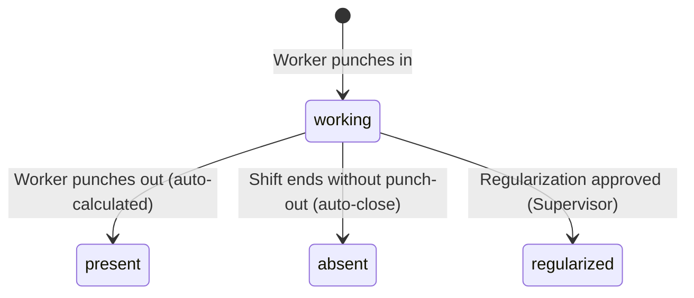
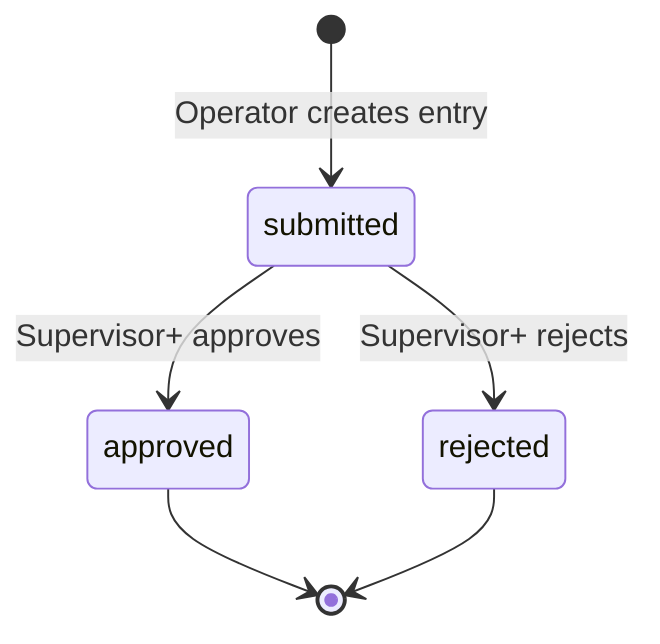
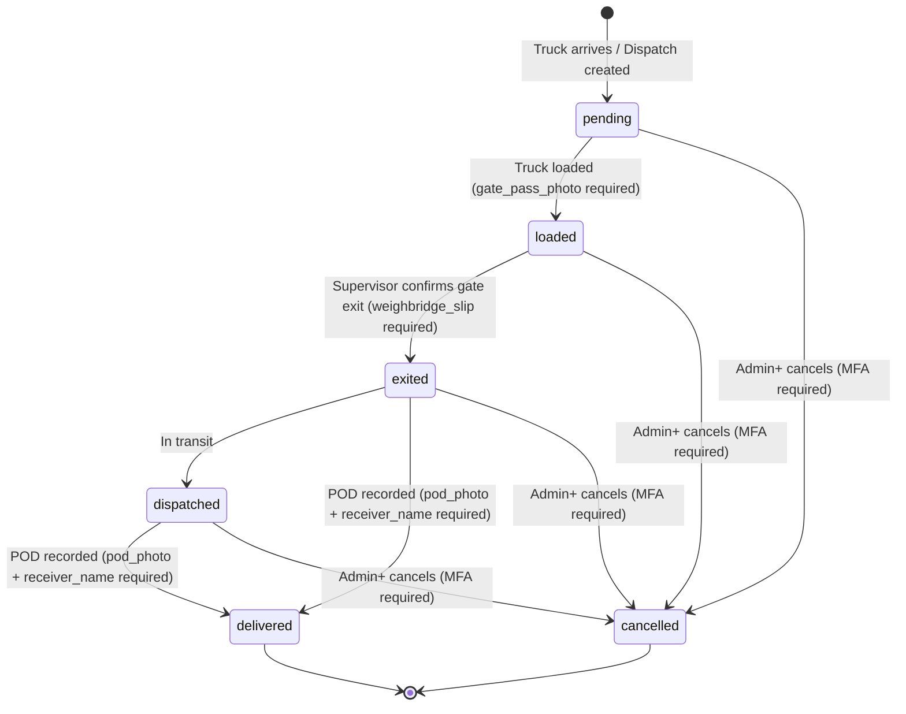
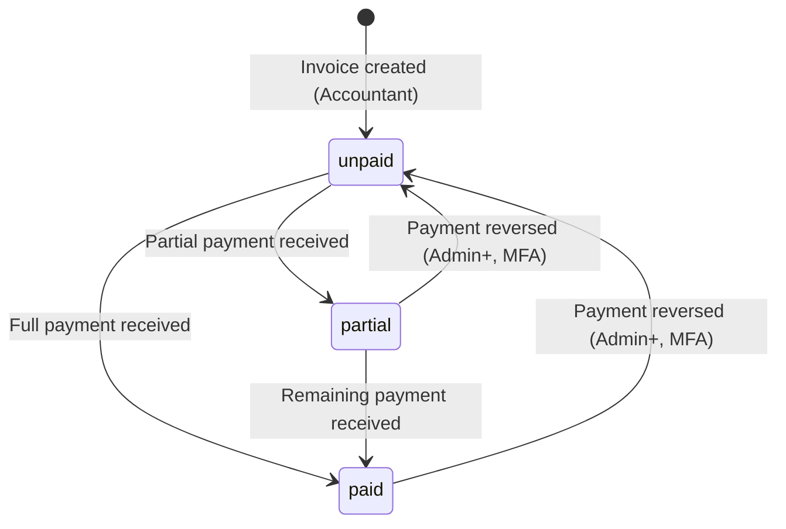
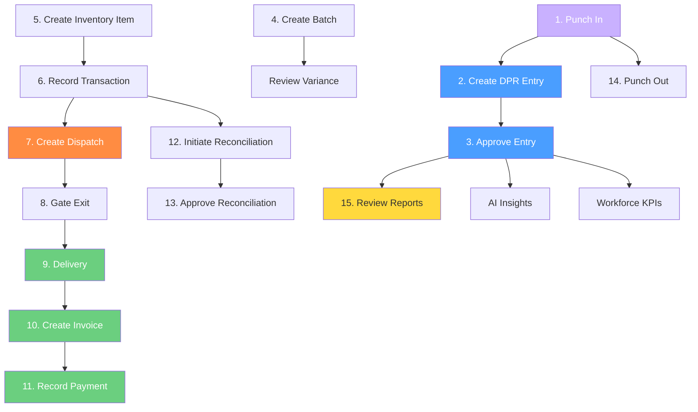

# FactoryNerve Operational Playbook

## Training & Testing Guide for Factory Employees

---

**Document Version:** v2.0  
**Based on:** FactoryNerve Operations Manual v1.0  
**Last Updated:** July 2026  

---

> 📌 **What This Document Is**
>
> This playbook describes how a real factory runs through FactoryNerve — one working day, stage by stage, role by role. It is written for factory employees who need to learn their daily tasks, not for software developers.
>
> If you can perform every step in this playbook correctly, you can run a full day of factory operations without ever asking a developer for help.

---

# Table of Contents

- [§10.1 — How to Use This Playbook](#101--how-to-use-this-playbook)
- [§10.2 — The Operational Day](#102--the-operational-day)
  - [Chapter 1 — Factory Opens & Attendance](#chapter-1--factory-opens--attendance)
  - [Chapter 2 — Production Recording](#chapter-2--production-recording)
  - [Chapter 3 — Supervisor Review & Approval](#chapter-3--supervisor-review--approval)
  - [Chapter 4 — Steel Operations: Batches & Inventory](#chapter-4--steel-operations-batches--inventory)
  - [Chapter 5 — Dispatch & Logistics](#chapter-5--dispatch--logistics)
  - [Chapter 6 — Invoicing, Customers & Payments](#chapter-6--invoicing-customers--payments)
  - [Chapter 7 — Management Review, Reports & AI Insights](#chapter-7--management-review-reports--ai-insights)
  - [Chapter 8 — End of Day & Closing](#chapter-8--end-of-day--closing)
- [§10.3 — Role Reference & Daily Scripts](#103--role-reference--daily-scripts)
- [§10.4 — Task Dependency & Sequencing Map](#104--task-dependency--sequencing-map)
- [§10.5 — End-to-End Test Scenarios](#105--end-to-end-test-scenarios)
- [§10.6 — Negative & Edge Case Test Bank](#106--negative--edge-case-test-bank)
- [§10.7 — Daily Smoke Test Checklist](#107--daily-smoke-test-checklist)
- [§10.8 — Bug Report Template](#108--bug-report-template)

---

# §10.1 — How to Use This Playbook

## Who This Is For

This playbook is written for:

| Reader | What You Will Learn |
|--------|-------------------|
| **New factory employee** | How to perform your daily work in FactoryNerve from start to end |
| **Shift supervisor** | How to review work, approve records, and hand off to the next role |
| **Accountant** | How to manage customers, invoices, payments, and reports |
| **Factory manager** | How to oversee operations, check analytics, and manage inventory |
| **System administrator** | How to configure users, settings, and factory profiles |
| **QA tester** | How to verify every workflow behaves as documented |
| **Factory owner** | How to review the full operational picture end to end |

## How the Day Narrative Works

The main section of this playbook (§10.2) follows **one complete working day** at a steel factory using FactoryNerve. Each chapter represents a stage of the day that happens in a real factory — from opening attendance in the morning to closing reports at the end of the shift.

Every stage tells you:

- **What needs to happen** — in plain operational language
- **Who does it** — which role performs the task
- **What they need first** — what must already be complete before starting
- **What happens after** — who picks up the work next
- **What can go wrong** — common mistakes and how to handle them

## Understanding the Markers

Throughout this document, you will see these markers:

| Marker | Meaning |
|--------|---------|
| ✅ **Enforced** | The system **will block** you if you try to do this wrong. Test this! |
| ℹ️ **Informational** | A recommended practice — the system does not enforce it |
| 🚨 **Common Mistake** | A frequent error that new users make |
| 💡 **Tip** | A shortcut or best practice |
| ⚠️ **Warning** | A situation that could cause data loss or incorrect records |
| 📝 **Note** | Additional context you should know |
| ✅ **Best Practice** | A recommended way of working |
| 📌 **Remember** | A key point to keep in mind |
| 🎯 **Goal** | What this workflow is designed to achieve |
| **Ref: [code path]** | A compact citation pointing to the source code or Operations Manual section that defines this behavior |

## Testing Philosophy

Every ✅ **Enforced** rule in this playbook can and should be tested. If the system does not block an action that this document says is enforced, that is a **bug** — please report it using the template in §10.8.

Rules marked ℹ️ **Informational** are recommended practices. The system will allow you to skip them, but doing so may cause downstream problems (inaccurate reports, missing data, delayed workflows).

## Operational Completeness Validation (OCV)

Every screen and workflow in the chapters that follow has been validated against the **Operational Completeness Validation (OCV)** checklist. This means each one has been checked for:

- ✅ Why the task exists, who performs it, when, and where
- ✅ What information is required and who provides it
- ✅ What validation occurs and the exact error message on failure
- ✅ What happens after submission — status changes, reports, queues, and notifications
- ✅ Which workflows begin, which end, and which role continues next
- ✅ What happens if the task fails or is skipped entirely
- ✅ Which business rule enforces the behavior (Enforced vs Informational)
- ✅ Whether every claim is backed by the Operations Manual or source code

## Verification Principle: Reconciling Sources

During the creation of this playbook, where the Operations Manual, source code, or UI appeared to disagree, the following principles were followed:

- The **source code implementation** is always treated as authoritative
- Known discrepancies between UI and backend are called out explicitly (e.g., credit limits that exist as UI fields but have no backend enforcement)
- If a workflow could not be fully verified, it is marked as **"Untested boundary — no enforced rule found"** rather than asserted as fact
- Expected results in test scenarios are always backed by either a Ref citation or explicitly marked as Untested boundary

## How to Report Issues

If you find something that does not match this playbook, use the Bug Report Template in §10.8 and send it to your system administrator or developer team.

---

# §10.2 — The Operational Day

---

## Chapter 1 — Factory Opens & Attendance

---

### Overview

🎯 **Goal:** Every worker records their arrival and prepares for the day's shift.

Every working day at the factory begins with attendance. Workers punch in to confirm their presence. The system tracks who is on shift, which shift they are working, and their total working hours. This data flows into payroll, workforce analytics, and productivity reports.

**Who is involved:**
- Attendance workers and Operators — punch in/out
- Supervisors — review attendance records and approve regularization requests
- Managers — configure shift templates and attendance profiles

**What comes before:** A new day begins — no prior tasks are required.

**What comes after:** Once punched in, workers proceed to their production tasks (Chapter 2).

---

### Screen: Attendance Punch-In

> 📷 **Screenshot Placeholder:** Navigation → Attendance → Punch-In Screen

**Purpose:** Record your arrival at the start of shift and your departure at shift end.

**Primary Users:** Attendance-only workers, Operators

**Navigation:** Dashboard → Attendance → Punch In/Out button, or directly visit `/attendance`

**Layout:**
- Current date and time displayed at the top
- Large **Punch In** button (visible before punching in)
- Large **Punch Out** button (visible after punching in)
- Shift selector (morning / evening / night)
- Weekly attendance summary below the punch buttons
- History tab showing past attendance records

**Fields:**

| Field | Required | What to Enter | Validation |
|-------|----------|--------------|------------|
| Shift | ✅ Yes | Select: morning, evening, or night | Must match available shift templates |
| Note | ❌ Optional | Any notes about late arrival or early departure | Max 500 characters |

**Actions:**

| Button | Who Can Use | What Happens | Ref |
|--------|------------|--------------|-----|
| **Punch In** | Attendance, Operator | Records arrival time with selected shift. Status becomes "working" | `attendance.self.punch` |
| **Punch Out** | Attendance, Operator | Records departure time. System calculates worked minutes | `attendance.self.punch` |
| **Request Regularization** | Attendance, Operator | Opens a form to explain a missed punch for a past date | `attendance.self.regularization.request` |

**What can go wrong:**

| Problem | What Happens | How to Fix |
|---------|-------------|------------|
| Forgot to punch in | No record of arrival | Submit a Regularization Request for that date |
| Forgot to punch out | Record stays "working" | System auto-closes at shift end, but may mark absent. Submit Regularization Request |
| Punched wrong shift | Wrong shift on record | Contact Supervisor to correct |
| Duplicate punch | System creates separate records | Contact Supervisor to remove the incorrect one |

**Permissions:**

| Action | Attendance | Operator | Supervisor+ |
|--------|-----------|----------|-------------|
| Punch In/Out | ✅ | ✅ | ✅ |
| View own attendance | ✅ | ✅ | ✅ |
| Request regularization | ✅ | ✅ | ✅ |
| Review others' attendance | ❌ | ❌ | ✅ |

**Related Screens:**
- `/attendance/review` — where Supervisors process regularization requests (see Chapter 3)

---

### How to Punch In (Step by Step)

1. **Navigate** to the Attendance screen from the Dashboard or menu.
2. **Select your shift** — morning, evening, or night.
3. **Click the Punch In button.** 
4. ✅ **Expected result:** The screen confirms your punch with the current time. Your status displays as "working."
5. 💡 **Tip:** Verify the time is correct. If it shows the wrong time, your device clock may need adjustment.

### How to Punch Out (Step by Step)

1. At the end of your shift, go to the Attendance screen.
2. Click the **Punch Out** button.
3. ✅ **Expected result:** The screen confirms your departure time and shows your total worked minutes for the day.

### How to Request Regularization (If You Missed a Punch)

1. Go to the Attendance screen.
2. Click **Request Regularization.**
3. Select the **date** you missed. ✅ **Enforced:** Must be a past date — future dates are blocked. [Ref: attendance.py — date validation]
4. Enter a **reason** for the missed punch.
5. Submit.
6. ✅ **Expected result:** The request appears in the Supervisor's review queue. Your attendance status shows "pending review."

### Current Shift Overview

```
        ╔══════════════════════════════════════╗
        ║        TODAY'S ATTENDANCE            ║
        ╠══════════════════════════════════════╣
        ║  Shift:    Morning (06:00 - 14:00)  ║
        ║  Status:   Present ✅                ║
        ║  Punched In:  06:03 AM               ║
        ║  Punched Out:  --:-- (pending)       ║
        ║  Worked:      5h 47m (ongoing)       ║
        ╚══════════════════════════════════════╝
```

---

### Status Lifecycle: Attendance Record



**Key Rules:**
- ✅ **Enforced:** Only workers with factory membership can punch. [Ref: attendance.py — PDP factory membership check]
- ✅ **Enforced:** Regularization cannot be requested for future dates. [Ref: attendance.py — date validation]
- ℹ️ **Informational:** No geo-fencing exists — workers can punch from anywhere.

### Summary

✅ Attendance records are the foundation of payroll, workforce intelligence, and labour cost analysis. Getting this right at the start of the day ensures accurate downstream data.

🚨 **Common mistake:** Forgetting to punch out at the end of the day. Always check your attendance record before leaving.

### Verification Checklist
- [ ] I can punch in and see my status change to "working"
- [ ] I know how to request regularization if I miss a punch
- [ ] I understand that regularization can only be requested for past dates (✅ Enforced)
- [ ] I know who to contact if I punch the wrong shift

### Related Chapters
→ **Chapter 2: Production Recording** — after punching in, proceed to record the shift's production output
→ **Chapter 3: Supervisor Review & Approval** — attendance regularization is reviewed by Supervisors

---

## Chapter 2 — Production Recording

---

### Overview

🎯 **Goal:** Record what was produced during the shift — units, manpower, downtime, quality issues, and materials used.

After attendance is recorded, the core work of the factory begins. At the end of each shift, the Operator creates a **Daily Production Report (DPR)** entry. This record captures everything that happened during the shift: how many units were produced versus the target, how many workers were present, how much downtime occurred, and any quality issues that arose.

The DPR entry is the single most important data record in FactoryNerve. It feeds:
- Production analytics and trends
- Workforce intelligence and worker efficiency
- AI anomaly detection and insights
- Reports for management review

**Who is involved:**
- **Operators** — create DPR entries at end of shift
- **Supervisors** — review and approve entries (next chapter)
- **AI system** — automatically generates a summary of each entry

**What comes before:** Workers must be punched in (Chapter 1) so that attendance data links to production records.

**What comes after:** Entries move to the Supervisor approval queue (Chapter 3).

---

### Screen: Create DPR Entry

> 📷 **Screenshot Placeholder:** Navigation → DPR Entry → New Entry Form

**Purpose:** Record the production results of one shift.

**Primary Users:** Operators

**Business Context:** At the end of every shift, the responsible Operator enters the shift's production data. This record becomes the official production log for the factory. Supervisors verify and approve it. Management reviews trends and makes decisions based on this data.

**Prerequisites:**
- ✅ You must be assigned to this factory
- ✅ You must not already have an entry for this date + shift ✅ **Enforced:** Duplicate entries are blocked. [Ref: Business Rule #1]
- 📝 **Tip:** If you already submitted an entry, edit the existing one instead of creating a duplicate

**Navigation:** Dashboard → DPR Entry or visit `/entry`

**Layout:**
- Date and shift selectors at the top
- Production numbers section (target, actual, performance)
- Manpower section (present, absent)
- Downtime section (minutes, reason)
- Quality section (issues toggle, details, rejection quantity)
- Materials section
- Notes section
- Submit button at the bottom

**Fields:**

| Field | Required | What to Enter | Validation | Business Meaning |
|-------|----------|--------------|------------|-----------------|
| Date | ✅ Yes | The date this shift covered | ✅ **Enforced:** Cannot be a future date [Ref: entries.py field_validator] | Which day's production this entry covers |
| Shift | ✅ Yes | Morning / Evening / Night | Must be valid shift type | Which shift period |
| Units Target | ✅ Yes | How many units you planned to produce | Must be > 0 | The production goal for the shift |
| Units Produced | ✅ Yes | How many units you actually made | Must be > 0 | Actual output |
| Manpower Present | ✅ Yes | Number of workers on the shift | Must be > 0 | Workers who attended |
| Manpower Absent | ✅ Yes | Number of workers absent | Must be >= 0 | Workers who were absent |
| Downtime Minutes | ✅ Yes | Minutes production was stopped | Must be >= 0 | Total lost production time |
| Downtime Reason | ❌ Optional | Why production stopped | Free text | Cause of downtime |
| Quality Issues | ✅ Yes | Toggle: Yes / No | Boolean | Whether any quality defects occurred |
| Quality Details | Conditional | Describe defects | Only if issues = Yes | Nature of quality problems |
| Rejection Quantity | Conditional | Units rejected | Only if issues = Yes | Number of rejected units |
| Defect Reason | Conditional | What caused the defect | Only if issues = Yes | Root cause of defect |
| Materials Used | ❌ Optional | Raw materials consumed | Free text | What materials went into production |

**Actions:**

| Button | Who Can Use | What Happens | Ref |
|--------|------------|--------------|-----|
| **Submit** | Operator+ | Creates entry with status "submitted." AI summary is auto-queued. | `production.entry.create` |
| **Smart Input** | Operator+ | Opens a text field to paste unstructured notes — AI extracts fields | Rate limit: 5 req/min |

**Validation Rules:**

| Rule | Error Message (if triggered) | Type |
|------|------------------------------|------|
| Date cannot be in the future | "Date must not be in the future" | ✅ Enforced |
| Duplicate date+shift | "An entry for this date and shift already exists" | ✅ Enforced |
| Units target must be > 0 | "Input should be greater than 0" | ✅ Enforced |
| Downtime minutes cannot be negative | "Input should be greater than or equal to 0" | ✅ Enforced |

**What can go wrong:**

| Problem | What Happens | How to Fix |
|---------|-------------|------------|
| Duplicate entry | System shows error 409 and blocks submission | Edit existing entry instead |
| Future date entered | System blocks with validation error | Correct the date |
| Wrong shift selected | Entry goes to wrong shift's data | Supervisor can edit within 24 hours |

**Permissions:**

| Action | Attendance | Operator | Supervisor+ |
|--------|-----------|----------|-------------|
| Create entry | ❌ | ✅ | ✅ |
| View entries | ❌ | ✅ | ✅ |
| Edit own entry (same day) | ❌ | ✅ (before review) | ✅ (within 24h) |
| Approve entries | ❌ | ❌ | ✅ |

**Hidden Behaviors:**
- After submission, the system automatically queues an AI-powered entry summary. [Ref: entries.py — _queue_entry_summary_job]
- If the entry has high downtime or quality issues, the system may create an operational alert for Supervisor review. [Ref: entries.py — check_entry_alerts()]

**Related Screens:**
- `/smart` — Smart Input for pasting unstructured notes
- `/entries` — Entry listing and search
- `/approvals` — Approval queue (see Chapter 3)

---

### Workflow: Record a Shift's Production

🎯 **Goal:** Create a complete, accurate DPR entry for one shift.

**Business Goal:** Capture every detail of the shift's production so the Supervisor can verify the completed work, management can review performance, and Inventory can reflect the newly produced stock.

**Actors Involved:** Operator (creates), AI system (auto-summarizes), Supervisor (reviews — next chapter)

**Starting Trigger:** End of shift OR when significant production data needs recording

**Required Inputs:** Date, shift, production numbers, manpower count, downtime info, quality info

**Step-by-Step Execution:**

1. **Operator navigates** to the DPR Entry screen.
2. **Selects the correct date** for the shift. ✅ **Enforced:** Cannot select a future date.
3. **Selects the correct shift** — morning, evening, or night.
4. **Enters production numbers:**
   - Units target (planned quantity)
   - Units produced (actual quantity)
5. **Enters manpower data:**
   - Number of workers present
   - Number of workers absent
6. **Enters downtime:**
   - Total minutes production was stopped
   - Reason for the downtime (optional but recommended)
7. **Reports quality issues:**
   - Toggle quality_issues = Yes if there were defects
   - If Yes, enter: rejection quantity, defect details, defect reason
8. **Optionally enters:** materials used, notes, scrap quantity
9. **Clicks Submit.**
10. ✅ **Expected result:** Entry is created with status "submitted." A confirmation message appears. The entry now appears in the Supervisor's approval queue.
11. 💡 **Tip:** After submission, you can view the auto-generated AI summary on the entry detail page.

**Alternative Method — Smart Input:**
1. Go to `/smart`.
2. Paste unstructured text (e.g., WhatsApp message, handwritten notes).
3. Click **Parse.**
4. ✅ **Expected result:** AI extracts fields and fills the form. Review and correct any errors before submitting.
5. ⚠️ **Warning:** Smart Input is rate limited to 5 requests per minute. If the AI confidence is low, the system falls back to the standard parser.

**Decision Points:**

```
        ┌─────────────────────┐
        │  End of shift       │
        │  Data to record?    │
        └──────────┬──────────┘
                   │
        ┌──────────▼──────────┐
        │  Structured data?   │
        │  (form fields)      │
        └──────┬──────┬───────┘
               │      │
        ┌──────▼─┐  ┌─▼──────────┐
        │ Use    │  │ Use Smart  │
        │ DPR    │  │ Input      │
        │ form   │  │ (paste     │
        │        │  │  notes)    │
        └───┬────┘  └─────┬──────┘
            │             │
            └──────┬──────┘
                   │
        ┌──────────▼──────────┐
        │     Submit          │
        │ ✅ Enforced: Not    │
        │    duplicate,       │
        │    not future date  │
        └──────────┬──────────┘
                   │
        ┌──────────▼──────────┐
        │ Status: submitted   │
        │ AI summary queued   │
        │ Ready for review    │
        └─────────────────────┘
```

**Approval Points:** None yet — the entry is in "submitted" status awaiting the Supervisor (next chapter).

**Business Rules:**
- ✅ **Enforced:** Only one entry per date+shift+factory. [Ref: Business Rule #1]
- ✅ **Enforced:** Date must not be in the future. [Ref: Business Rule #2]
- ℹ️ **Informational:** AI summary is auto-generated after submission if enabled. [Ref: Business Rule #6]

**Validation Rules:**
- Numeric fields: units_target > 0, units_produced > 0, downtime_minutes >= 0
- Date: must be valid, not future
- Shift: must be one of morning, evening, night
- Duplicate: 409 Conflict if entry already exists for same date+shift

**Error Recovery:**
- If the system returns a 409 Conflict: you already have an entry. Edit the existing entry instead.
- If the system returns a 422 Validation Error: check each field for the error message and correct the invalid value.
- If the system returns a 500 Server Error: the system has saved a copy of your failed payload for recovery. Please contact support.

**Completion Conditions:**
- Entry is created with status "submitted"
- Entry appears in the approval queue for Supervisors
- AI summary has been queued for generation

**Downstream Effects:**
- ✅ Approval queue is updated with a new pending item
- ✅ AI system begins summarization
- ℹ️ Anomaly detection checks for high downtime or quality issues
- ℹ️ Workforce intelligence will include this entry's data

**Notifications Sent:**
- No direct email notifications to Supervisors — they must check the approval queue manually
- In-app alert may be shown on the Supervisor's dashboard

**Next Responsible Role:** Supervisor (Chapter 3 — Review & Approval)

---

### Status Lifecycle: DPR Entry



**Transitions:**

| From | To | Triggered By | Required Permission | Ref |
|------|----|-------------|-------------------|-----|
| (none) | submitted | Operator creates entry | `production.entry.create` | entries.py |
| submitted | approved | Supervisor reviews and approves | `production.entry.approve` | entries.py |
| submitted | rejected | Supervisor reviews and rejects | `production.entry.approve` | entries.py |

**Rollback Rules:**
- ✅ **Enforced:** Once approved or rejected, only Supervisor+ can edit within 24 hours of creation. [Ref: entries.py — ~line 1150]
- ✅ **Enforced:** Operator cannot edit after Supervisor has reviewed. [Ref: entries.py — ~line 1140]

---

### Summary

✅ The DPR entry is the heartbeat of FactoryNerve. Accurate entries mean accurate reports, reliable AI insights, and trustworthy analytics.

🚨 **Common mistakes:**
- Creating a duplicate entry (system blocks it — edit the existing one)
- Entering a future date (system blocks it — use today's or a past date)
- Forgetting to record quality issues — always set the toggle correctly

### Verification Checklist
- [ ] I can create a DPR entry and see it in "submitted" status
- [ ] I understand I cannot create a duplicate entry for the same date+shift (✅ Enforced)
- [ ] I understand I cannot use a future date (✅ Enforced)
- [ ] I know the Smart Input alternative for pasting unstructured notes
- [ ] I understand that my entry goes to the Supervisor for approval

### Related Chapters
→ **Chapter 3: Supervisor Review & Approval** — after submission, entries await Supervisor approval
→ **Chapter 7: Management Review** — approved entries feed reports and analytics

---

## Chapter 3 — Supervisor Review & Approval

---

### Overview

🎯 **Goal:** Supervisors review pending work — production entries, attendance regularization, and OCR verifications — and either approve or reject them.

This is the quality gate of the factory. Nothing moves forward without Supervisor review. The Supervisor checks that the data is accurate, the work was completed correctly, and any irregularities are properly noted.

**Who is involved:**
- **Supervisors** — the primary approvers for most workflows
- **Managers** — may handle escalated approvals (L2 two-stage approval)
- **Operators** — their work is being reviewed

**What comes before:**
- Production entries created by Operators (Chapter 2)
- Regularization requests from workers who missed punches (Chapter 1)
- OCR-verified documents uploaded and submitted (scanning happens throughout the day)

**What comes after:**
- Approved production entries feed analytics and inventory
- Rejected entries go back to Operators with reasons
- Approved attendance records finalize payroll data

---

### Screen: Approval Queue

> 📷 **Screenshot Placeholder:** Navigation → Approvals

**Purpose:** A central place where Supervisors review every pending item that requires their decision.

**Primary Users:** Supervisors, Managers, Admins, Owners

**Business Context:** The approval queue is the Supervisor's command center. Every production entry, attendance regularization, and OCR verification that needs a decision appears here. Nothing moves downstream until the Supervisor acts.

**Prerequisites:** Items must be in "submitted" or "pending" status from their respective workflows.

**Navigation:** Dashboard → Approvals, or visit `/approvals`

**Layout:**
- Filter bar at the top: Module type, Status, Date range
- Table of pending items with columns: Type, ID, Submitted By, Date, Status, Actions
- Each row has **Approve** and **Reject** buttons (with optional reason text field)
- Pagination at the bottom

**Filters:**

| Filter | Options | Purpose |
|--------|---------|---------|
| Module | Production Entry, Attendance, OCR, Stock Reconciliation | Focus on one type |
| Status | Pending, Approved, Rejected | View items by decision state |
| Date Range | Custom date picker | Show items from specific days |

**Actions:**

| Button | Who Can Use | What Happens | Ref |
|--------|------------|--------------|-----|
| **Approve** | Supervisor+ | Entry/record status changes to "approved" | `production.entry.approve` |
| **Reject** | Supervisor+ | Entry/record status changes to "rejected," reason recorded | `production.entry.approve` |
| **View Details** | Supervisor+ | Opens the full record for review | Varies by module |

**Validation Rules:**
- ✅ **Enforced:** You cannot approve your own entry — maker-checker separation. [Ref: approval_instance.py — user_id guard]
- ✅ **Enforced:** For two-stage approvals (IP-3), the same person cannot clear both L1 and L2. [Ref: approval_instance.py ~line 100]

**Permissions:**

| Action | Operator | Supervisor | Manager+ |
|--------|----------|------------|----------|
| View approval queue | ❌ | ✅ | ✅ |
| Approve DPR entries | ❌ | ✅ | ✅ |
| Approve attendance | ❌ | ✅ | ✅ |
| Reject any item | ❌ | ✅ | ✅ |
| Clear L2 (two-stage) | ❌ | ❌ | ✅ |

**Hidden Behaviors:**
- The system tracks who approved or rejected and the reason given.
- Rejection reasons appear in the record's audit log.
- For OCR verifications, the approval domain matters: Operations OCR goes to Supervisor; Finance OCR goes to Accountant.

**Related Screens:**
- `/attendance/review` — Dedicated attendance approval screen
- `/ocr/verify` — Dedicated OCR verification screen
- Entry detail page — Full view of the production entry being reviewed

---

### Workflow: Review and Approve a DPR Entry

🎯 **Goal:** Verify that the Operator's production entry is accurate and complete, then approve it so the data flows into reports and analytics.

**Actors Involved:** Supervisor (reviewer), Operator (creator — already completed their part)

**Starting Trigger:** An Operator submits a DPR entry, placing it in the approval queue.

**Step-by-Step Execution:**

1. **Supervisor opens** the Approval Queue or navigates to `/entries` and filters by status "pending" / "submitted."
2. **Reviews the entry details:**
   - Check that the date and shift are correct.
   - Verify that units target and produced are reasonable.
   - Check manpower numbers against the shift roster.
   - Review downtime reason and quality issues.
3. **Makes a decision:**
   - If the data looks correct: Click **Approve.**
   - If there are errors or omissions: Click **Reject.** Enter a clear reason explaining what needs to be corrected.
4. ✅ **Expected result (approve):** Entry status changes to "approved." The data is now available in reports, analytics, and AI insights.
5. ✅ **Expected result (reject):** Entry status changes to "rejected" with the rejection reason stored. The Operator can see the reason and create a corrected entry.
6. 💡 **Tip:** Always provide a reason when rejecting. This helps the Operator understand what to fix and reduces back-and-forth.

**Decision Points:**

```
        ┌─────────────────────────────┐
        │  Pending entry in queue     │
        └─────────────┬───────────────┘
                      │
        ┌─────────────▼───────────────┐
        │  Review data carefully      │
        │  - Numbers reasonable?      │
        │  - Downtime explained?      │
        │  - Quality issues noted?    │
        └─────────────┬───────────────┘
                      │
            ┌─────────┴──────────┐
            │                    │
   ┌────────▼────────┐  ┌───────▼──────────┐
   │ Data correct?   │  │ Errors found?    │
   └────────┬────────┘  └───────┬──────────┘
            │                    │
   ┌────────▼────────┐  ┌───────▼──────────┐
   │ Click Approve    │  │ Click Reject     │
   │ Status: approved │  │ Enter reason     │
   │                  │  │ Status: rejected │
   └────────┬────────┘  └───────┬──────────┘
            │                    │
            └─────────┬──────────┘
                      │
        ┌─────────────▼───────────────┐
        │  ✓ Decision recorded in     │
        │  audit log                  │
        │  ✓ Next item appears        │
        └─────────────────────────────┘
```

**Approval Points:**
- This entire workflow IS the approval point. One decision — approve or reject.

**Business Rules:**
- ✅ **Enforced:** Same person cannot approve their own entry (maker-checker). [Ref: Business Rule implicit in approval_service.py]
- ✅ **Enforced:** Two-stage approvals (IP-3): L1 cleared by one person, L2 by a different person. [Ref: approval_instance.py ~line 100]

**Common Mistakes:**
- 🚨 Approving without checking details — always verify at least the date, shift, and units produced.
- 🚨 Rejecting without a reason — the Operator needs to know what to fix.
- 🚨 Trying to approve your own entry — the system will block you.

**Completion Conditions:**
- Entry is either "approved" or "rejected"
- Decision is recorded in the audit log
- If approved: data flows into analytics, reports, and AI

**Downstream Effects:**
- ✅ Approved entries feed into production reports and dashboards
- ✅ AI system has a complete record for analysis
- ✅ Workforce intelligence uses approved data for efficiency calculations
- ℹ️ Rejected entries require the Operator to create a new, corrected version

**Next Responsible Role:**
- If approved: Reports/analytics are now up to date — management (Chapter 7) can review
- If rejected: The Operator needs to create a corrected entry

---

### Workflow: Review Attendance Regularization

🎯 **Goal:** Verify that a worker's request to correct their attendance record is legitimate, and either approve or reject it.

**Actors Involved:** Supervisor (reviewer), Worker (requester)

**Starting Trigger:** A worker submits a regularization request for a missed punch.

**Step-by-Step Execution:**

1. **Supervisor opens** the Attendance Review screen at `/attendance/review`.
2. **Reviews the pending requests** — sorted by date, worker name.
3. **Checks the details:**
   - What date is the request for?
   - What reason did the worker give?
   - Does the reason seem legitimate?
4. **Makes a decision:**
   - **Approve:** The attendance record is updated to reflect the corrected time.
   - **Reject:** The record stays as-is. Enter a reason so the worker understands.
5. ✅ **Expected result (approve):** The worker's attendance record is corrected. Status reflects their actual attendance.
6. ✅ **Expected result (reject):** The request is marked as rejected with your reason logged.

---

### Workflow: Verify OCR Data

🎯 **Goal:** Cross-check OCR-extracted data against the original paper document, and either approve it (making the data official) or reject it for rework.

**Actors Involved:** Supervisor (operations domain), Accountant (finance domain), Operator (uploader)

**Starting Trigger:** An Operator uploads a document and submits the OCR-extracted data for verification.

**Step-by-Step Execution:**

1. **Supervisor navigates** to `/ocr/verify`.
2. **Filters** by domain (operations) and status (pending).
3. **Opens a verification record** — the original document image and the extracted data are shown side by side.
4. **Compares** the extracted data against the image:
   - Are the numbers correct?
   - Are the dates and quantities accurate?
   - Is any data missing or garbled?
5. **If corrections are needed:** Edit the extracted fields directly.
6. **Makes a decision:**
   - **Approve:** Data becomes official — can be used to create entries or inventory transactions.
   - **Reject:** Data is sent back to the Operator for correction.
7. ✅ **Expected result:** OCR verification is marked approved or rejected, and downstream workflows can proceed.

---

### Summary

✅ The Supervisor role is the most operationally critical role in FactoryNerve. Every approval decision affects the accuracy of reports, analytics, and downstream workflows.

🚨 **Common mistakes:**
- Rushing through approvals without verifying data
- Rejecting without providing a reason
- Attempting to self-approve (system blocks this)
- Approving OCR data for the wrong domain (operations vs. finance)

### Verification Checklist
- [ ] I can view the approval queue and see pending items
- [ ] I can approve and reject entries
- [ ] I understand I cannot approve my own entry (✅ Enforced — maker-checker)
- [ ] I understand gate exit and delivery confirmation are Supervisor-only actions (✅ Enforced)
- [ ] I know the difference between operations-domain OCR and finance-domain OCR

### Related Chapters
→ **Chapter 2: Production Recording** — Operators create the entries I review
→ **Chapter 4: Steel Operations** — after approval, batch and inventory work proceeds
→ **Chapter 5: Dispatch & Logistics** — dispatch gate exit requires Supervisor action

---

## Chapter 4 — Steel Operations: Batches & Inventory

---

### Overview

🎯 **Goal:** Track steel production batches, manage inventory items, and reconcile physical stock with system records.

This chapter covers the steel-specific operations that happen during and after production. Steel batches track expected vs. actual output to detect material loss. Inventory management tracks all stock movements. Stock reconciliation verifies that physical stock matches the system's records.

**Who is involved:**
- **Supervisors** — create batches, view inventory, participate in reconciliation
- **Managers** — manage inventory items, create transactions, initiate reconciliations
- **Admins** — approve reconciliation results
- **Operators** — view inventory and batches (read-only)

**What comes before:** Production batches should follow the actual production run. DPR entries (Chapter 2) record shift-level output.

**What comes after:** Batch data informs dispatch (Chapter 5) and invoicing (Chapter 6).

---

### Screen: Steel Batch Creation

> 📷 **Screenshot Placeholder:** Steel → Batches → Create New Batch

**Purpose:** Record a steel production batch, including input materials, expected output, and actual output.

**Primary Users:** Supervisors, Managers

**Business Context:** Every production run in the steel factory consumes raw material and produces finished goods. The batch record tracks both — allowing the system to compute the difference (loss/variance) and flag unusual results.

**Prerequisites:**
- ✅ Inventory items must exist for both input material and output product [Ref: steel.py — _get_item_or_404]
- ✅ Production date must not be in the future

**Navigation:** Steel → Batches → Create New Batch

**Fields:**

| Field | Required | What to Enter | Validation |
|-------|----------|--------------|------------|
| Production Date | ✅ Yes | Date the batch was produced | ✅ **Enforced:** Not future |
| Input Item | ✅ Yes | Select from inventory items | Must exist in same factory |
| Output Item | ✅ Yes | Select from inventory items | Must exist in same factory |
| Input Quantity (kg) | ✅ Yes | Weight of input material used | Must be > 0 |
| Expected Output (kg) | ✅ Yes | Expected yield from input | Must be > 0 |
| Actual Output (kg) | ✅ Yes | What was actually produced | Must be > 0 |
| Scrap Qty (kg) | ❌ No | Scrap generated | >= 0 |
| Rejection Qty (kg) | ❌ No | Rejected output | >= 0 |
| Heat Number | ❌ No | BIS/ISI traceability number | Free text |
| Notes | ❌ No | Any additional information | Free text |

**Auto-computed Fields (read-only):**

| Field | How It's Calculated | Business Meaning |
|-------|-------------------|-----------------|
| Loss (kg) | Input Qty − Actual Output | Material that wasn't recovered |
| Loss % | Loss / Input Qty × 100 | Efficiency metric |
| Severity | < 3% = Normal, 3-10% = High, > 10% = Critical | Attention required indicator |

**Actions:**

| Button | Who Can Use | What Happens | Ref |
|--------|------------|--------------|-----|
| **Create Batch** | Supervisor+, Manager+ | Batch created with severity auto-computed | `production.batch.create` |
| **View Variance** | Manager+ | Review detailed variance analysis | `production.batch.variance.approve` |

**Permissions:**

| Action | Operator | Supervisor | Manager+ |
|--------|----------|------------|----------|
| View batches | ✅ (read) | ✅ | ✅ |
| Create batches | ❌ | ✅ | ✅ |
| Approve variance | ❌ | ❌ | ✅ |

**What can go wrong:**

| Problem | What Happens | Fix |
|---------|-------------|-----|
| Input item doesn't exist | Creation blocked | Create the item first in Inventory |
| Duplicate batch code | Creation blocked | Use a unique batch code |
| Very high loss % (>10%) | Severity = Critical, no auto-notification | Manually flag for Manager attention |

**Related Screens:**
- `/steel/inventory` — where items are created and managed
- `/steel/batches` — batch listing with severity indicators

---

### Screen: Inventory Management

> 📷 **Screenshot Placeholder:** Steel → Inventory

**Purpose:** View all inventory items, their current stock levels, and the transaction history (ledger).

**Primary Users:** Managers (create/edit items), Supervisors (view), Operators (view read-only)

**Navigation:** Steel → Inventory

**Layout:**
- Item list table with columns: Item Code, Name, Category, Current Balance (kg), Rate per kg (financial roles only), Reorder Point, Confidence
- Filter bar: by category, search by name/code
- Each item row: click to view ledger/transaction history
- Create New Item button (Managers+)

**Key Behaviors:**
- ℹ️ **Informational:** The "Reorder Point" field exists but is not enforced — no alert is triggered when stock falls below it. [Ref: inventory check]
- ℹ️ **Informational:** Stock balance is calculated as sum of all inward transactions minus all outward transactions (append-only ledger).
- ✅ **Hidden:** The Rate per kg column is **redacted** for Operator and Supervisor roles. Only Accountant+ roles can see financial data. [Ref: steel.py — financial field redaction]

**Actions:**

| Button | Who Can Use | What Happens | Ref |
|--------|------------|--------------|-----|
| **Create Item** | Manager+ | Adds new item to inventory | `inventory.item.manage` |
| **Edit Item** | Manager+ | Modifies item details | `inventory.item.manage` |
| **Record Transaction** | Manager+ | Adds inward/outward ledger entry | `inventory.transaction.create` |
| **View Ledger** | Operator+ | Shows all transactions for an item | `inventory.ledger.view` |

**Fields (Create Item Form):**

| Field | Required | Validation |
|-------|----------|-----------|
| Item Code | ✅ Yes | 2-40 characters, auto-normalized |
| Name | ✅ Yes | 2-160 characters |
| Category | ✅ Yes | Must select from valid categories |
| Rate per kg | ❌ No | >= 0 (financial role visible) |
| HSN Code | ❌ No | Max 12 characters |
| GST Rate | ❌ No | >= 0 |

---

### Workflow: Record and Review a Steel Production Batch

🎯 **Goal:** Record a production run and review the variance to detect material loss or process issues.

**Actors Involved:** Supervisor (create), Manager (review variance if needed)

**Starting Trigger:** A production run is completed and results are available.

**Step-by-Step Execution:**

1. **Supervisor navigates** to Steel → Batches → Create New Batch.
2. **Enters the production details:**
   - Date of production
   - Input material item and quantity used
   - Output product item and quantity produced
   - Expected output (based on standard yield)
3. **Clicks Create Batch.**
4. ✅ **Expected result:**
   - Batch is recorded with status "recorded"
   - Loss %, severity, and variance are auto-computed
   - Severity shows: Normal (< 3%), High (3-10%), or Critical (> 10%)
5. **If severity is High or Critical:** The Supervisor should flag this to the Manager for review.
6. **Manager reviews** the variance and decides if any action is needed (process improvement, investigation).
7. 💡 **Tip:** The system does not auto-create inventory transactions for batch input/output. You need to record these separately in the Inventory module.

**Completion Conditions:**
- Batch is saved with severity classification
- Variance can be viewed and analyzed

**Downstream Effects:**
- ℹ️ Batch data appears in the batch listing with severity color-coding
- ℹ️ Manager can review variance if severity is High or Critical
- ⚠️ **Note:** Inventory is NOT automatically updated when a batch is created. Record inventory transactions separately.

**Next Responsible Role:** Manager (review variance for High/Critical severity)

---

### Summary

✅ Steel batches and inventory form the backbone of material tracking. Accurate batch records help detect theft, process loss, and quality issues. Accurate inventory ensures dispatch and invoicing are based on real stock levels.

⚠️ **Important limitation:** Inventory is NOT automatically updated when a batch is created. You must record inventory transactions separately through the Inventory module. However, inventory IS automatically deducted when a dispatch reaches "exited" status — so the two inventory update paths are independent. [Ref: dispatch.py vs batch creation — different mechanisms]

🚨 **Common mistakes:**
- Creating a batch but forgetting to record inventory transactions separately
- Not flagging Critical severity batches for Manager review
- Creating duplicate item codes (system blocks this with a unique constraint)

### Verification Checklist
- [ ] I can create a steel production batch and see severity auto-computed
- [ ] I understand the difference between Normal (<3%), High (3-10%), and Critical (>10%) severity
- [ ] I understand inventory transactions must be recorded separately for batch inputs/outputs (ℹ️ Informational)
- [ ] I can view inventory items and their stock balances
- [ ] I know that financial fields (rate per kg) are hidden from Operator/Supervisor roles (⚠️ UI behavior — backend redaction confirmed)

### Related Chapters
→ **Chapter 5: Dispatch & Logistics** — inventory is consumed during dispatch
→ **Chapter 6: Invoicing** — inventory items are used in invoice line items

---

## Chapter 5 — Dispatch & Logistics

---

### Overview

🎯 **Goal:** Manage truck dispatch from gate entry to delivery — including loading, gate exit, transit tracking, and proof of delivery.

Dispatch is the physical movement of goods from the factory to the customer. The system tracks each truck's full lifecycle: from arrival (pending), through loading, gate exit, and transit, to final delivery with proof of delivery (POD) documentation.

**Who is involved:**
- **Supervisors** — create dispatches, confirm gate exit, record delivery
- **Managers** — update dispatch status
- **Admins** — cancel dispatches (requires MFA for security)

**What comes before:** Inventory must exist (Chapter 4) for dispatched goods. Customer invoices (Chapter 6) can reference dispatch data.

**What comes after:** Dispatch delivery triggers inventory deduction and completes the customer order cycle.

---

### Screen: Dispatch Management

> 📷 **Screenshot Placeholder:** Steel → Dispatches

**Purpose:** Track the full lifecycle of each truck dispatch from gate entry through to delivery.

**Primary Users:** Supervisors (create, exit, deliver), Managers (update), Admins (cancel)

**Business Context:** Every truck that carries goods out of the factory is tracked. The system records key events: truck arrival, loading, weighbridge reading, gate exit, and delivery confirmation. This provides a complete audit trail and ensures inventory is deducted at the correct time.

**Prerequisites:**
- ✅ Items to dispatch must exist in inventory
- ✅ For gate exit: weighbridge slip photo is required [Ref: dispatch state machine]
- ✅ For delivery: POD photo and receiver name are required [Ref: dispatch state machine]

**Navigation:** Steel → Dispatches

**Layout:**
- Dispatch list with status indicators (color-coded)
- Filter by: status, date range, truck number
- Create New Dispatch button
- Each dispatch row shows: number, truck, driver, status, dates
- Click to view detail and take actions

**Status Indicators:**

| Status | Color | Meaning |
|--------|-------|---------|
| Pending | Blue | Truck has arrived, being loaded |
| Loaded | Yellow | Truck is loaded, ready for gate exit |
| Exited | Orange | Truck has left the factory |
| Dispatched | Purple | In transit to customer |
| Delivered | Green | Delivery confirmed with POD |
| Cancelled | Red | Dispatch was cancelled |

**Fields (Create Dispatch Form):**

| Field | Required | What to Enter |
|-------|----------|--------------|
| Truck Number | ✅ Yes | Vehicle registration number |
| Driver Name | ✅ Yes | Driver's full name |
| Driver Phone | ✅ Yes | Contact number |
| Destination | ✅ Yes | Delivery location |
| Items | ✅ Yes | Line items: item + quantity |
| Dispatch Date | ✅ Yes | Date of dispatch |
| Notes | ❌ No | Any special instructions |

**Actions per Status:**

| Current Status | Available Actions | Required Permission | Required Documents |
|---------------|------------------|-------------------|-------------------|
| Pending | Move to Loaded | `dispatch.record.update` | Gate pass photo required |
| Pending | Cancel | `dispatch.record.cancel` (Admin+, MFA) | — |
| Loaded | Move to Exited | `dispatch.record.update` (Supervisor only) | Weighbridge slip photo required |
| Loaded | Cancel | `dispatch.record.cancel` (Admin+, MFA) | — |
| Exited | Move to Dispatched | `dispatch.record.update` | — |
| Exited | Move to Delivered | `dispatch.record.update` (Supervisor only) | POD photo + receiver name required |
| Exited | Cancel | `dispatch.record.cancel` (Admin+, MFA) | — |
| Dispatched | Move to Delivered | `dispatch.record.update` (Supervisor only) | POD photo + receiver name required |
| Dispatched | Cancel | `dispatch.record.cancel` (Admin+, MFA) | — |
| Delivered | (terminal) | — | — |
| Cancelled | (terminal) | — | — |

**Permissions:**

| Action | Operator | Supervisor | Manager | Admin+ |
|--------|----------|------------|---------|--------|
| View dispatches | ✅ | ✅ | ✅ | ✅ |
| Create dispatch | ❌ | ✅ | ✅ | ✅ |
| Update status (general) | ❌ | some states | ✅ | ✅ |
| Confirm gate exit | ❌ | ✅ | ❌ | ❌ |
| Confirm delivery | ❌ | ✅ | ❌ | ❌ |
| Cancel dispatch | ❌ | ❌ | ❌ | ✅ (MFA) |

**Validation Rules:**
- ✅ **Enforced:** Gate exit requires weighbridge slip photo. [Ref: dispatch.py — mandatory field check]
- ✅ **Enforced:** Delivery requires POD photo + receiver name. [Ref: dispatch.py — mandatory field check]
- ✅ **Enforced:** Only Supervisor role can move dispatch to "exited" or "delivered" status. [Ref: dispatch.py — role guard]
- ✅ **Enforced:** Cancellation is Admin+ only with MFA verification. [Ref: dispatch.py — MFA guard]

**Hidden Behavior:**
- ✅ **Enforced:** When a dispatch reaches "exited," "dispatched," or "delivered" status, inventory is automatically deducted. [Ref: dispatch.py — _dispatch_status_posts_inventory]
- ℹ️ **Informational:** No automatic notification is sent to the customer when the dispatch is created or delivered.

**Related Screens:**
- `/steel/inventory` — stock levels update automatically on dispatch exit/delivery
- Invoices — dispatches can reference sales invoices

---

### Workflow: Full Dispatch Lifecycle

🎯 **Goal:** Move a truckload from factory gate to customer delivery, with all required documentation at each step.

**Actors Involved:** Supervisor (create, exit, deliver), Admin (cancel if needed)

**Starting Trigger:** A truck arrives at the factory to pick up goods.

**Step-by-Step Execution:**

#### Stage 1: Truck Arrives at Gate
1. **Supervisor creates a dispatch** at Steel → Dispatches → Create New.
2. **Enters:** truck number, driver name, phone, destination, items being dispatched, quantity.
3. **Clicks Create.**
4. ✅ **Expected result:** Dispatch status = "pending." Truck is recorded in the system.

#### Stage 2: Truck is Loaded
5. Once the truck is loaded:
   - Take a photo of the **gate pass**.
   - Click **Move to Loaded**.
   - Upload the gate pass photo.
6. ✅ **Expected result:** Status changes to "loaded."

#### Stage 3: Truck Exits Gate
7. At the gate:
   - Take a photo of the **weighbridge slip** (required).
   - **Only a Supervisor** can perform this step. [Ref: dispatch.py — role guard]
   - Click **Confirm Gate Exit**.
   - Upload the weighbridge slip photo.
8. ✅ **Expected result:** Status changes to "exited." Inventory is deducted automatically. [Ref: dispatch.py — inventory posting]
9. 🚨 **Common mistake:** Forgetting to take the weighbridge slip photo. The system will block the gate exit without it.

#### Stage 4: In Transit
10. The truck is on the road. Status can remain "exited" or be set to "dispatched" (in transit).

#### Stage 5: Delivery Confirmed
11. At the customer location:
    - Take a photo of the **proof of delivery (POD)**.
    - Get the **receiver's name**.
    - **Only a Supervisor** can perform this step. [Ref: dispatch.py — role guard]
    - Click **Confirm Delivery**.
    - Upload the POD photo and enter the receiver's name.
12. ✅ **Expected result:** Status changes to "delivered" (terminal state). The dispatch is complete.

**Cancellation (if needed):**
- At any stage before delivery, an **Admin** can cancel the dispatch.
- Admin must complete **MFA verification**. [Ref: dispatch.py — MFA guard]
- ✅ **Expected result:** Status changes to "cancelled" (terminal state). No inventory deduction occurs (or reversal if already deducted).

**Decision Tree:**

```
        ┌──────────────────────────────┐
        │  Truck arrives at factory    │
        │  Supervisor creates dispatch │
        │  Status: PENDING             │
        └──────────────┬───────────────┘
                       │
        ┌──────────────▼───────────────┐
        │  Truck loaded                │
        │  Upload gate pass photo      │
        │  Status: LOADED              │
        └──────────────┬───────────────┘
                       │
        ┌──────────────▼───────────────┐
        │  Truck at gate exit          │
        │  Upload weighbridge slip     │
        │  (Supervisor only)           │
        │  ✅ Inventory deducted       │
        │  Status: EXITED              │
        └──────────────┬───────────────┘
                       │
              ┌────────┴────────┐
              │                 │
     ┌────────▼──────┐  ┌──────▼──────────┐
     │ In transit    │  │ Delivered       │
     │ Status:       │  │ Upload POD +    │
     │ DISPATCHED    │  │ receiver name   │
     └────────┬──────┘  │ (Supervisor)    │
              │         └──────┬──────────┘
              └────────┬───────┘
                       │
        ┌──────────────▼───────────────┐
        │  Status: DELIVERED           │
        │  ✓ Terminal state            │
        │  ✓ Audit trail complete      │
        └──────────────────────────────┘
```

**Business Rules:**
- ✅ **Enforced:** Gate exit requires weighbridge slip photo. [Ref: Dispatch State Machine]
- ✅ **Enforced:** Delivery requires POD photo + receiver name. [Ref: Dispatch State Machine]
- ✅ **Enforced:** Only Supervisor can confirm gate exit and delivery. [Ref: dispatch.py — role guard]
- ✅ **Enforced:** Cancellation requires Admin+ with MFA. [Ref: dispatch.py — MFA guard]
- ✅ **Enforced:** Inventory is deducted when dispatch reaches exited/dispatched/delivered status. [Ref: dispatch.py — inventory posting]

**Completion Conditions:**
- Status = "delivered" with POD documentation
- All documentation (photos, names) attached to the dispatch record
- Inventory correctly deducted

**Downstream Effects:**
- ✅ Inventory balance is updated (goods are now "out")
- ✅ Dispatch record provides complete audit trail from gate to delivery
- ℹ️ Dispatch data can be referenced by invoices

---

### Status Lifecycle: Dispatch



**Flow Rules:**

| From | To | Required Document | Required Role | Inventory Effect |
|------|----|------------------|--------------|-----------------|
| Pending | Loaded | Gate pass photo | Any update role | None |
| Loaded | Exited | Weighbridge slip photo | Supervisor only | Deducted |
| Exited | Dispatched | None | Any update role | (already deducted) |
| Exited | Delivered | POD photo + receiver name | Supervisor only | (already deducted) |
| Dispatched | Delivered | POD photo + receiver name | Supervisor only | (already deducted) |
| Any non-terminal | Cancelled | None | Admin+ (MFA) | Reversed if deducted |

---

### Summary

✅ Dispatch management ensures every truck leaving the factory is tracked, documented, and audited. Gate exit documents are mandatory, delivery requires proof, and inventory is automatically updated.

🚨 **Common mistakes:**
- Forgetting to take required photos (gate pass, weighbridge slip, POD) — the system will block status transitions without them
- Trying to confirm gate exit without being a Supervisor — only Supervisor role can do this
- Not completing delivery confirmation — dispatch stays in "exited" or "dispatched" state indefinitely

### Verification Checklist
- [ ] I can create a dispatch and see status "pending"
- [ ] I understand gate exit requires a weighbridge slip photo (✅ Enforced)
- [ ] I understand delivery requires POD photo and receiver name (✅ Enforced)
- [ ] I know that only a Supervisor can confirm gate exit and delivery (✅ Enforced)
- [ ] I know that dispatch cancellation requires Admin+ with MFA (✅ Enforced)
- [ ] I understand that inventory is automatically deducted on dispatch exit (✅ Enforced)

### Related Chapters
→ **Chapter 4: Steel Operations** — inventory items must exist before dispatch
→ **Chapter 6: Invoicing** — invoices can reference dispatches

---

## Chapter 6 — Invoicing, Customers & Payments

---

### Overview

🎯 **Goal:** Create sales invoices, manage customer accounts, record payments, and track collections.

This chapter covers the financial operations of the factory. Sales invoices are created for dispatched goods. Customer master records track credit limits and verification status. Payments are recorded against invoices, and follow-up tasks help manage collections.

**Who is involved:**
- **Accountants** — primary operators for invoicing, payments, and customer management
- **Managers** — edit invoices pre-dispatch, oversee financial operations
- **Admins** — void invoices, reverse payments (requires MFA)
- **Supervisors** — can view financial data

**What comes before:** Goods must be dispatched (Chapter 5) to create invoices — though invoices can technically be created independently.

**What comes after:** Payments and collection activities close the order-to-cash cycle.

---

### Screen: Sales Invoice Creation

> 📷 **Screenshot Placeholder:** Steel → Invoices → Create New Invoice

**Purpose:** Create a weight-based sales invoice with GST auto-calculation for goods sold.

**Primary Users:** Accountants, Managers

**Business Context:** Invoices represent the financial side of goods leaving the factory. Each invoice is linked to a customer, contains line items with weight × rate calculations, and has GST automatically computed.

**Prerequisites:**
- ✅ Customer must exist in the system (create them first)
- ✅ Inventory items being invoiced must exist
- ✅ Invoice line total must not exceed ₹10,000,000 [Ref: steel.py — line total max]

**Navigation:** Steel → Invoices → Create New

**Fields (Invoice Header):**

| Field | Required | What to Enter | Validation |
|-------|----------|--------------|------------|
| Customer | ✅ Yes | Select from customer list | Customer must exist |
| Invoice Date | ✅ Yes | Date of invoice | Must be valid date |
| Due Date | ✅ Yes | Payment due date | Must be after invoice date |
| Reference | ❌ No | Optional reference number | Free text |
| Notes | ❌ No | Additional notes | Free text |

**Fields (Invoice Lines):**

| Field | Required | Validation | Notes |
|-------|----------|-----------|-------|
| Item | ✅ Yes | Must exist in inventory | Select from dropdown |
| Weight (kg) | ✅ Yes | > 0 | Quantity being invoiced |
| Rate per kg | ✅ Yes | > 0 for finished goods | Price per kilogram |
| HSN Code | ❌ No | Max 12 chars | Auto-filled from item if set |
| GST Rate | ❌ No | >= 0 | Auto-filled from item if set |

**Auto-computed Fields:**

| Field | Calculation |
|-------|------------|
| Line Total | Weight × Rate per kg |
| Taxable Amount | Sum of all line totals |
| CGST Amount | (Taxable × GST%) / 2 |
| SGST Amount | (Taxable × GST%) / 2 |
| Total Amount | Taxable + CGST + SGST |
| Total Weight | Sum of all line weights |

**Validation Rules:**
- ✅ **Enforced:** Maximum 25 lines per invoice. [Ref: steel.py — max lines guard]
- ✅ **Enforced:** Line total maximum ₹10,000,000. [Ref: steel.py — line total guard]
- ✅ **Enforced:** Rate per kg must be > 0 for finished goods categories. [Ref: steel.py — rate validation]
- ℹ️ **Informational:** No minimum total amount check.

**Actions:**

| Button | Who Can Use | What Happens | Ref |
|--------|------------|--------------|-----|
| **Create Invoice** | Accountant+ | Invoice created with status "unpaid" | `invoice.record.create` |
| **Edit Invoice** | Manager+ | Modify pre-dispatch invoices | `invoice.record.edit` |
| **Void Invoice** | Admin+ (MFA) | Make invoice invalid | `invoice.record.void` |

**Permissions:**

| Action | Operator | Supervisor | Accountant | Manager | Admin+ |
|--------|----------|------------|------------|---------|--------|
| View invoices | ❌ | ✅ | ✅ | ✅ | ✅ |
| Create invoices | ❌ | ❌ | ✅ | ✅ | ✅ |
| Edit invoices | ❌ | ❌ | ❌ | ✅ | ✅ |
| Void invoices | ❌ | ❌ | ❌ | ❌ | ✅ (MFA) |

**Related Screens:**
- `/steel/customers` — Customer master management
- `/steel/customer-payments` — Payment recording and allocation
- Dispatches — dispatch records can reference invoices

---

### Screen: Customer Master

> 📷 **Screenshot Placeholder:** Steel → Customers

**Purpose:** Manage customer information, credit limits, and identity verification.

**Primary Users:** Accountants (create, edit), Admins (verify identity documents)

**Navigation:** Steel → Customers

**Fields:**

| Field | Required | Validation |
|-------|----------|-----------|
| Name | ✅ Yes | Must be unique |
| GST Number | ❌ No | Auto-format validated when entered |
| PAN Number | ❌ No | Auto-format validated when entered |
| Credit Limit | ❌ No | >= 0 (no enforcement) |
| Address | ❌ No | Free text |
| Status | System-set | active / on_hold / blocked |

**Verification Status Lifecycle:**

```
draft → format_valid → pending_review → verified / mismatch / rejected
```

- ✅ **Enforced:** PAN and GST numbers are format-validated when entered. [Ref: steel.py — format check]
- ✅ **Enforced:** Only Admin+ can verify identity documents. [Ref: `customer.verification.review`]
- ℹ️ **Informational:** Risk score is computed but not enforced — it's for the Accountant's information.
- ℹ️ **Informational:** Customer can be set to "on_hold" or "blocked" but no hard enforcement prevents transactions with blocked customers.

**Auto-alerts (Informational):**
| Condition | Severity |
|-----------|----------|
| Customer on hold | Critical |
| Identity verification issue | Critical |
| Overdue exposure | Warning |
| Credit limit pressure | Warning |
| Collection follow-up open | Info |

---

### Workflow: Create an Invoice and Record Payment

🎯 **Goal:** Bill the customer for goods delivered and record their payment.

**Actors Involved:** Accountant (create invoice, record payment), Manager (edit if needed), Admin (void if needed)

**Starting Trigger:** Goods are dispatched (Chapter 5) or a sale is agreed.

**Step-by-Step Execution:**

1. **Accountant navigates** to Steel → Invoices → Create New.
2. **Selects the customer** — must already exist in the system. If not, create the customer first.
3. **Enters invoice header** — date, due date, any reference.
4. **Adds line items** — each with item, weight, rate, and optional HSN/GST.
   - ✅ **Enforced:** Max 25 lines. [Ref: steel.py]
   - ✅ **Enforced:** Line total max ₹10,000,000. [Ref: steel.py]
   - ✅ **Enforced:** Rate per kg > 0 for finished goods. [Ref: steel.py]
5. **Reviews the auto-calculated totals** — taxable amount, GST, total.
6. **Clicks Create Invoice.**
7. ✅ **Expected result:** Invoice created with status "unpaid."
8. **Sends the invoice to the customer** (outside the system — no automated sending).

**Recording Payment:**

1. When payment arrives, go to Customer Payments.
2. Select the **customer** and the **invoice(s)** being paid.
3. Enter the **payment amount**, **payment date**, and **payment method**.
4. Click **Record Payment.**
5. ✅ **Expected result:**
   - If full payment: invoice status changes to "paid"
   - If partial payment: invoice status changes to "partial"
   - Payment allocation is recorded

**Business Rules:**
- ✅ **Enforced:** Invoice voiding requires Admin+ role with MFA. [Ref: `invoice.record.void`]
- ✅ **Enforced:** Payment reversal requires Admin+ role with MFA. [Ref: `payment.record.reverse`]
- ℹ️ **Informational:** No auto-notification sent to customer about invoice creation or overdue reminder.

**Completion Conditions:**
- Invoice is created and GST is correctly computed
- Payment is recorded and allocated to the correct invoice(s)

**Downstream Effects:**
- ✅ Invoice status reflects payment progress (unpaid → partial → paid)
- ℹ️ Overdue invoices appear in collection follow-up tasks
- ℹ️ Customer risk score is updated

---

### Status Lifecycle: Sales Invoice



---

### Summary

✅ Invoicing and payments complete the order-to-cash cycle. Accurate invoices ensure correct GST reporting. Timely payment recording keeps customer account status current.

🚨 **Common mistakes:**
- Creating invoices without checking customer credit status
- Not verifying PAN/GST numbers at customer creation time
- Forgetting to record payment allocations to specific invoices
- Attempting to void an invoice post-dispatch without MFA (system requires it)

### Verification Checklist
- [ ] I can create a sales invoice with GST auto-calculation
- [ ] I understand invoices are limited to 25 line items (✅ Enforced)
- [ ] I understand line total cannot exceed ₹10,000,000 (✅ Enforced)
- [ ] I understand invoice voiding and payment reversal require Admin+ with MFA (✅ Enforced)
- [ ] I can record a payment and see invoice status update (unpaid → partial/paid)
- [ ] I understand that PAN/GST format validation happens on entry (✅ Enforced) but credit limits are not enforced (ℹ️ Informational)

### Related Chapters
→ **Chapter 5: Dispatch & Logistics** — dispatches inform invoicing
→ **Chapter 7: Management Review** — financial reports depend on accurate invoicing

---

## Chapter 7 — Management Review, Reports & AI Insights

---

### Overview

🎯 **Goal:** Review factory performance through reports, analytics, AI-powered insights, and workforce intelligence.

Management reviews happen throughout the day, but the end of the day (or the start of the next day) is when the full picture comes together. Reports show production trends, workforce efficiency, financial summaries, and AI-flagged anomalies.

**Who is involved:**
- **Supervisors** — operations analytics, AI insights, workforce overview
- **Managers** — full analytics, trends, executive reports, batch variance review
- **Accountants** — financial reports, email summaries
- **Admins/Owners** — premium dashboards, full system view

**What comes before:** Data must exist: DPR entries approved (Chapter 3), batches created (Chapter 4), invoices generated (Chapter 6).

**What comes after:** The day's data is captured and reviewed. Decisions from management feed into the next day's operations.

---

### Screen: Operations Dashboard

> 📷 **Screenshot Placeholder:** Dashboard

**Purpose:** At-a-glance view of today's production, attendance, and key metrics.

**Primary Users:** All roles (with role-appropriate data)

**Business Context:** The Dashboard is the first thing everyone sees when they log in. It shows the data most relevant to the viewer's role.

**Layout (varies by role):**
- **Operator:** Today's entry status, pending work items, attendance status
- **Supervisor:** Pending approvals count, team attendance summary, recent anomalies
- **Manager:** Production trends, batch severity alerts, inventory summary
- **Accountant:** Invoice aging, payment summary, customer KPIs
- **Admin/Owner:** Full organization overview

**Filters:**
- Date range
- Factory (if the user has access to multiple)
- Department/shift

---

### Screen: Reports

> 📷 **Screenshot Placeholder:** Reports

**Purpose:** Generate and export reports in PDF, Excel, or email format.

**Primary Users:** Supervisors (operations reports), Accountants (financial reports)

**Navigation:** Reports section

**Available Reports:**

| Report Name | Module | Data Source | Who Can View | Format |
|------------|--------|------------|-------------|--------|
| Production Summary | DPR | Approved entries | Supervisor+ | PDF, Excel |
| Shift Comparison | DPR | Approved entries | Supervisor+ | Charts |
| Attendance Summary | Attendance | Approved records | Accountant+ | PDF, Excel |
| Batch Variance | Steel Batches | All batches | Manager+ | PDF |
| Inventory Status | Inventory | Items + transactions | Operator+ | Table |
| Dispatch Log | Dispatches | Dispatch records | Supervisor+ | PDF, Excel |
| Invoice Register | Invoices | Sales invoices | Accountant+ | PDF, Excel |
| Executive Summary | All | Aggregated data | Supervisor+ | PDF |
| Workforce KPIs | Workforce | Entries + attendance | Supervisor+ | Charts |
| Premium Analytics | Various | All data | Supervisor+ (plan-gated) | Dashboards |

**Actions:**
- **Filter** by date range, department, shift, status
- **Export** to PDF or Excel
- **Email** summary (Accountant+)
- **Schedule** recurring reports (where available)

---

### Screen: AI Dashboard

> 📷 **Screenshot Placeholder:** AI

**Purpose:** View AI-generated insights about production data — anomalies, suggestions, natural language queries.

**Primary Users:** Supervisors, Managers

**Business Context:** AI analyzes production and attendance data to find patterns, flag anomalies, and generate suggestions that might not be obvious from manual review.

**Navigation:** AI section

**Sub-sections:**

| Section | Purpose | Permission Required |
|---------|---------|-------------------|
| **NLQ Chat** | Ask questions in plain English about your data | `ai.nlq.query` |
| **Anomalies** | AI-flagged unusual patterns (e.g., sudden downtime spike) | `ai.anomalies.view` |
| **Suggestions** | AI-generated improvement recommendations | `ai.suggestions.view` |
| **Executive Summary** | AI-written overview of recent operations | `ai.executive.view` |
| **Usage Stats** | How much AI quota your org has used | `ai.usage.view` |

**NLQ Example Questions:**
- "What was the production for last week?"
- "Show me which shift had the most downtime this month"
- "Which worker has the highest efficiency?"
- "Compare this month's production to last month"

**Limitations:**
- ⚠️ **Enforced:** AI features depend on available quota — daily token cap (default: 250,000 tokens) and monthly cost cap (default: $250 USD). [Ref: organization.py — AI quota fields]
- ⚠️ **Enforced:** NLQ queries and AI features may be plan-gated — some require "pilot" plan or higher. [Ref: feature_limits.py]
- ⚠️ **Enforced:** Smart Input is rate-limited to 5 requests per minute per user. [Ref: ai.py — rate limit]

**What can go wrong:**

| Problem | What Happens | Fix |
|---------|-------------|-----|
| AI quota exceeded | 403 with upgrade prompt | Wait for quota reset or upgrade plan |
| Vague question | Poor quality AI response | Ask a more specific question |
| Provider error | Error returned to user | Retry after a moment |

---

### Screen: Workforce Intelligence

> 📷 **Screenshot Placeholder:** Workforce

**Purpose:** Analyze worker productivity, attendance patterns, overtime costs, and labour efficiency.

**Primary Users:** Supervisors (performance), Accountants (cost), Admins (manage rates)

**Navigation:** Workforce

**KPIs Displayed:**

| KPI | Calculation | What It Tells You |
|-----|------------|-------------------|
| Worker Efficiency | Units produced ÷ Workers present | How productive each shift was |
| Overtime % | Overtime minutes ÷ Total minutes | How much extra time was worked |
| Labour Cost | Hours × Rate + Overtime premium | Cost of workforce by period |
| Absenteeism Rate | Absent ÷ Total workers × 100 | How many workers missed shifts |
| Shift Comparison | Performance across morning/evening/night | Which shift performs best |

**Prerequisites:**
- ℹ️ **Informational:** Labour rates must be configured by Admin for accurate cost calculations. [Ref: workforce_cost_rate.py]

**Actions:**
- View overview KPIs (Supervisor+)
- Drill into individual worker performance (Supervisor+)
- View cost breakdown by period (Accountant+)
- Manage hourly labour rates (Admin+)

---

### Workflow: End-of-Day Management Review

🎯 **Goal:** Review the full day's operations through reports, analytics, and AI insights to make informed decisions for the next day.

**Actors Involved:** Manager, Supervisor, Accountant (each reviews what's relevant to them)

**Starting Trigger:** End of the working day, or start of the next day before operations begin.

**Step-by-Step Execution:**

1. **Manager opens** the Dashboard and scans today's summary.
2. **Checks pending items** — any approvals waiting beyond 24 hours?
3. **Reviews production reports:**
   - Production trends over the past week/month
   - Shift comparison — which shift performed best?
   - Performance vs. targets
4. **Checks AI anomalies** — any unusual patterns flagged?
5. **Reviews workforce intelligence:**
   - Worker efficiency trends
   - Overtime analysis — is overtime within budget?
   - Absenteeism — any concerning patterns?
6. **Accountant reviews financial reports:**
   - Invoice aging — any invoices past due?
   - Customer balances — any credit limit issues?
   - Payment reconciliation
7. **Manager reviews batch variances** — any High or Critical severity batches needing investigation?
8. **Makes decisions and notes actions:**
   - Production targets for tomorrow
   - Investigate flagged anomalies
   - Follow up on overdue invoices
   - Adjust staffing if needed
9. 💡 **Tip:** Using the AI NLQ feature, you can ask specific questions like "Show me which product had the highest rejection rate this month" instead of searching through multiple reports.

---

### Summary

✅ Management review closes the operational loop. The data captured throughout the day — production, attendance, dispatch, invoicing — is distilled into actionable insights.

🚨 **Common mistakes:**
- Reviewing reports before all entries are approved — wait for Supervisor approval to complete first
- Ignoring AI-flagged anomalies — the AI may detect patterns humans miss
- Forgetting to check batch variance reports — material loss can go undetected

### Verification Checklist
- [ ] I can view the Operations Dashboard with role-appropriate data
- [ ] I can access production reports and export to PDF/Excel
- [ ] I can use the AI NLQ feature to ask questions about my data
- [ ] I understand that AI features depend on available quota (✅ Enforced)
- [ ] I understand that Smart Input is rate-limited to 5 requests/minute (✅ Enforced)
- [ ] I know that labour rates must be configured by Admin for accurate cost data (ℹ️ Informational)

### Related Chapters
→ **Chapter 2: Production Recording** — approved entries feed all reports
→ **Chapter 6: Invoicing** — financial reports depend on invoice data
→ **Chapter 8: End of Day & Closing** — complete the day after management review

---

## Chapter 8 — End of Day & Closing

---

### Overview

🎯 **Goal:** Ensure all day's work is captured, no pending items remain, and the system is ready for the next day's operations.

Closing the day means verifying that:
- All attendance records are correct
- All production entries are submitted
- All pending approvals are processed
- All batches, dispatches, and invoices are up to date
- No anomalous conditions are left unchecked

**Who is involved:** Every role performs their end-of-day checks.

---

### End-of-Day Checklist by Role

#### Attendance Worker / Operator

- [ ] ✅ **Punched out** — verify departure time is recorded
- [ ] ✅ **Attendance record** shows correct hours for today
- [ ] ✅ **No pending regularization requests** — if you missed a punch, submit the request before leaving
- [ ] ✅ **DPR entry submitted** (Operators) — if your shift is done, ensure the entry is created
- [ ] ✅ **No pending OCR uploads** — if you scanned documents, verify they were submitted

#### Supervisor

- [ ] ✅ **All pending approvals processed** — check the Approval Queue for any items older than today
- [ ] ✅ **Attendance regularization queue cleared** — approve or reject all pending requests
- [ ] ✅ **OCR verifications reviewed** — no pending operations-domain documents
- [ ] ✅ **Dispatches updated** — no dispatches stuck in "loaded" or "exited" without progression
- [ ] ✅ **AI anomalies reviewed** — check if any alerts need attention
- [ ] ✅ **End-of-day reports reviewed** — production summary, workforce overview

#### Accountant

- [ ] ✅ **Invoices created** for today's dispatches (if applicable)
- [ ] ✅ **Payments recorded** — any payments received today should be allocated to invoices
- [ ] ✅ **Customer follow-ups noted** — any overdue invoices flagged
- [ ] ✅ **Financial reports reviewed** — invoice register, payment summary

#### Manager

- [ ] ✅ **Production reports reviewed** — trends, comparisons, performance
- [ ] ✅ **Batch variances reviewed** — any High/Critical severity batches investigated
- [ ] ✅ **AI insights checked** — anomalies and suggestions reviewed
- [ ] ✅ **Inventory levels reviewed** — any items approaching reorder point
- [ ] ✅ **Workforce KPIs checked** — efficiency, overtime, absenteeism

#### Admin

- [ ] ✅ **System settings verified** — user accounts, factory profiles, shift templates
- [ ] ✅ **Usage and quota checked** — AI usage, OCR quotas, storage
- [ ] ✅ **Any support issues addressed** — from Feedback module

---

### Day-End Summary

A clean end-of-day means the next day starts smoothly. Data flows from one day to the next — approved entries feed reports, paid invoices update customer accounts, delivered dispatches adjust inventory.

✅ If every role completes their end-of-day checklist, the system is ready for the next day's operations.

### Verification Checklist
- [ ] I have completed my role-specific end-of-day checklist
- [ ] All attendance records are correct (I punched in and out)
- [ ] All DPR entries are submitted (if applicable)
- [ ] All pending approvals are processed (if applicable)
- [ ] All dispatches are updated (if applicable)
- [ ] All payments are recorded (if applicable)

### Related Chapters
→ **Chapter 1: Factory Opens & Attendance** — the cycle begins again tomorrow
→ **Chapter 7: Management Review** — decisions made today feed into tomorrow's operations

---

# §10.3 — Role Reference & Daily Scripts

---

## Attendance Worker

### Responsibilities
- Punch in at shift start
- Punch out at shift end
- Request attendance regularization if a punch is missed

### Daily Objectives
- Record attendance accurately every day
- Ensure no missed punches go unresolved

### Required Information
- Your shift assignment (morning, evening, or night)

### Information This Role Produces → Consumed By
- **Produces:** Attendance records → **Consumed by:** Supervisor (review), Accountant (payroll), Workforce Intelligence (analytics)

### Who Blocks This Role
- No one — attendance is self-service

### Who This Role Blocks
- No one — but incomplete attendance (missing punches) creates regularization work for the Supervisor

### What Becomes Impossible If This Role Fails to Act
- Attendance records will be incomplete
- Payroll calculations may be inaccurate
- Workforce analytics will miss data

### Daily Script

```
DAY SCRIPT: Attendance Worker
══════════════════════════════

START OF SHIFT:
  1. Go to Attendance screen [/attendance]
  2. Select your shift (morning/evening/night)
  3. Click [Punch In]
  4. ✓ Verify: Status shows "working" with your punch-in time

DURING SHIFT:
  - (No system actions needed during the shift)

END OF SHIFT:
  1. Go to Attendance screen [/attendance]
  2. Click [Punch Out]
  3. ✓ Verify: Status shows your total worked minutes
  4. ✓ Verify: No pending regularization requests

IF YOU MISSED A PUNCH:
  1. Go to Attendance screen
  2. Click [Request Regularization]
  3. Select the missed date
  4. Enter reason for missed punch
  5. Submit
  6. ✓ Verify: Request is pending — Supervisor will process
```

---

## Operator

### Responsibilities
- Create DPR production entries at end of each shift
- Upload paper documents via OCR scanning
- Record attendance (punch in/out)
- Verify and submit OCR verification data

### Daily Objectives
- Complete DPR entry for every shift worked
- Ensure all paper documents are scanned and submitted

### Required Information
- Shift production data (units, manpower, downtime, quality)
- Paper documents for OCR scanning

### Information This Role Produces → Consumed By
- **Produces:** DPR entries → **Consumed by:** Supervisor (approval), AI (summaries), Reports
- **Produces:** OCR uploads → **Consumed by:** Supervisor/Accountant (verification)

### Who Blocks This Role
- No one — Operators work independently

### Who This Role Blocks
- **Supervisor** — cannot approve entries until Operators submit them
- **Reports** — cannot show complete data until entries are submitted

### What Becomes Impossible If This Role Fails to Act
- Production data is missing
- AI summaries cannot be generated
- Reports and analytics are incomplete
- Downstream workflows (dispatch, invoicing) lack production context

### Daily Script

```
DAY SCRIPT: Operator
════════════════════

START OF SHIFT:
  1. Go to Attendance screen [/attendance]
  2. Punch in for your shift
  3. ✓ Verify: Attendance shows "working"

END OF SHIFT:
  1. Go to DPR Entry screen [/entry]
  2. Select today's date and your shift
  3. Enter:
     - Units target and produced
     - Manpower present and absent
     - Downtime minutes and reason
     - Quality issues (toggle Yes if any defects)
     - Materials used (optional)
  4. Click [Submit]
  5. ✓ Verify: Entry created with status "submitted"
     [Ref: Business Rule #1 - no duplicate date+shift]
     [Ref: Business Rule #2 - date must not be future]

  ALTERNATIVE: Use Smart Input [/smart]
    1. Paste unstructured notes from the shift
    2. Click [Parse]
    3. Review AI-extracted fields
    4. Correct any errors
    5. Submit

IF PAPER DOCUMENTS EXIST:
  1. Go to OCR Scan screen [/ocr/scan]
  2. Upload document images
  3. Wait for OCR processing
  4. Review extracted data
  5. Edit if needed
  6. Submit for verification
  7. ✓ Verify: Document is pending Supervisor/Accountant review

END OF DAY:
  1. Punch out at Attendance [/attendance]
  2. ✓ Verify: No pending work items in work queue [/work-queue]
```

---

## Supervisor

### Responsibilities
- Approve or reject production entries
- Review and approve attendance regularization
- Verify OCR data (operations domain)
- Create and update dispatches (gate exit, delivery confirmation)
- Monitor team performance and AI insights

### Daily Objectives
- Clear the approval queue every day
- Ensure all dispatches are properly documented
- Review team performance data

### Required Information
- Production entry details (from Operator submissions)
- Attendance regularization requests (from workers)
- OCR-verified document data
- Dispatch documentation (photos, receiver names)

### Information This Role Produces → Consumed By
- **Produces:** Approved entries → **Consumed by:** Reports, Analytics, AI, Workforce Intelligence
- **Produces:** Approved attendance → **Consumed by:** Payroll, Workforce Intelligence
- **Produces:** Verified dispatches → **Consumed by:** Inventory (auto-deducted), Customer delivery tracking

### Who Blocks This Role
- **Operators** — must submit entries before Supervisor can approve
- **Workers** — must submit regularization requests before Supervisor can review

### Who This Role Blocks
- **Manager** — pending approvals delay management reporting
- **Accountant** — pending OCR verification in operations domain
- **Inventory** — dispatches stuck in "loaded" cannot proceed to gate exit

### What Becomes Impossible If This Role Fails to Act
- Production entries remain unapproved
- Attendance records remain uncorrected
- OCR data stays unverified
- Dispatches cannot progress past loading
- Reports and analytics show incomplete data

### Daily Script

```
DAY SCRIPT: Supervisor
══════════════════════

START OF SHIFT:
  1. Go to Approvals queue [/approvals]
  2. ✓ Check: Any pending approvals from yesterday?
  3. Go to Attendance Review [/attendance/review]
  4. ✓ Check: Any pending regularization requests?
  5. Go to OCR Verification [/ocr/verify]
  6. ✓ Check: Any pending operations-domain verifications?

THROUGHOUT THE SHIFT:

  PROCESS ENTRIES:
    1. Review each pending DPR entry
       - Verify date, shift, numbers are reasonable
       - Check downtime and quality notes
    2. If correct → Click [Approve]
       ✓ Result: Status changes to "approved"
       ✓ Data now available in reports
    3. If errors → Click [Reject] with reason
       ✓ Result: Status changes to "rejected"
       ✓ Operator can create corrected entry
       [Ref: cannot self-approve - maker-checker enforced]

  REVIEW ATTENDANCE:
    1. Review each regularization request
    2. If legitimate → [Approve]
       ✓ Result: Attendance record corrected
    3. If invalid → [Reject] with reason
       ✓ Result: Record stays as-is

  VERIFY OCR:
    1. Open each pending operations-domain OCR
    2. Compare extracted data against document image
    3. Edit fields if needed
    4. If accurate → [Approve]
    5. If incorrect → [Reject]
       [Ref: Finance domain OCR goes to Accountant]

  MANAGE DISPATCHES:
    1. Check pending dispatches [/steel/dispatches]
    2. If truck loaded with gate pass photo → [Move to Loaded]
    3. If truck at gate with weighbridge slip → [Confirm Gate Exit]
       [Ref: Supervisor only - role guard]
       [Ref: Inventory auto-deducted on exit]
    4. If delivered with POD photo + receiver name → [Confirm Delivery]
       [Ref: Supervisor only - role guard]

END OF SHIFT:
  1. ✓ Verify: No approvals pending > 24 hours
  2. ✓ Verify: No dispatches stuck in loading/exit
  3. Review AI anomalies [/ai]
  4. Check workforce overview [/workforce]
  5. Review end-of-day reports [/reports]
```

---

## Accountant

### Responsibilities
- Create and manage sales invoices
- Record customer payments and allocations
- Manage customer master records
- Create and manage vendor bills
- Generate financial reports and email summaries

### Daily Objectives
- Invoice all completed dispatches
- Record all incoming payments
- Follow up on overdue invoices
- Keep customer records up to date

### Required Information
- Dispatch data (for invoicing)
- Customer payment details
- Vendor bill information

### Information This Role Produces → Consumed By
- **Produces:** Invoices → **Consumed by:** Customers (payment requests), Management (financial reports)
- **Produces:** Payment records → **Consumed by:** Invoice status updates, Customer credit tracking
- **Produces:** Vendor bill records → **Consumed by:** Accounts payable tracking

### Who Blocks This Role
- **Supervisor** — must complete dispatches before invoices can be created (if linked)
- **Customers** — must provide payment for invoice reconciliation

### Who This Role Blocks
- **Management** — invoicing and payment data feeds financial reports
- **Admin** — customer verification may be pending Accountant action

### What Becomes Impossible If This Role Fails to Act
- Sales are not invoiced
- Payments are not tracked
- Customer account balances become inaccurate
- Financial reports are incomplete
- Overdue debts go uncollected

### Daily Script

```
DAY SCRIPT: Accountant
══════════════════════

START OF SHIFT:
  1. Check Invoice Register [/steel/invoices]
     - Review unpaid/overdue invoices
  2. Check Customer list [/steel/customers]
     - Review new customers needing data setup
  3. Check OCR finance verifications [/ocr/verify]
     - Filter by domain: finance

THROUGHOUT THE SHIFT:

  CREATE INVOICES:
    1. Go to Steel → Invoices → Create New
    2. Select customer
    3. Enter date, due date
    4. Add line items (item, weight, rate)
       [Ref: max 25 lines, max ₹10M per line]
    5. ✓ Verify: GST auto-calculated correctly
    6. Click [Create Invoice]
    7. ✓ Result: Invoice status = "unpaid"

  RECORD PAYMENTS:
    1. Go to Customer Payments
    2. Select customer
    3. Select invoice(s) being paid
    4. Enter amount, date, method
    5. Click [Record Payment]
    6. ✓ Result:
       - Full payment: Invoice status = "paid"
       - Partial payment: Invoice status = "partial"
       [Ref: Admin+ required for payment reversal with MFA]

  MANAGE CUSTOMERS:
    1. Create new customers as needed
    2. Enter GST/PAN for format validation
    3. Set credit limits
    4. ✓ Note: Only Admin can verify identity documents

  VERIFY FINANCE OCR:
    1. Open pending finance-domain OCR verifications
    2. Compare extracted data with document images
    3. Approve or reject

END OF SHIFT:
  1. ✓ Verify: All dispatches from today are invoiced (if applicable)
  2. ✓ Verify: All received payments are recorded
  3. Check overdue invoice list — flag for follow-up
  4. Generate email summary if needed [/email-summary]
```

---

## Manager

### Responsibilities
- Oversee production operations and analytics
- Manage inventory items and transactions
- Review and act on batch variances
- Edit invoices (pre-dispatch)
- Review workforce KPIs and AI insights

### Daily Objectives
- Ensure production is on track
- Investigate high-severity batch variances
- Keep inventory accurate and up to date

### Required Information
- Production reports and analytics
- Batch variance data
- Inventory levels
- Workforce performance data

### Information This Role Produces → Consumed By
- **Produces:** Inventory transactions → **Consumed by:** Dispatch (stock availability), Stock reconciliation
- **Produces:** Variance decisions → **Consumed by:** Production planning

### Who Blocks This Role
- **Supervisor** — must approve entries before Manager sees full analytics
- **Operators** — must enter production data

### Who This Role Blocks
- **Admin** — escalated variance decisions may require Manager input
- **Operations** — inventory management decisions affect production planning

### What Becomes Impossible If This Role Fails to Act
- Inventory items may not be created when needed
- High-severity batch variances may go uninvestigated
- Production optimization opportunities may be missed

### Daily Script

```
DAY SCRIPT: Manager
═══════════════════

START OF SHIFT:
  1. Open Dashboard — review today's summary
  2. Check production reports [/reports]
     - Yesterday's performance vs targets
     - Trends over last week/month
  3. Check batch variances [/steel/batches]
     - Any High or Critical severity batches?
       [Ref: severity = auto-computed from variance %]

THROUGHOUT THE SHIFT:

  REVIEW BATCH VARIANCES:
    1. Open any High/Critical severity batch
    2. Review loss % and variance details
    3. If needed → Approve variance or investigate cause
    4. ✓ Note: Batch update endpoint not implemented — cannot edit batch after creation

  MANAGE INVENTORY:
    1. Check inventory levels [/steel/inventory]
    2. Create new items as needed
    3. Record inventory transactions (inward/outward)
       [Ref: Item code must be unique per factory]
    4. Initiate stock reconciliation if needed

  EDIT INVOICES (PRE-DISPATCH):
    1. Review invoices needing changes
    2. Edit as needed
       [Ref: Admin+ with MFA required for voiding post-dispatch]

  REVIEW AI INSIGHTS:
    1. Check AI anomalies [/ai]
    2. Review AI suggestions for production improvements
    3. Use NLQ for ad-hoc questions about data

END OF SHIFT:
  1. Review full production summary
  2. ✓ Verify: No Critical severity batches uninvestigated
  3. Review workforce KPIs [/workforce]
  4. Plan adjustments for tomorrow
```

---

## Admin

### Responsibilities
- Manage system users and roles
- Configure factory profiles and settings
- Verify customer identity documents
- Cancel dispatches (requires MFA)
- Void invoices and reverse payments (requires MFA)
- View billing and subscription status
- Manage labour cost rates

### Daily Objectives
- Keep the system configured correctly
- Process MFA-protected actions when needed
- Review system health and usage

### Required Information
- User access requests
- Identity documents for customer verification
- System configuration requirements

### Information This Role Produces → Consumed By
- **Produces:** User accounts → **Consumed by:** All roles (access)
- **Produces:** Customer verification decisions → **Consumed by:** Accountant (can proceed with verified customers)
- **Produces:** System settings → **Consumed by:** All users

### Who Blocks This Role
- No one — Admin operates independently

### Who This Role Blocks
- **Accountant** — customer verification pending Admin review
- **Supervisor** — dispatch cancellation requires Admin
- **All users** — new users cannot access until Admin creates their account

### What Becomes Impossible If This Role Fails to Act
- New users cannot be added to the system
- Customer identity verification cannot proceed
- Dispatches cannot be cancelled (MFA required)
- Invoices cannot be voided (MFA required)
- Labour cost rates cannot be configured

### Daily Script

```
DAY SCRIPT: Admin
═════════════════

START OF SHIFT:
  1. Check user management [/settings/users]
     - Any new user requests to process?
  2. Check customer verifications
     - Any pending identity document reviews?
  3. Review system status

THROUGHOUT THE SHIFT:

  MANAGE USERS:
    1. Create new user accounts as needed
    2. Assign roles (Attendance, Operator, Supervisor, etc.)
    3. Deactivate accounts for departing employees

  VERIFY CUSTOMERS:
    1. Review pending customer verifications
    2. Check PAN/GST documents
    3. Verify or reject based on document review
       [Ref: `customer.verification.review` permission required]

  MFA-PROTECTED ACTIONS:
    [All require MFA verification]
    - Cancel dispatch: only from non-terminal states
    - Void invoice: post-dispatch invoices only
    - Reverse payment: with audit trail
    - Change plan: platform scope required

  CONFIGURE SETTINGS:
    1. Update factory profiles
    2. Manage shift templates [/settings/attendance]
    3. Configure labour cost rates

END OF SHIFT:
  1. ✓ Verify: No pending user requests
  2. ✓ Verify: No pending customer verifications > 48 hours
  3. Review billing status [/billing]
```

---

## Owner

### Responsibilities
- Full system access and oversight
- Review premium analytics and control tower dashboards
- Approve plan changes and billing operations
- Strategic decision-making based on all available data

### Daily Objectives
- Review the complete operational picture
- Make strategic decisions based on data

### Required Information
- All reports, analytics, AI insights, and dashboards

### Information This Role Produces → Consumed By
- **Produces:** Strategic decisions → **Consumed by:** Management (execution)

### Who Blocks This Role
- No one — Owner has full access

### Who This Role Blocks
- No one — Owner's decisions guide strategy

### What Becomes Impossible If This Role Fails to Act
- Strategic decisions may be delayed
- Premium analytics and control tower insights are available but unused

### Daily Script

```
DAY SCRIPT: Owner
═════════════════

START OF SHIFT:
  1. Open Control Tower Dashboard
  2. Review organization-wide KPIs
  3. Check premium analytics

THROUGHOUT THE DAY:
  1. Review production trends and financial reports
  2. Check AI executive summaries
  3. Review workforce and operational efficiency
  4. Make strategic decisions based on data

END OF DAY:
  1. Review any escalated issues
  2. Approve plan changes if needed (requires MFA)
  3. Review system health and usage
```

---

# §10.4 — Task Dependency & Sequencing Map

---

## Task Dependency Table

| # | Task | Performed By | Requires First (Ref) | Blocks Until Done | How to Verify |
|---|------|-------------|---------------------|-------------------|---------------|
| 1 | Punch In | Attendance, Operator | Factory membership ✅ [Ref: attendance.py] | Production recording | Status shows "working" |
| 2 | Create DPR Entry | Operator | No duplicate date+shift ✅ [Ref: Business Rule #1] | Supervisor approval | Status "submitted" |
| 3 | Supervisor Approve Entry | Supervisor | Entry in "submitted" status ✅ | Analytics/reports | Status "approved" |
| 4 | Create Production Batch | Supervisor+ | Inventory items exist ✅ [Ref: steel.py item check] | Batch variance review | Status "recorded" |
| 5 | Manage Inventory Items | Manager+ | None | Everything consuming inventory | Item exists in list |
| 6 | Record Inventory Transaction | Manager+ | Inventory item exists ✅ [Ref: unique item code] | Dispatch stock availability | Balance updated |
| 7 | Create Dispatch | Supervisor+ | Items available in inventory ℹ️ | Gate exit process | Status "pending" |
| 8 | Confirm Gate Exit | Supervisor only | Dispatch = "loaded", weighbridge slip photo ✅ [Ref: dispatch state machine] | Delivery confirmation | Status "exited" |
| 9 | Confirm Delivery | Supervisor only | Dispatch = "exited"/"dispatched", POD photo + receiver name ✅ [Ref: dispatch state machine] | Invoice creation | Status "delivered" |
| 10 | Create Sales Invoice | Accountant+ | Customer exists, max 25 lines ✅ | Payment recording | Status "unpaid" |
| 11 | Record Payment | Accountant+ | Invoice exists | Invoice status update | Status "paid"/"partial" |
| 12 | Initiate Stock Reconciliation | Manager+ | Inventory items exist ✅ [Ref: item existence check] | Reconciliation approval | Status "pending" |
| 13 | Approve Reconciliation | Admin+ | Reconciliation in "pending" status | Stock correction | Status "approved" |
| 14 | Punch Out | Attendance, Operator | Must have punched in ✅ | End of day | Status "present" |
| 15 | Review Reports | Supervisor+ | Approved entries exist ✅ | Management decisions | Reports show data |

## Dependency Graph



---

# §10.5 — End-to-End Test Scenarios

---

## Scenario 1: Full Production Day — Order to Cash

This scenario walks through a complete working day, switching between user roles at each step. Each step cites the Enforced rule it depends on.

**Prerequisites:**
- Test accounts exist for: Operator, Supervisor, Accountant, Manager
- At least one inventory item exists
- At least one customer exists (pre-verified)

### Test Script

```
TEST: Complete Production Day — Order to Cash
══════════════════════════════════════════════

--- STAGE 1: ATTENDANCE ---

Step 1.1: Punch In (Operator)
  Login as: Operator
  Action: Navigate to /attendance → Select shift "morning" → Click [Punch In]
  ✓ Expected: Status shows "working", punch-in time recorded
  Rule: attendance.self.punch — Operator+ can self-punch

--- STAGE 2: PRODUCTION RECORDING ---

Step 2.1: Create DPR Entry (Operator)
  Login as: Operator
  Action: Navigate to /entry → Enter:
    - Date: today
    - Shift: morning
    - Units target: 100
    - Units produced: 95
    - Manpower present: 8
    - Manpower absent: 1
    - Downtime minutes: 30
    - Downtime reason: "Machine adjustment"
    - Quality issues: Yes
    - Quality details: "3 units with surface defects"
    - Rejection qty: 3
  Action: Click [Submit]
  ✓ Expected: Entry created with status "submitted"
  ✅ Rule: Duplicate date+shift blocked (Ref: Business Rule #1)
  ✅ Rule: Future date blocked (Ref: Business Rule #2)

Step 2.2: Create Duplicate Entry (Operator — Negative Test)
  Login as: Operator
  Action: Same date, same shift, click [Submit]
  ✓ Expected: 409 Conflict error — "Entry already exists for this date and shift"
  ✅ Rule: Duplicate prevention enforced (Ref: Business Rule #1)
  Action: Navigate back — entry still in "submitted" status

--- STAGE 3: SUPERVISOR REVIEW ---

Step 3.1: Approve DPR Entry (Supervisor)
  Login as: Supervisor
  Action: Navigate to /approvals → Find the Operator's entry → Click [View Details]
  Action: Review entry data
  Action: Click [Approve]
  ✓ Expected: Entry status changes to "approved"
  ✅ Rule: Supervisor+ can approve (Ref: production.entry.approve)

Step 3.2: Attempt Self-Approval (Supervisor — Negative Test)
  Login as: Supervisor
  Action: Create a DPR entry as Supervisor
  Action: Navigate to /approvals → Attempt to approve own entry
  ✓ Expected: System blocks with maker-checker error
  ✅ Rule: Cannot approve own entry (Ref: approval_instance.py)

Step 3.3: Reject an Entry with Reason (Supervisor)
  Login as: Supervisor
  Action: Create a second entry (as Supervisor) or find a test entry
  Action: Click [Reject] → Enter reason: "Incorrect units target"
  ✓ Expected: Entry status changes to "rejected", reason recorded
  ✅ Rule: Rejection requires production.entry.approve permission

--- STAGE 4: STEEL BATCH ---

Step 4.1: Create Steel Production Batch (Supervisor)
  Login as: Supervisor
  Action: Navigate to /steel/batches → Create New
  Action: Enter:
    - Production date: today
    - Input item: select raw material
    - Output item: select finished good
    - Input qty: 1000 kg
    - Expected output: 950 kg
    - Actual output: 930 kg
  Action: Click [Create Batch]
  ✓ Expected: Batch created, loss% = 7%, severity = "high"
  ✅ Rule: Input/output items must exist (Ref: steel.py item check)
  ✅ Rule: Date not future (Ref: entries.py field_validator)

--- STAGE 5: DISPATCH ---

Step 5.1: Create Dispatch (Supervisor)
  Login as: Supervisor
  Action: Navigate to /steel/dispatches → Create New
  Action: Enter:
    - Truck number: "MH-01-AB-1234"
    - Driver name: "Test Driver"
    - Driver phone: "9876543210"
    - Destination: "Test Customer Location"
    - Items: select item, qty 500 kg
  Action: Click [Create]
  ✓ Expected: Dispatch created with status "pending"

Step 5.2: Move to Loaded (Supervisor)
  Action: Click [Move to Loaded] → Upload gate pass photo
  ✓ Expected: Status changes to "loaded"

Step 5.3: Confirm Gate Exit (Supervisor)
  Action: Click [Confirm Gate Exit] → Upload weighbridge slip photo
  ✓ Expected: Status changes to "exited", inventory deducted
  ✅ Rule: Weighbridge slip required (Ref: dispatch state machine)
  ✅ Rule: Supervisor only (Ref: dispatch.py role guard)

Step 5.4: Attempt Gate Exit as Non-Supervisor (Manager — Negative Test)
  Login as: Manager
  Action: Try to confirm gate exit on another test dispatch
  ✓ Expected: Blocked — only Supervisor can perform this transition
  ✅ Rule: Role guard enforced (Ref: dispatch.py)

Step 5.5: Confirm Delivery (Supervisor)
  Login as: Supervisor
  Action: Click [Confirm Delivery] → Upload POD photo → Enter receiver name
  ✓ Expected: Status changes to "delivered"
  ✅ Rule: POD photo + receiver name required (Ref: dispatch state machine)

--- STAGE 6: INVOICING ---

Step 6.1: Create Sales Invoice (Accountant)
  Login as: Accountant
  Action: Navigate to /steel/invoices → Create New
  Action: Select customer → Enter date → Add line items
  Action: Add 26 lines (negative test)
  ✓ Expected: Blocked — max 25 lines (Ref: steel.py)
  Action: Remove to 3 lines → Set rate per kg
  Action: Click [Create Invoice]
  ✓ Expected: Invoice created with status "unpaid"
  ✅ Rule: Max 25 lines (Ref: steel.py)
  ✅ Rule: Line total max ₹10M (Ref: steel.py)
  ✅ Rule: Rate > 0 for finished goods (Ref: steel.py)

--- STAGE 7: PAYMENT ---

Step 7.1: Record Full Payment (Accountant)
  Action: Navigate to Customer Payments → Select customer
  Action: Select the invoice → Enter full amount
  Action: Click [Record Payment]
  ✓ Expected: Invoice status changes to "paid"
  ✅ Rule: Payment allocation updates invoice status

--- STAGE 8: MANAGEMENT REVIEW ---

Step 8.1: Review Reports (Manager)
  Login as: Manager
  Action: Navigate to /reports → Production Summary
  ✓ Expected: Approved entry and batch data appear in reports
  Action: Navigate to /ai → Check anomalies
  ✓ Expected: AI insights available (if quota not exceeded)

--- STAGE 9: END OF DAY ---

Step 9.1: Punch Out (Operator)
  Login as: Operator
  Action: Navigate to /attendance → Click [Punch Out]
  ✓ Expected: Attendance record shows total worked minutes

Step 9.2: Verify No Pending Items (Supervisor)
  Login as: Supervisor
  Action: Check /approvals → No pending items
  Action: Check /attendance/review → No pending regularization
  ✓ Expected: Queue is clear

TEST COMPLETE ✓
```

---

## Scenario 2: OCR Document Processing

```
TEST: OCR Document Processing
═════════════════════════════

Step 1: Upload Document (Operator)
  Login as: Operator
  Action: Navigate to /ocr/scan → Upload a test document image
  ✓ Expected: Document accepted, OCR processing begins

Step 2: Submit for Verification (Operator)
  Action: Review OCR-extracted data → Edit if needed → Click [Submit]
  ✓ Expected: OCR verification pending, domain set (operations/finance)

Step 3: Approve Operations OCR (Supervisor)
  Login as: Supervisor
  Action: Navigate to /ocr/verify → Filter by domain: operations
  Action: Review extracted data → Click [Approve]
  ✓ Expected: OCR verification approved

Step 4: Approve Finance OCR (Accountant)
  Login as: Accountant
  Action: Navigate to /ocr/verify → Filter by domain: finance
  Action: Review extracted data → Click [Approve]
  ✓ Expected: OCR verification approved

Step 5: Attempt Wrong Domain Approval (Supervisor — Negative Test)
  Login as: Supervisor
  Action: Try to approve a finance-domain OCR verification
  ✓ Expected: Blocked — only Accountant+ can approve finance domain
  ✅ Rule: Domain separation enforced (Ref: permission_catalog.py)
```

---

## Scenario 3: Dispatch Cancellation

```
TEST: Dispatch Cancellation (Admin Only)
════════════════════════════════════════

Step 1: Create Dispatch (Supervisor)
  Login as: Supervisor
  Action: Create a test dispatch in "pending" status

Step 2: Attempt Cancel as Non-Admin (Supervisor — Negative Test)
  Login as: Supervisor
  Action: Try to cancel the dispatch
  ✓ Expected: Blocked — Supervisor cannot cancel
  ✅ Rule: dispatch.record.cancel requires Admin+ (Ref: dispatch.py)

Step 3: Cancel as Admin (Admin)
  Login as: Admin
  Action: Navigate to the dispatch → Click [Cancel]
  Action: Complete MFA verification
  ✓ Expected: Dispatch status changes to "cancelled"
  ✅ Rule: Admin+ with MFA required (Ref: dispatch.py)
```

---

# §10.6 — Negative & Edge Case Test Bank

---

## Test Bank: Negative Cases

| # | Test | Action Attempted | Expected Block / Message | Rule Type | Ref |
|---|------|-----------------|-------------------------|-----------|-----|
| N01 | Duplicate DPR entry | Create entry for same date+shift | 409 Conflict: "Entry already exists for this date and shift" | ✅ Enforced | Business Rule #1 |
| N02 | Future date in DPR | Submit entry with tomorrow's date | 422 Validation Error: "Date must not be in the future" | ✅ Enforced | Business Rule #2 |
| N03 | Self-approval | Try to approve your own DPR entry | System blocks — maker-checker violation | ✅ Enforced | approval_instance.py |
| N04 | Attendance regularization future date | Request regularization for tomorrow | Validation error: must be past date | ✅ Enforced | attendance.py |
| N05 | Gate exit without weighbridge slip | Try to confirm exit without photo | System blocks — mandatory field validation | ✅ Enforced | dispatch state machine |
| N06 | Gate exit by non-Supervisor | Manager tries to confirm gate exit | System blocks — role guard violation | ✅ Enforced | dispatch.py |
| N07 | Delivery without POD photo | Try to confirm delivery without photo | System blocks — mandatory field validation | ✅ Enforced | dispatch state machine |
| N08 | Delivery by non-Supervisor | Manager tries to confirm delivery | System blocks — role guard violation | ✅ Enforced | dispatch.py |
| N09 | Cancel without MFA | Admin cancels dispatch without MFA | System blocks — MFA required | ✅ Enforced | dispatch.py |
| N10 | Cancel as non-Admin | Supervisor tries to cancel dispatch | System blocks — permission denied | ✅ Enforced | dispatch.py |
| N11 | Invoice over 25 lines | Create invoice with 26 lines | System blocks — max 25 lines | ✅ Enforced | steel.py |
| N12 | Invoice line over ₹10M | Create line with ₹15,000,000 total | System blocks — max ₹10M per line | ✅ Enforced | steel.py |
| N13 | Invoice rate ₹0 for finished goods | Set rate per kg = 0 | System blocks — must be > 0 | ✅ Enforced | steel.py |
| N14 | Void invoice without MFA | Admin voids invoice without MFA | System blocks — MFA required | ✅ Enforced | invoice.record.void |
| N15 | Reverse payment without MFA | Admin reverses payment without MFA | System blocks — MFA required | ✅ Enforced | payment.record.reverse |
| N16 | Duplicate inventory item code | Create item with existing code | System blocks — unique constraint violation | ✅ Enforced | steel_inventory_item.py |
| N17 | Operator approves entry | Operator tries to approve any entry | System blocks — insufficient permission | ✅ Enforced | production.entry.approve |
| N18 | Finance OCR by Supervisor | Supervisor tries to approve finance OCR | System blocks — Accountant+ required | ✅ Enforced | ocr.verification.approve_finance |
| N19 | AI quota exceeded | Make NLQ query after quota exhausted | 403 with upgrade prompt | ✅ Enforced | organization.py AI quota || N20 | Smart Input rate limit | Exceed 5 requests in 1 minute | 429 Rate limit exceeded | ✅ Enforced | ai.py |
| N21 | Operator edits after Supervisor review | Operator edits entry already reviewed | System blocks — only Supervisor+ can edit post-review | ✅ Enforced | entries.py ~line 1140 |
| N22 | Duplicate submission without client_request_id | Submit same payload twice without idempotency key | Second submission creates duplicate (no guard — relies on client_request_id) | ✅ Enforced | entries.py ~line 490 |

## Test Bank: Edge Cases

| # | Test | Action | Expected Behavior | Rule Type | Ref |
|---|------|--------|-------------------|-----------|-----|
| E01 | Zero downtime entry | Create DPR with 0 downtime | Accepted — allowed | ℹ️ Informational | entries.py |
| E02 | Zero rejection entry | Create DPR with quality_issues=No, rejection_qty=0 | Accepted — quality issues not flagged | ℹ️ Informational | entries.py |
| E03 | Batch with very high loss | Create batch with 50% loss | Accepted, severity="critical", no auto-notification | ℹ️ Informational | steel_service.py |
| E04 | Dispatch with no items | Attempt to create dispatch with empty item list | Behavior not verified — may be allowed | Untested boundary | dispatch.py |
| E05 | Edit after 24h window | Supervisor edits entry older than 24h | System blocks — edit window expired | ✅ Enforced | entries.py ~line 1150 |
| E06 | Operator edits after Supervisor review | Operator edits entry after it was reviewed | System blocks — only Supervisor+ can edit post-review | ✅ Enforced | entries.py ~line 1140 |
| E07 | Stock goes negative | Record outward transaction > current balance | Behavior not verified — no negative balance guard found | Untested boundary | steel_inventory_transaction.py |
| E08 | L1 and L2 same person | Same user clears both approval stages | System blocks — same person cannot clear both | ✅ Enforced | approval_instance.py |

---

# §10.7 — Daily Smoke Test Checklist

---

**Purpose:** A 15-minute daily check that all critical workflows are operational. Run this at the start of each day.

**Who should run this:** Supervisor or Manager

| # | Test | Action | Expected Result | Pass/Fail |
|---|------|--------|----------------|-----------|
| 1 | Attendance Punch | Punch in as test Operator | Status shows "working" | ☐ |
| 2 | DPR Entry Create | Create a test entry for yesterday | Status "submitted" | ☐ |
| 3 | Duplicate Block | Try same date+shift again | 409 Conflict error | ☐ |
| 4 | Approval Queue | Log in as Supervisor, check queue | Pending items visible | ☐ |
| 5 | Entry Approval | Approve the test entry | Status changes to "approved" | ☐ |
| 6 | Create Dispatch | Create test dispatch | Status "pending" | ☐ |
| 7 | View Inventory | Open inventory list | Items and balances visible | ☐ |
| 8 | View Reports | Open production report | Data from yesterday visible | ☐ |
| 9 | AI Check | Open AI dashboard | Dashboard loads (quota permitting) | ☐ |
| 10 | Invoice Check | Open invoice register | Existing invoices visible | ☐ |
| 11 | Customer Check | Open customer list | Customer records visible | ☐ |
| 12 | Dashboard | Open main dashboard | KPIs and summary load | ☐ |
| 13 | Attendance Review | Open attendance review | Pending regularization visible | ☐ |
| 14 | Workforce | Open workforce screen | KPIs and charts load | ☐ |
| 15 | Punch Out | Punch out as test Operator | Worked minutes calculated | ☐ |
| 16 | Self-Approve Block | Approve own entry as Supervisor | Blocked — maker-checker | ☐ |

**If any test fails:** Report using the Bug Report Template in §10.8. Note the exact step, expected result, and actual result.

---

# §10.8 — Bug Report Template

---

Use this template to report any behavior that does not match the playbook.

```
═══════════════════════════════════════════
           BUG REPORT
═══════════════════════════════════════════

**Stage of the day:**
  (Which chapter was this? e.g., Chapter 2 — Production Recording)

**Role tested as:**
  (e.g., Operator, Supervisor, Accountant)

**Step from playbook:**
  (Describe exactly which step you were following)

**Expected (per manual/citation):**
  (What the playbook says should happen. Include the Ref number if applicable)

**Actual:**
  (What actually happened — error message, unexpected behavior, block)

**Enforced rule violated?**
  (Yes/No + citation if applicable)
  (e.g., "Yes — Business Rule #1: Duplicate entry should be blocked with 409")

**Steps to reproduce:**
  1.
  2.
  3.

**Screenshot/Error message:**
  (If available)

**Browser/Device:**
  (e.g., Chrome 120, Windows 11)

**Date and time:**
═══════════════════════════════════════════
```

---

# End of Playbook

---

## Document Quality Checklist

✅ Chapters follow the real day timeline — no invented stages  
✅ Every screen referenced applies the Screen Documentation Standard  
✅ Every workflow includes objective, participants, prerequisites, step-by-step, and expected results  
✅ Every role has a daily script with specific actions and verifications  
✅ Every Enforced rule appears in the Negative Test Bank  
✅ Writing uses operational language — no developer jargon in main narrative  
✅ Citations appear as compact Ref tags at step ends  
✅ Nothing is documented in isolation — every screen and workflow states what feeds it and what unlocks next  
✅ Professional formatting with tables, Mermaid diagrams, callouts, and consistent hierarchy  
✅ Publication-ready for factory employees, QA testers, UAT teams, and managers  

---

*This playbook was generated from the FactoryNerve Operations Manual v1.0 and source code analysis. Every claim is traceable to implementation code unless explicitly marked as Untested boundary or Informational.*
