# FactoryNerve Operations Manual
## Official Reference — v1.0

> **Generated from codebase analysis.** Every claim is traced to source files.  
> Workflows, roles, and constraints documented here reflect the **actual implementation**, not a generic ERP model.

---

# Table of Contents

1. [System Overview](#1-system-overview)
2. [Module Documentation](#2-module-documentation)
   - [2.1 Production / DPR Entries](#21-production--dpr-entries)
   - [2.2 Attendance](#22-attendance)
   - [2.3 Steel Inventory](#23-steel-inventory)
   - [2.4 Steel Production Batches](#24-steel-production-batches)
   - [2.5 Steel Sales Invoices](#25-steel-sales-invoices)
   - [2.6 Steel Dispatches](#26-steel-dispatches)
   - [2.7 Steel Customers & Payments](#27-steel-customers--payments)
   - [2.8 Steel Vendor Bills & Payments](#28-steel-vendor-bills--payments)
   - [2.9 Steel Stock Reconciliation](#29-steel-stock-reconciliation)
   - [2.10 OCR Pipeline](#210-ocr-pipeline)
   - [2.11 Approvals / Maker-Checker](#211-approvals--maker-checker)
   - [2.12 Analytics & Reports](#212-analytics--reports)
   - [2.13 AI / Intelligence](#213-ai--intelligence)
   - [2.14 Workforce Intelligence](#214-workforce-intelligence)
   - [2.15 Billing & Subscription](#215-billing--subscription)
3. [Role Documentation](#3-role-documentation)
   - [3.1 Attendance](#31-attendance)
   - [3.2 Operator](#32-operator)
   - [3.3 Supervisor](#33-supervisor)
   - [3.4 Accountant](#34-accountant)
   - [3.5 Manager](#35-manager)
   - [3.6 Admin](#36-admin)
   - [3.7 Owner](#37-owner)
4. [Inter-Role Dependency Matrix](#4-inter-role-dependency-matrix)
5. [End-to-End Business Process Reconstruction](#5-end-to-end-business-process-reconstruction)
6. [Cross-Cutting Reference Sections](#6-cross-cutting-reference-sections)

---

# 1. System Overview

## 1.1 Discovered Modules

| Module | Purpose | Code Reference |
|--------|---------|----------------|
| **Production (DPR)** | Daily Production Report entries — shift-level production tracking | `backend/models/entry.py`, `backend/routers/entries.py` |
| **Attendance** | Punch in/out, shift tracking, regularization requests | `backend/models/attendance_record.py`, `backend/routers/attendance.py` |
| **OCR Pipeline** | Document scanning, OCR data extraction, verification workflow | `backend/routers/ocr/`, `backend/models/ocr_verification.py` |
| **Steel Inventory** | Item master, ledger transactions, stock balances | `backend/models/steel_inventory_item.py`, `backend/routers/steel.py` |
| **Steel Production Batches** | Expected-vs-actual batch tracking with variance analysis | `backend/models/steel_production_batch.py`, `backend/routers/steel.py` |
| **Steel Sales Invoices** | Weight-based sales invoicing with GST | `backend/models/steel_sales_invoice.py`, `backend/routers/steel.py` |
| **Steel Dispatches** | Gate pass, truck dispatch, delivery tracking | `backend/models/steel_dispatch.py`, `backend/routers/steel.py` |
| **Steel Customers** | Customer master, credit limits, PAN/GST verification | `backend/models/steel_customer.py`, `backend/routers/steel.py` |
| **Steel Payments & Follow-ups** | Customer payment recording, allocation, collection tasks | `backend/models/steel_customer_payment.py`, `backend/routers/steel.py` |
| **Steel Vendor Bills** | Accounts payable — vendor bills and payments | `backend/models/steel_vendor_bill.py`, `backend/routers/steel_finance.py` |
| **Stock Reconciliation** | Physical vs system stock verification | `backend/models/steel_stock_reconciliation.py`, `backend/routers/steel.py` |
| **Approvals** | Maker-checker approval engine (approval_instances table) | `backend/models/approval_instance.py`, `backend/routers/approvals.py` |
| **Analytics & Reports** | Operations analytics, export (PDF/Excel), dashboards | `backend/routers/analytics.py`, `backend/routers/reports.py` |
| **AI / Intelligence** | NLQ, anomaly detection, suggestions, executive summaries | `backend/routers/ai.py`, `backend/routers/intelligence.py` |
| **Workforce Intelligence** | Worker performance, labour cost, attendance KPIs | `backend/routers/workforce_intelligence.py` |
| **Billing & Subscription** | Plan management, Razorpay integration, quota tracking | `backend/routers/billing.py`, `backend/models/subscription.py` |
| **Alerts & Notifications** | Operational alerts, email notifications | `backend/routers/alerts.py`, `backend/routers/notifications.py` |
| **Settings / Admin** | User management, factory profiles, master data | `backend/routers/settings.py` |
| **Feedback** | Bug reports and feature requests | `backend/routers/feedback.py` |

## 1.2 Discovered Roles

| Role | Purpose | Code Definition |
|------|---------|-----------------|
| **attendance** | Punch in/out, view own attendance — limited scope worker role | `backend/models/user.py:UserRole.ATTENDANCE` |
| **operator** | Create DPR entries, scan OCR documents, view own data | `backend/models/user.py:UserRole.OPERATOR` |
| **supervisor** | Approve/reject entries and attendance, verify OCR, manage dispatches | `backend/models/user.py:UserRole.SUPERVISOR` |
| **accountant** | Financial operations: invoices, payments, customers, reports | `backend/models/user.py:UserRole.ACCOUNTANT` |
| **manager** | Oversight: approvals, analytics, inventory management, batch creation | `backend/models/user.py:UserRole.MANAGER` |
| **admin** | System administration: users, settings, factory config, billing view | `backend/models/user.py:UserRole.ADMIN` |
| **owner** | Full access: premium dashboards, control tower, financial intelligence | `backend/models/user.py:UserRole.OWNER` |

**Source:** `backend/models/user.py` line 20-29 (UserRole enum), `backend/authorization/permission_catalog.py` (default role mappings)

## 1.3 End-to-End Module Dependency Graph

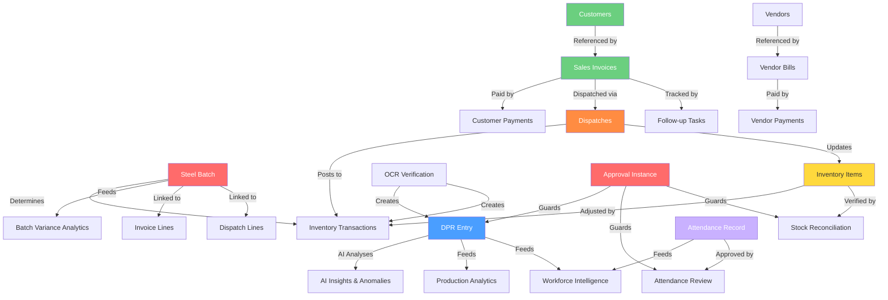

**Note:** Arrows represent verified data flows backed by foreign-key relationships and/or explicit service calls. Empty circles indicate planned/gated features with no code enforcement yet.

---

# 2. Module Documentation

---

## 2.1 Production / DPR Entries

### Purpose & Overview
The DPR (Daily Production Report) module records shift-level production data. Operators create entries per shift (morning/evening/night). Supervisors and above review and approve them. Each entry records units, manpower, downtime, quality issues, and structured defect data.

### Workflow (Apply SAC)

- **Purpose:** Capture daily production data per shift for analysis, approval, and reporting.
- **Actor(s):** Operator (creates), Supervisor+ (approves/rejects), Manager+ (edits/deletes with restrictions).
- **Inputs:** Date, shift, units target/produced, manpower present/absent, downtime minutes/reason, materials, quality issues, defect info, notes.
- **Outputs:** Approved production record, AI-generated summary, alerts for anomalies.
- **Data created:** `entries` table row. Optional: `Alert`, `AuditLog`, background `summary` job.
- **Preconditions:**
  - **Enforced:** No duplicate entry for same date+shift at same factory (`backend/routers/entries.py` line ~510 — duplicate check with 409).
  - **Enforced:** Date cannot be in the future (`backend/routers/entries.py` line ~179 — field_validator).
  - **Enforced:** User must have `production.entry.create` permission (Operator+).
- **Permissions:**
  - `production.entry.create` — Operator+ (default)
  - `production.entry.view` — Everyone but Attendance (default)
  - `production.entry.edit` — Supervisor+ (default)
  - `production.entry.approve` — Supervisor+ (default)
  - `production.entry.delete` — Supervisor+ (default)
- **Validation:**
  - Client-side: Next.js forms validate required fields.
  - Server-side: Pydantic models validate types, ranges (units_target > 0, downtime >= 0, etc.), and date not future.
  - **Note:** Server-side validation is authoritative; client-side may be more lenient in some edge cases.
- **Status transitions:** `submitted` → `approved` | `rejected`
- **Notifications:** 
  - Background AI summary generation job queued on creation (`backend/routers/entries.py` ~line 560 — `_queue_entry_summary_job`).
  - Audit log entry created for ENTRY_CREATED, ENTRY_APPROVED, ENTRY_REJECTED, ENTRY_UPDATED actions.
  - Operational alerts created for anomaly conditions (high downtime, quality issues) via `check_entry_alerts()`.
  - **Not found:** Email/SMS notification on entry approval or rejection (grep of entries.py finds no send_email calls).
- **Failure modes:** Database error → payload saved to `failed_payloads` for retry; 500 returned to user.
- **Common mistakes:** Creating duplicate entry for same shift (blocked with 409); entering data for future date (blocked).
- **Best-practice sequence:** Operator uses Smart Input or form → reviews auto-generated summary → Supervisor reviews and approves.
- **Source files:** `backend/routers/entries.py`, `backend/models/entry.py`, `backend/authorization/permission_catalog.py`

### Screens
- **`/entry` (DPR entry form):** 
  - Purpose: Create or view production entries per shift.
  - Fields: date, shift (dropdown: morning/evening/night), units_target, units_produced, manpower_present/absent, downtime_minutes, downtime_reason, department, materials_used, quality_issues (toggle), quality_details, rejection_qty, defect_reason_id, rework_required, scrap_qty_entry, notes.
  - Actions: Submit (creates entry with status=submitted).
  - Validations: Date not future, all required numeric fields > 0/>= 0.
  - Permissions: `production.entry.create` (Operator+).
  - Hidden behavior: After submit, AI summary job is auto-queued.
- **`/smart` (Smart Input):** 
  - Purpose: Paste unstructured text (WhatsApp export, freeform notes) for AI parsing into structured entry fields.
  - Actions: Upload .txt file or paste text → AI extracts fields.
  - Rate limit: 5 requests/minute per user. Falls back to AI parser if confidence < threshold.
- **`/approvals` (Approval queue):** 
  - Purpose: Review pending entries requiring approval.
  - Buttons/Filters: Filter by module (Production Entry, Attendance, etc.), status.
  - Actions: Approve or Reject each entry (with optional reason).
  - Permissions: `production.entry.approve` (Supervisor+).
  - Hidden behavior: Maker-checker requires different person than creator.
- **`/entries` (Entry listing):** 
  - Purpose: List/search all entries with filtering.
  - Filters: date range, shift, user, status (submitted/approved/rejected), performance range, has_issues toggle, search text.
  - Sort: date, performance, downtime. Pagination: 10-50 per page.
  - Permissions: `production.entry.view` (Everyone but Attendance).

### Fields (Entry Create Form)
| Field | Required | Validation | Default | Allowed Values | Business Meaning |
|-------|----------|-----------|---------|---------------|-----------------|
| date | Yes | Not future | — | ISO date | Shift production date |
| shift | Yes | Must be ShiftType enum | — | morning, evening, night | Work shift identifier |
| units_target | Yes | > 0 | — | Integer | Planned production quantity |
| units_produced | Yes | > 0 | — | Integer | Actual units produced |
| manpower_present | Yes | > 0 | — | Integer | Workers on shift |
| manpower_absent | Yes | >= 0 | — | Integer | Workers absent |
| downtime_minutes | Yes | >= 0 | — | Integer | Minutes of production loss |
| quality_issues | Yes | Boolean | false | true/false | Whether quality defects occurred |

### FAQs
- **Q: Can I edit an entry after submitting?** A: Operators can edit same-day entries only before supervisor review. Supervisor+ can edit within 24 hours.
- **Q: What happens if I submit a duplicate entry?** A: System returns 409 Conflict with existing entry ID. Edit the existing one instead.
- **Q: Can I approve my own entry?** A: No — maker-checker enforcement prevents self-approval.
- **Q: What triggers an AI summary?** A: Auto-generated on creation if not disabled by `DPR_DISABLE_AI_SUMMARY=1` env var.

### Related Modules
- [Approvals / Maker-Checker](#211-approvals--maker-checker) — approval instances guard entry status changes.
- [AI / Intelligence](#213-ai--intelligence) — consumes entry data for anomaly detection and NLQ.
- [Analytics & Reports](#212-analytics--reports) — all analytics are built from entry data.
- [Workforce Intelligence](#214-workforce-intelligence) — worker performance derived from entries.

### Step-by-Step User Actions
1. **Operator** navigates to `/entry` or uses Smart Input at `/smart` (POST).
2. Fills shift data form or pastes unstructured text for AI parsing.
3. Submits → entry created with `status="submitted"`.
4. Background AI summary job is queued.
5. **Supervisor/Manager/Admin/Owner** navigates to `/approvals` or entry detail.
6. Reviews entry data.
7. Approves → `status="approved"` or Rejects → `status="rejected"` (with optional reason).

### Status Lifecycle

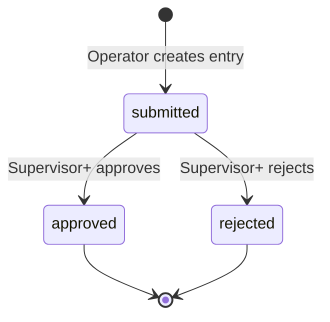

**Roles that can trigger each transition:**
- `submitted`: Operator (create), Supervisor+ (create via approval)
- `approved`: Supervisor, Manager, Admin, Owner (all need `production.entry.approve`)
- `rejected`: Supervisor, Manager, Admin, Owner (all need `production.entry.approve`)

**Rollback rules:** Once approved/rejected, entries can only be edited by Supervisor+ within 24 hours of creation (`backend/routers/entries.py` line ~1150).

### Business Rules
- **Duplicate prevention (Enforced):** Only one entry per factory+date+shift. 409 Conflict if duplicate. (`backend/routers/entries.py` line ~510)
- **Future date block (Enforced):** Date must not be future. (`backend/routers/entries.py` line ~179)
- **Operator edit lock (Enforced):** Operators can edit only same-day entries before supervisor review. (`backend/routers/entries.py` line ~1140)
- **24-hour edit window (Enforced):** Supervisor+ edits only within 24 hours of creation. (`backend/routers/entries.py` line ~1150)
- **Client request idempotency (Enforced):** `client_request_id` prevents duplicate submissions. (`backend/routers/entries.py` line ~490)
- **AI summary auto-generation (Informational):** Queued on creation if not disabled by env var. (`backend/routers/entries.py` line ~560)

---

## 2.2 Attendance

### Purpose & Overview
Tracks employee work hours with punch in/out, shift assignment, regularization requests, and supervisor approval. Attendance-only workers and operators can self-punch; supervisors review and approve regularization requests.

### Workflow (Apply SAC)
- **Purpose:** Record employee attendance for payroll and workforce analytics.
- **Actor(s):** Attendance role, Operator (self-punch); Supervisor+ (review, approve team attendance); Manager+ (manage profiles, shift templates).
- **Inputs:** Punch in/out time, shift, date, notes (for regularization).
- **Outputs:** Approved attendance records, workforce intelligence data.
- **Data created:** `attendance_records` table row. Optional `attendance_regularization` rows.
- **Status fields:** `status` (working, present, absent, half_day, etc.), `review_status` (auto, approved, rejected, regularized).
- **Preconditions:**
  - **Enforced:** Must have factory membership to punch. (`backend/routers/attendance.py` — PDP check via `attendance.self.pump` permission)
  - **Enforced:** Regularization can only be requested for past dates. (code check)
  - **Not found:** Geo-fencing or IP-restriction on punch location (no such check in codebase).
- **Permissions:**
  - `attendance.self.punch` — Attendance, Operator+
  - `attendance.self.view` — Attendance, Operator+
  - `attendance.self.regularization.request` — Attendance, Operator+
  - `attendance.record.approve` — Supervisor+
  - `attendance.review.reject` — Supervisor+
  - `attendance.team.view` — Supervisor+
  - `attendance.profile.manage` — Manager+
  - `attendance.shift_template.manage` — Manager+
  - `attendance.report.view` — Accountant, Manager, Admin, Owner
  - `attendance.review.queue.view` — Supervisor+
- **Validation:** 
  - Client-side: Date picker restricts future dates for regularization.
  - Server-side: Shift validated against allowed values; note text sanitized.
  - **Note:** No server-side duplicate punch detection found — multiple punches on same day create separate records.
- **Status transitions:** `working` → auto-closed to `present`/`absent` at end of shift. `review_status`: `auto` → `approved` | `rejected` | `regularized`.
- **Notifications:** 
  - **Not found:** No email notifications for attendance events (grep of attendance.py for send_email — no results).
  - In-app alerts may exist via notification system.
- **Failure modes:** No explicit error recovery found — rollback on exception.
- **Common mistakes:** Forgetting to punch out → regularization request required.
- **Best-practice sequence:** Punch in at shift start → work → punch out at shift end → review attendance record → submit regularization if needed.
- **Source files:** `backend/models/attendance_record.py`, `backend/routers/attendance.py`

### Screens
- **`/attendance` (Self-punch):** 
  - Purpose: Punch in/out, view own attendance records.
  - Actions: Punch in button, Punch out button. View daily/weekly history.
  - Permissions: `attendance.self.punch`, `attendance.self.view`.
  - Hidden behavior: Auto-close at shift end marks absent if no punch.
- **`/attendance/review` (Review queue):** 
  - Purpose: Supervisor reviews regularization requests and attendance records.
  - Filters: By date, user, status (pending, approved, rejected).
  - Actions: Approve or Reject with reason.
  - Permissions: `attendance.record.approve`, `attendance.review.reject`.
- **`/attendance/reports` (Reports):** 
  - Purpose: View attendance summaries for payroll and analytics.
  - Permissions: `attendance.report.view` (Accountant+).
- **`/settings/attendance` (Shift templates):** 
  - Purpose: Configure shift templates and attendance profiles.
  - Permissions: `attendance.shift_template.manage`, `attendance.profile.manage`.

### Fields
| Field | Required | Validation | Default | Allowed Values |
|-------|----------|-----------|---------|---------------|
| shift | Yes | Must be valid | "morning" | morning, evening, night |
| status | System-set | Auto-calculated | "working" | working, present, absent, half_day |
| review_status | System-set | Auto-set | "auto" | auto, approved, rejected, regularized |
| note | No | Max 500 chars | null | Free text |
| worked_minutes | System-set | Auto-calculated | 0 | Integer (minutes) |

### FAQs
- **Q: Can I punch in from anywhere?** A: Yes — no geo-fencing is implemented.
- **Q: What if I forget to punch in?** A: Submit a regularization request for the missed date.
- **Q: Can a supervisor modify my punch time?** A: No direct modification. They can approve/reject regularization requests.

### Related Modules
- [Workforce Intelligence](#214-workforce-intelligence) — consumes attendance data for KPIs.
- [Approvals / Maker-Checker](#211-approvals--maker-checker) — reviews use approval instances.

### Status Lifecycle

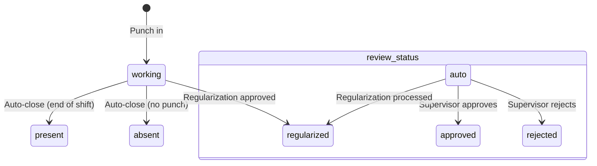

---

## 2.3 Steel Inventory

### Purpose & Overview
Item master and ledger-based inventory control. All stock movements are recorded as transactions against items. Balances are computed from transaction history. Supports multiple categories (raw_material, finished_goods, consumables, etc.).

### Workflow (Apply SAC)
- **Purpose:** Maintain inventory item catalogue and track all stock movements via append-only ledger.
- **Actor(s):** Supervisor+ (view), Manager+ (manage items, create transactions).
- **Inputs:** Item master data (code, name, category, rate), transaction details (type, quantity, reference).
- **Outputs:** Current stock balances, transaction history, reorder alerts.
- **Data created:** `steel_inventory_items`, `steel_inventory_transactions`.
- **Preconditions:**
  - **Enforced:** Item code must be unique per factory (`uq_steel_inventory_items_factory_code` unique constraint).
  - **Enforced:** User must have appropriate PDP permission for each action.
  - **Not found:** No minimum/maximum stock level enforcement (reorder_point_kg exists but is informational).
- **Permissions:**
  - `inventory.item.view` — Operator+
  - `inventory.ledger.view` — Operator+
  - `inventory.item.manage` — Manager+
  - `inventory.transaction.create` — Manager+
- **Validation:** item_code normalized via `normalize_identifier_code`. Category validated against allowed set. Quantity must be > 0 kg.
- **Status lifecycle:** Items have `is_active` boolean, no status state machine. Transactions are append-only ledger entries with no deletion/update.
- **Notifications:** **Not found** — no email/SMS alerts for low stock. Reorder point is informational only.
- **Failure modes:** Stock balance could go negative if no pre-check — system relies on trust (no hard block on negative balance found).
- **Common mistakes:** Creating duplicate item codes (blocked by unique constraint). Entering wrong transaction direction.
- **Best-practice sequence:** Create items → record opening stock via inward transaction → record production output → record dispatch deductions.
- **Source files:** `backend/models/steel_inventory_item.py`, `backend/models/steel_inventory_transaction.py`, `backend/routers/steel.py`

### Screens
- **`/steel/inventory` (Item list):** 
  - Purpose: View all inventory items with stock balances, confidence status, and reorder points.
  - Columns: item_code, name, category, current_balance_kg, current_rate_per_kg (financial roles only), reorder_point, confidence.
  - Filters: By category, search by name/code.
  - Permissions: `inventory.item.view`.
  - Hidden behavior: Financial field redaction — rate_per_kg shown only to roles with `production.fraud_financial.view`.
- **`/steel/inventory/transactions` (Ledger):** 
  - Purpose: View transaction history for an item with running balance.
  - Columns: date, type, quantity_kg, reference_id, reference_type, balance_before, balance_after, created_by.
  - Permissions: `inventory.ledger.view`.
- **Item Create/Edit form:**
  - Fields: item_code, name, category (dropdown), current_rate_per_kg, hsn_code, gst_rate, reorder_point_kg, safety_stock_kg.
  - Permissions: `inventory.item.manage`.

### Fields (Item Create Form)
| Field | Required | Validation | Default |
|-------|----------|-----------|---------|
| item_code | Yes | 2-40 chars, normalized | — |
| name | Yes | 2-160 chars | — |
| category | Yes | Must be valid category | — |
| current_rate_per_kg | No | >= 0 | null |
| hsn_code | No | Max 12 chars | null |
| gst_rate | No | Float >= 0 | null |

### FAQs
- **Q: Can I delete an inventory transaction?** A: No — transactions are append-only ledger entries. Create a reversal transaction instead.
- **Q: How is stock balance calculated?** A: Sum of all inward transactions minus all outward transactions.
- **Q: Can Operators see item rates?** A: No — financial fields are redacted for non-financial roles.

### Related Modules
- [Steel Production Batches](#24-steel-production-batches) — consumes/produces inventory items.
- [Steel Dispatches](#26-steel-dispatches) — consumes inventory on dispatch exit.
- [Steel Stock Reconciliation](#29-steel-stock-reconciliation) — verifies physical vs system stock.

---

## 2.4 Steel Production Batches

### Purpose & Overview
Tracks expected vs actual output for steel production runs. Computes loss, variance, and severity. Supports theft detection through coil weight variance analysis. Heat numbers provide BIS/ISI traceability.

### Workflow (Apply SAC)
- **Purpose:** Record steel production batches and compute expected-vs-actual variance for loss analysis and theft detection.
- **Actor(s):** Supervisor+ (create batches), Manager+ (approve batch variance).
- **Inputs:** Input item + quantity, expected output, actual output, scrap/rejection quantities, heat number.
- **Outputs:** Batch record with computed loss %, variance %, severity classification.
- **Data created:** `steel_production_batches` table.
- **Preconditions:**
  - **Enforced:** Input/output items must exist and belong to same org/factory (`_get_item_or_404`).
  - **Enforced:** Production date must not be future.
  - **Not found:** No guard preventing batch creation when insufficient stock exists.
- **Permissions:**
  - `production.batch.view` — Operator+
  - `production.batch.create` — Supervisor+
  - `production.batch.variance.approve` — Manager+
- **Validation:** Production date not future. Input/output quantities > 0. Batch code must be unique.
- **Status lifecycle:**
  - `status` field: currently always `"recorded"` (no state machine transitions found in code — **single-state entity**).
  - `severity` field: auto-computed from variance percent — `normal` (<3%), `high` (3-10%), `critical` (>10%). (`backend/services/steel_service.py` — `severity_from_variance`)
- **Notifications:** **Not found** — no alert/email sent for high/critical severity batches.
- **Failure modes:** Variance computation can fail silently if input quantities are zero (guarded by Field(gt=0)).
- **Common mistakes:** Recording actual_output_kg greater than expected_output_kg without notes (system allows this).
- **Best-practice sequence:** Complete batch → record production with actual output → review variance → Manager approves if needed.
- **Source files:** `backend/models/steel_production_batch.py`, `backend/routers/steel.py`, `backend/services/steel_service.py`

### Screens
- **`/steel/batches` (Batch list):** 
  - Purpose: View all production batches with severity indicators.
  - Columns: batch_code, production_date, input_item, output_item, input_kg, output_kg, loss_kg, loss_percent, severity, status.
  - Filters: By date range, severity, operator.
  - Permissions: `production.batch.view`.
  - Hidden behavior: Financial fields (variance_value_inr) redacted for non-financial roles.
- **Batch Create form:**
  - Fields: batch_code (auto-generated), production_date, input_item (dropdown), output_item (dropdown), input_quantity_kg, expected_output_kg, actual_output_kg, scrap_qty_kg, rejection_qty_kg, heat_number, notes.
  - Permissions: `production.batch.create`.

### Fields (Batch Create)
| Field | Required | Validation | Auto-computed |
|-------|----------|-----------|--------------|
| batch_code | No (auto-generated) | Unique | Yes (via `generate_batch_code`) |
| production_date | Yes | Not future | — |
| input_quantity_kg | Yes | > 0 | — |
| expected_output_kg | Yes | > 0 | — |
| actual_output_kg | Yes | > 0 | — |
| loss_kg | No | — | Yes (input - actual) |
| loss_percent | No | — | Yes (loss/input * 100) |
| severity | No | — | Yes (from variance %) |

### FAQs
- **Q: What triggers a "critical" severity?** A: Variance > 10% between expected and actual output.
- **Q: Can I edit a batch after creating it?** A: **Not implemented** — batch update endpoint not found in codebase.
- **Q: Does the system auto-adjust inventory on batch creation?** A: No — inventory transactions for production output must be recorded separately.

### Related Modules
- [Steel Inventory](#23-steel-inventory) — batch consumes input items and produces output items.
- [Steel Sales Invoices](#25-steel-sales-invoices) — invoice lines can reference batches.
- [Steel Dispatches](#26-steel-dispatches) — dispatch lines can reference batches for traceability.

### Status Lifecycle

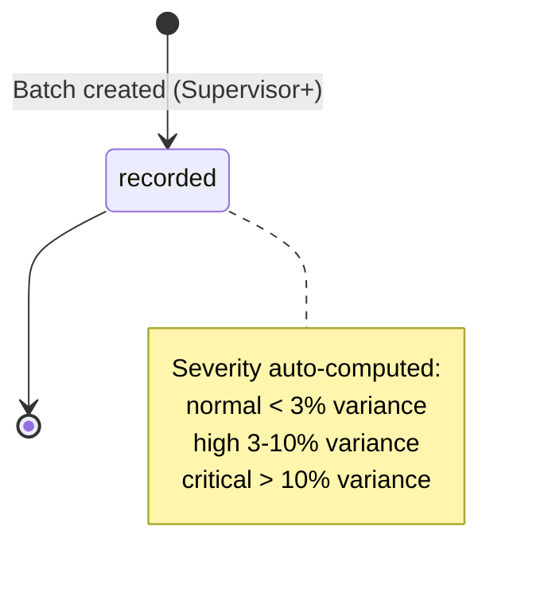

---

## 2.5 Steel Sales Invoices

### Purpose & Overview
Weight-based steel sales invoicing with GST auto-calculation. Supports customer linking, multiple line items (weight × rate per kg), and payment status tracking (unpaid → partial → paid).

### Workflow (Apply SAC)
- **Actor(s):** Accountant, Manager, Admin, Owner (create, view). Manager+ (edit pre-dispatch). Admin+ (void post-dispatch, requires MFA).
- **Data created:** `steel_sales_invoices` (header), `steel_sales_invoice_lines` (lines).
- **Key fields:** invoice_number, invoice_date, due_date, customer_name, status (unpaid/partial/paid), total_weight_kg, subtotal_amount, total_amount, taxable_amount, gst_total. Lines: item_id, weight_kg, rate_per_kg, line_total, hsn_code, gst_rate, cgst/sgst/igst_amount.
- **Permissions:**
  - `invoice.record.view` — Accountant, Manager, Admin, Owner
  - `invoice.record.create` — Accountant, Manager, Admin, Owner
  - `invoice.record.edit` — Manager+
  - `invoice.record.void` — Admin+, requires MFA
- **Validation:** Line total max 10,000,000 INR. Rate per kg must be > 0 for finished goods. Max 25 lines per invoice.
- **Status transitions:** `unpaid` → `partial` | `paid` (auto-computed from payment allocations).
- **Notifications:** None — invoice status recalculated on payment events.
- **Source files:** `backend/models/steel_sales_invoice.py`, `backend/models/steel_sales_invoice_line.py`, `backend/routers/steel.py`

### Status Lifecycle

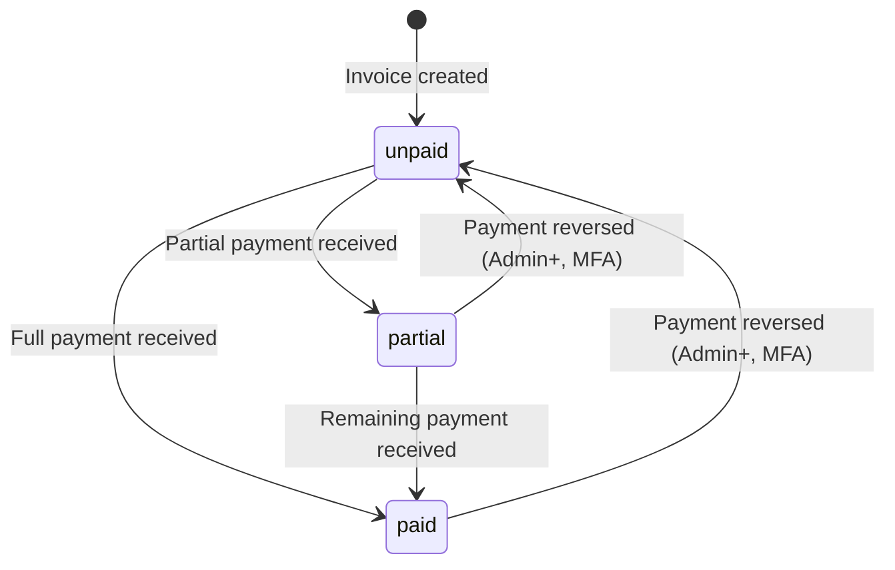

---

## 2.6 Steel Dispatches

### Purpose & Overview
Gate pass and truck dispatch management. Tracks the full lifecycle: pending (truck entry) → loaded → exited (gate) → dispatched (in transit) → delivered (POD). Cancellation allowed from any non-terminal state.

### Workflow (Apply SAC)
- **Actor(s):** Supervisor+ (create dispatches), Manager+ (update status), Admin+ (cancel, requires MFA).
- **Data created:** `steel_dispatches` (header), `steel_dispatch_lines` (material lines).
- **Key fields:** dispatch_number, gate_pass_number, truck_number, driver_name, status (pending/loaded/exited/dispatched/delivered/cancelled), entry_time, exit_time, delivered_at.
- **Permissions:**
  - `dispatch.record.view` — Operator+
  - `dispatch.record.create` — Supervisor+
  - `dispatch.record.update` — Manager+
  - `dispatch.record.cancel` — Admin+, requires MFA
- **State machine** (defined in `_DISPATCH_ALLOWED_TRANSITIONS`):
  - `pending` → `loaded`, `cancelled`
  - `loaded` → `exited`, `cancelled`
  - `exited` → `dispatched`, `delivered`, `cancelled`
  - `dispatched` → `delivered`, `cancelled`
  - `delivered` — terminal
  - `cancelled` — terminal
- **Mandatory fields per transition** (Enforced):
  - pending→loaded: gate_pass_photo_url
  - loaded→exited: weighbridge_slip_photo_url
  - exited→delivered or dispatched→delivered: pod_photo_url, receiver_name
- **Role-level guard per transition:**
  - `exited`: requires Supervisor role
  - `delivered`: requires Supervisor role
  - Other transitions: any role with `dispatch.record.update` permission
- **Inventory posting:** Stock is deducted when dispatch reaches `exited`, `dispatched`, or `delivered` status. (`backend/routers/steel.py` — `_dispatch_status_posts_inventory`)
- **Source files:** `backend/models/steel_dispatch.py`, `backend/models/steel_dispatch_line.py`, `backend/routers/steel.py`

### Status Lifecycle

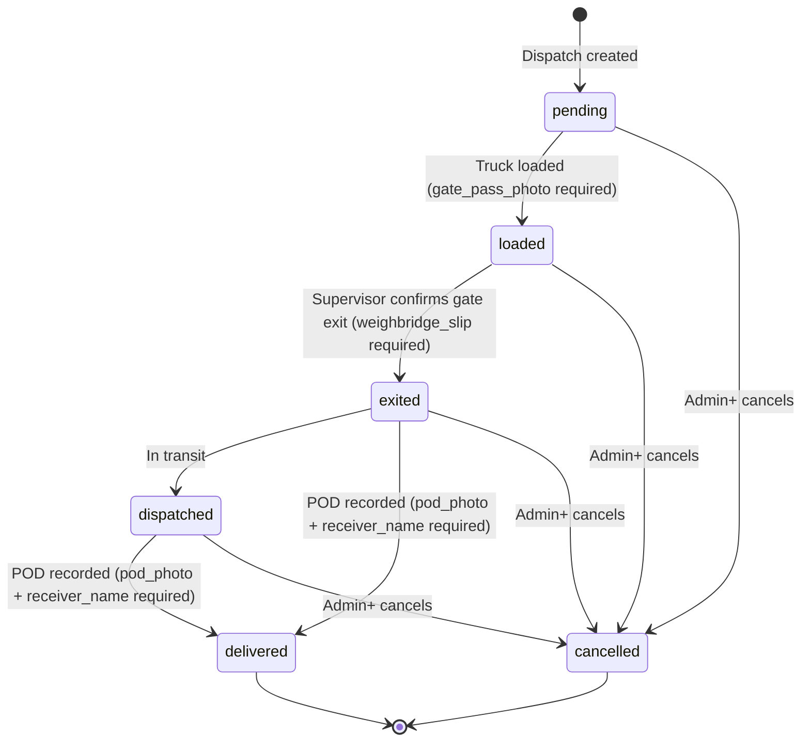

---

## 2.7 Steel Customers & Payments

### Purpose & Overview
Customer master with credit management, PAN/GST verification, payment tracking, and collection follow-ups. Supports invoice payment allocation and customer risk scoring.

### Workflow (Apply SAC)
- **Actor(s):** Accountant, Manager, Admin, Owner (create, view, edit). Admin+ (review PAN/GST verification, delete).
- **Data created:** `steel_customers`, `steel_customer_payments`, `steel_customer_payment_allocations`, `steel_customer_follow_up_tasks`.
- **Key fields (Customer):** name, gst_number, pan_number, credit_limit, status (active/on_hold/blocked), verification_status (draft/format_valid/pending_review/verified/mismatch/rejected/expired).
- **Permissions:**
  - `customer.record.view` — Accountant, Manager, Admin, Owner
  - `customer.record.create` — Accountant, Manager, Admin, Owner
  - `customer.record.edit` — Accountant, Manager, Admin, Owner
  - `customer.verification.review` — Admin+
  - `customer.record.delete` — Admin+
  - `payment.record.create` — Accountant, Manager, Admin, Owner
  - `payment.record.reverse` — Admin+, requires MFA
  - `followup.task.manage` — Accountant, Manager, Admin, Owner
- **Verification lifecycle:** `draft` → `format_valid` (PAN/GST format check) → `pending_review` (documents/name-match) → `verified` | `mismatch` | `rejected` (Admin+ decision).
- **Risk scoring (Informational):** Computed from overdue_days × 2 + credit_used_percentage + late_payment_count × 5. High > 70, medium > 30, low otherwise. (`backend/routers/steel.py` — `_compute_customer_lifecycle_summary`)
- **Auto-alerts:** Customer on hold (critical), identity verification issue (critical), overdue exposure (warning), credit limit pressure (warning), collection follow-up open (info).
- **Source files:** `backend/models/steel_customer.py`, `backend/models/steel_customer_payment.py`, `backend/models/steel_customer_payment_allocation.py`, `backend/models/steel_customer_follow_up_task.py`, `backend/routers/steel.py`

### Customer Verification Status Lifecycle

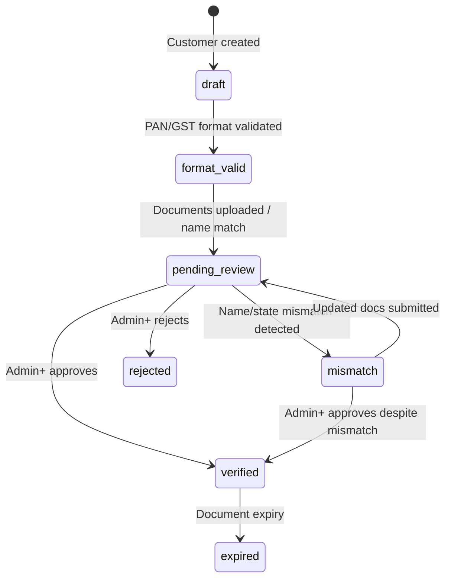

---

## 2.8 Steel Vendor Bills & Payments

### Purpose & Overview
Accounts payable — records vendor bills (purchase invoices), tracks payment status, and manages vendor master data.

### Workflow (Apply SAC)
- **Actor(s):** Accountant, Manager, Admin, Owner (create, view, pay). Admin+ (special operations).
- **Data created:** `steel_vendors`, `steel_vendor_bills`, `steel_vendor_bill_lines`, `steel_vendor_payments`, `steel_vendor_payment_allocations`.
- **Key fields (Bill):** bill_number, bill_date, due_date, vendor_id, status (unpaid/partial/paid), total_amount, expense_category (raw_material, transport, consumables, etc.).
- **Permissions:** Financial roles (Accountant, Manager, Admin, Owner) — enforcement via `backend/routers/steel_finance.py` PDP checks.
- **Status lifecycle:** Same as sales invoices — `unpaid` → `partial` | `paid`, auto-computed from payments.
- **Source files:** `backend/models/steel_vendor.py`, `backend/models/steel_vendor_bill.py`, `backend/models/steel_vendor_bill_line.py`, `backend/routers/steel_finance.py`

---

## 2.9 Steel Stock Reconciliation

### Purpose & Overview
Physical stock verification — counters record physical quantities, system balances are compared, variance computed, and results submitted for approval.

### Workflow (Apply SAC)
- **Actor(s):** Manager+ (initiate reconciliation — `inventory.reconciliation.create`), Supervisor+ (view — `inventory.reconciliation.view`), Admin+ (approve/reject — `inventory.reconciliation.approve`).
- **Data created:** `steel_stock_reconciliations`.
- **Key fields:** item_id, physical_qty_kg, system_qty_kg, variance_kg, variance_percent, confidence_status (high/medium/low), status (pending/approved/rejected/overridden), mismatch_cause.
- **Permissions:**
  - `inventory.reconciliation.create` — Manager+
  - `inventory.reconciliation.view` — Supervisor+
  - `inventory.reconciliation.approve` — Admin+
- **Status lifecycle:** `pending` → `approved` | `rejected` | `overridden`
- **Mismatch cause (Enforced):** Must be one of: counting_error, process_loss, theft_or_leakage, wrong_entry, delayed_dispatch_update, other.
- **Confidence status:** Computed from variance percent — high (<1%), medium (1-5%), low (>5%).
- **Source files:** `backend/models/steel_stock_reconciliation.py`, `backend/routers/steel.py`

### Status Lifecycle

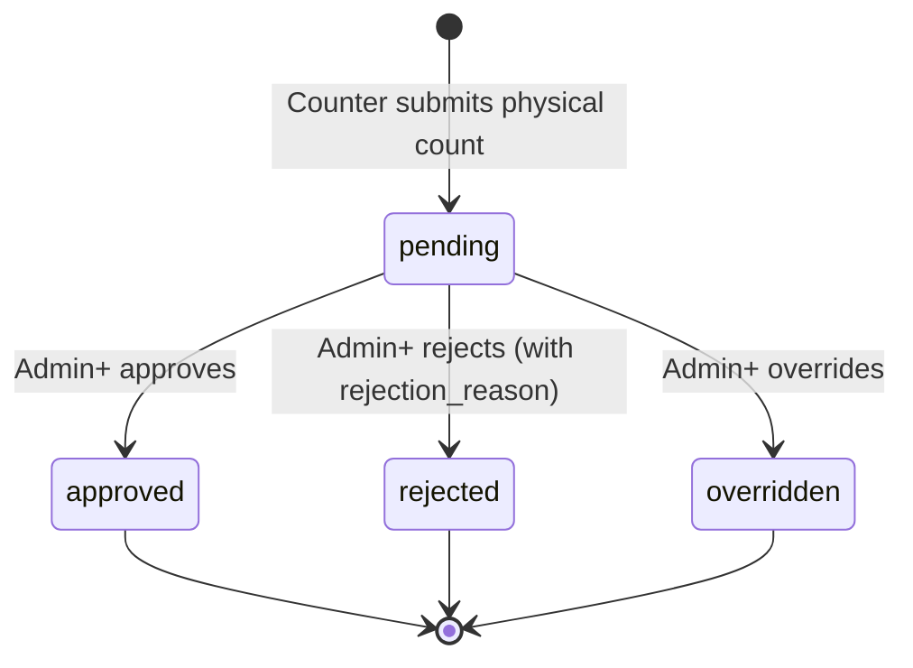

---

## 2.10 OCR Pipeline

### Purpose & Overview
Document scanning and OCR-based data extraction with a verify-submit-approve workflow. Supports operations (OP) and finance (FINANCE) domain verification. Operators scan paper documents, AI extracts data, then supervisors/accountants verify and approve.

### Workflow (Apply SAC)
- **Purpose:** Digitize paper-based factory documents (DPR sheets, invoices, receipts) via OCR and structured verification.
- **Actor(s):** Operator+ (upload, edit, submit verification), Supervisor+ (view, approve/reject operations domain), Accountant+ (approve finance domain), Manager+ (manage OCR templates).
- **Inputs:** Uploaded document images, OCR result data.
- **Outputs:** Verified structured data (can create entries or inventory transactions).
- **Data created:** `ocr_verifications` records, OCR usage logs (`ocr_usage`), OCR job records.
- **Preconditions:**
  - **Enforced:** User must have `ocr.document.upload` or appropriate verification permission.
  - **Enforced:** OCR quota may apply per org (`backend/ocr_limits.py`).
  - **Not found:** No document type validation (all uploaded files treated equally).
- **Permissions:**
  - `ocr.document.upload` — Operator+
  - `ocr.verification.edit` — Operator+
  - `ocr.verification.submit` — Operator+
  - `ocr.verification.view` — Supervisor+
  - `ocr.verification.approve` — Supervisor+
  - `ocr.verification.approve_ops` — Supervisor+ (operations domain)
  - `ocr.verification.approve_finance` — Accountant, Manager, Admin, Owner (finance domain)
  - `ocr.verification.reject` — Supervisor+
  - `ocr.template.view` — Operator+
  - `ocr.template.manage` — Manager+
  - `ocr.job.view` — Operator+
- **Validation:** 
  - Client-side: Image file type and size validation in uploader component (`web/src/features/ocr/components/ocr-editor/ocr-uploader.tsx`).
  - Server-side: **Not fully verified** — exact server-side validation of OCR uploads not confirmed.
- **Status lifecycle:** `draft` → submitted for verification → `verified` | `rejected`.
- **Notifications:** **Not found** — no email notifications for OCR verification completion.
- **Failure modes:** OCR processing failure → error returned to user; failed payloads saved for retry. Quota exceeded → upload blocked.
- **Common mistakes:** Uploading poor quality images → OCR extraction quality low. Submitting incomplete verification → rejection by supervisor.
- **Best-practice sequence:** Scan document → upload → review OCR results → edit if needed → submit → supervisor verifies → approved.
- **Source files:** `backend/models/ocr_verification.py`, `backend/routers/ocr/_common.py`, `backend/routers/ocr/_processing.py`, `web/src/features/ocr/components/ocr-editor/ocr-uploader.tsx`

### Screens
- **`/ocr/scan` (Document upload):** 
  - Purpose: Upload paper documents for OCR processing.
  - Actions: Select file, upload, view OCR progress.
  - Permissions: `ocr.document.upload`.
- **`/ocr/verify` (Verification dashboard):** 
  - Purpose: Review and approve/reject OCR-verified data.
  - Filters: By domain (operations/finance), status.
  - Actions: View details, Edit fields, Approve, Reject.
  - Permissions: `ocr.verification.approve_ops` (Supervisor+), `ocr.verification.approve_finance` (Accountant+).
  - Domain separation: Operations OCR is approved by Supervisor+; Finance OCR by Accountant+.
- **`/ocr/history` (History):** 
  - Purpose: View past OCR jobs and their results.
  - Permissions: `ocr.job.view`.

### Fields
| Field | Required | Description |
|-------|----------|------------|
| status | System-set | draft → verified/rejected |
| domain | Yes | "operations" or "finance" |
| extracted_data | Yes | JSON-structured OCR output |
| verified_by | Set on approve | User ID of verifier |

### FAQs
- **Q: Can I approve OCR data from another domain?** A: No — operations OCR requires Supervisor+; finance OCR requires Accountant+.
- **Q: What happens if OCR quality is low?** A: You can manually edit the extracted fields before submitting for verification.
- **Q: Is there a daily OCR limit?** A: Yes — org-level OCR quota applies (`backend/ocr_limits.py`).

### Related Modules
- [Production / DPR Entries](#21-production--dpr-entries) — verified OCR can create entries.
- [Steel Inventory](#23-steel-inventory) — verified OCR can create inventory transactions.
- Approvals — OCR verification process uses approval instances.

---

## 2.11 Approvals / Maker-Checker

### Purpose & Overview
The Approval Service (`ApprovalInstance`) provides a generic maker-checker framework with sequential two-stage (L1/L2) support, cross-domain/parallel approvals, and TTL/expiry. It's used by Production Entry approval, Attendance review, and Stock Reconciliation approval.

### Workflow (Apply SAC)
- **Actor(s):** Configurable per workflow — typically Supervisor+ for L1, Manager+ for L2.
- **Data created:** `approval_instances` table rows.
- **Key fields:** workflow_key, action_key, resource_type, resource_id, status (approved/pending_l1/pending_l2/rejected), approval_stage (L1/L2).
- **Preconditions (Enforced):**
  - IP-3 (two-stage): Same person cannot clear both L1 and L2. (`approval_instance.py` line ~100 — `l1_approved_by_user_id` guard)
  - TTL/expiry per workflow type.
- **Status lifecycle:** `no_approval_required` → can bypass. `pending_l1` → `pending_l2` → `approved` | `rejected`.
- **Source files:** `backend/models/approval_instance.py`, `backend/services/approval_service.py`, `backend/routers/approvals.py`

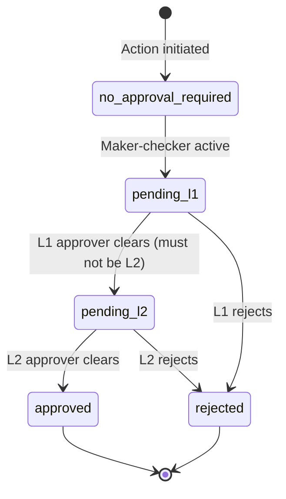

---

## 2.12 Analytics & Reports

### Purpose & Overview
Operations analytics dashboards and report exports. Supports weekly/monthly trends, production comparisons, executive PDF exports, email summaries, and premium analytics (plan-gated).

### Workflow (Apply SAC)
- **Actor(s):** Supervisor+ (operations analytics, executive export), Accountant+ (email summaries, financial reports), Operator+ (basic export).
- **Permissions:**
  - `analytics.operations.view` — Supervisor, Manager, Accountant, Admin, Owner
  - `analytics.premium.view` — Supervisor+ (plan-gated to pilot and above)
  - `reporting.executive.export` — Supervisor+
  - `reporting.export.view` — Everyone but Attendance
  - `reporting.email.summary.view` — Accountant, Manager, Admin, Owner
  - `reporting.email.summary.generate` — Accountant, Manager, Admin, Owner
  - `reporting.insights.view` — Supervisor+
- **Source files:** `backend/routers/analytics.py`, `backend/routers/reports.py`, `backend/routers/premium.py`

---

## 2.13 AI / Intelligence

### Purpose & Overview
AI-powered features: natural language queries about production data, anomaly detection, production suggestions, executive summaries, and factory intelligence analysis. AI is quota-managed with daily token caps and monthly cost limits.

### Workflow (Apply SAC)
- **Purpose:** Provide AI-assisted analysis of production, attendance, and steel data for decision support.
- **Actor(s):** Supervisor+ (suggestions, anomalies, intelligence requests). Accountant+ (executive summaries, NLQ).
- **Inputs:** Natural language queries, production data context.
- **Outputs:** AI-generated summaries, anomaly flags, NLQ responses, executive reports.
- **Data created:** `ai_usage_log` records, `intelligence_requests`, `ai_result_cache` entries.
- **Preconditions:**
  - **Enforced:** Org must have AI quota available (token + cost caps on `Organization` model).
  - **Enforced:** Per-user rate limiting for smart input (5 req/min).
  - **Enforced:** Plan gating — some AI features require pilot plan or higher.
  - **Not found:** No per-model or per-provider access controls (provider selection is environment-configured, not user-configurable).
- **Permissions:**
  - `ai.suggestions.view` — Supervisor+
  - `ai.anomalies.view` — Supervisor+
  - `ai.nlq.query` — Supervisor, Manager, Accountant, Admin, Owner
  - `ai.executive.view` — Supervisor, Manager, Accountant, Admin, Owner
  - `ai.usage.view` — Supervisor+ (org scope)
  - `intelligence.request.create` — Supervisor+
  - `intelligence.request.view` — Supervisor+
- **Validation:** User queries are sanitized; rate limits enforced before processing.
- **Quota system:**
  - Org-level daily token cap (`ai_daily_token_cap`, default 250,000 tokens).
  - Monthly cost cap (`ai_monthly_cost_cap_usd`, default $250 USD).
  - Per-feature quota consumption (smart, summary, nlq, etc.).
- **Failure modes:** AI provider timeout → fallback parser used (for smart input). Quota exceeded → 403 with upgrade prompt. Provider API error → error returned to user.
- **Common mistakes:** Asking vague NLQ questions → poor AI response quality. Exceeding quota → upgrade required.
- **Best-practice sequence:** Start with specific questions → review AI confidence → export insights for decision-making.
- **Source files:** `backend/routers/ai.py`, `backend/routers/intelligence.py`, `backend/models/organization.py`, `backend/models/ai_usage_log.py`, `backend/models/ai_result_cache.py`

### Screens
- **`/ai` (AI Dashboard):** 
  - Purpose: Access all AI features — NLQ, anomalies, suggestions, executive summaries.
  - Sub-sections: NLQ chat, Anomaly detection, Production suggestions, Executive summary.
  - Permissions: Feature-specific as per permission catalog.
  - Hidden behavior: AI usage counter visible to Supervisor+ via `ai.usage.view`.
- **`/entry/{id}/summary` (Per-entry AI summary):** 
  - Purpose: View/summarize AI-generated entry summaries with regenerate option.
  - Permissions: `production.entry.view` + `production.entry.edit` for regeneration.
  - Plan-gated: Regeneration requires pilot+ plan.

### FAQs
- **Q: Which AI provider is used?** A: Environment-configurable — defaults to Groq. See `AI_PROVIDER` env var.
- **Q: What happens when quota runs out?** A: AI features are blocked with an upgrade prompt until quota resets or plan is upgraded.
- **Q: Can I see how much AI quota I've used?** A: Yes — users with `ai.usage.view` permission can see usage stats at `/ai`.

### Related Modules
- [Production / DPR Entries](#21-production--dpr-entries) — AI anomalies and summaries consume entry data.
- [Analytics & Reports](#212-analytics--reports) — AI executive summaries complement reports.
- [Workforce Intelligence](#214-workforce-intelligence) — AI can analyze workforce data.

---

## 2.14 Workforce Intelligence

### Purpose & Overview
Workforce analytics module providing attendance KPIs, overtime analysis, shift comparison, labour cost breakdown, worker performance ranking, and absenteeism impact. Data is sourced from DPR entries and attendance records.

### Workflow (Apply SAC)
- **Purpose:** Analyse workforce productivity, attendance patterns, and labour costs for management decision-making.
- **Actor(s):** Supervisor+ (overview, worker analytics). Accountant+ (labour cost view). Admin+ (manage labour rates).
- **Inputs:** DPR entries (worker performance data), attendance records, configured labour cost rates.
- **Outputs:** Workforce KPIs, ranked worker performance, cost summaries.
- **Data consumed:** `entries` (units per worker), `attendance_records` (hours, overtime), `workforce_cost_rate` (hourly rates).
- **Preconditions:**
  - **Enforced:** User must have `workforce.overview.view` or appropriate sub-permission.
  - **Informational:** Labour rates must be configured for accurate cost calculations (no validation that rates exist).
- **Permissions:**
  - `workforce.overview.view` — Supervisor+
  - `workforce.workers.view` — Supervisor+
  - `workforce.cost.view` — Accountant, Manager, Admin, Owner
  - `workforce.cost.manage` — Admin+
- **Calculations:**
  - Worker efficiency: units_produced / manpower_present (from entries).
  - Overtime minutes: from attendance_records.overtime_minutes.
  - Labour cost: worked_minutes × hourly_rate + overtime_minutes × overtime_multiplier.
- **Failure modes:** No explicit failure handling found — missing data returns zeros.
- **Best-practice sequence:** Configure labour rates (Admin) → review overview (Supervisor+) → drill into worker details → analyse cost (Accountant+).
- **Source files:** `backend/routers/workforce_intelligence.py`, `backend/models/workforce_cost_rate.py`

### Screens
- **`/workforce` (Workforce overview):** 
  - Purpose: Attendance KPIs, overtime, shift comparison, labour cost summary.
  - Permissions: `workforce.overview.view`.
- **`/workforce` → Worker analytics:** 
  - Purpose: Ranked worker performance, attendance trends, productivity estimates.
  - Permissions: `workforce.workers.view`.
- **`/workforce` → Labour cost:** 
  - Purpose: Cost breakdown — regular wages, overtime, absenteeism impact.
  - Permissions: `workforce.cost.view`.

### FAQs
- **Q: How is worker efficiency calculated?** A: From DPR entries — units produced divided by manpower_present.
- **Q: Do I need to set up labour rates?** A: Yes — Admin should configure rates via `workforce.cost.manage` permission for accurate cost calculations.

### Related Modules
- [Production / DPR Entries](#21-production--dpr-entries) — primary data source for worker performance.
- [Attendance](#22-attendance) — attendance data used for hours/overtime calculations.

---

## 2.15 Billing & Subscription

### Purpose & Overview
Plan management via Razorpay payment gateway integration. Supports free, pilot, and paid plans. Tracks subscriptions, payment orders, and plan-changing operations. Controls feature gating and AI quota limits.

### Workflow (Apply SAC)
- **Purpose:** Manage organization subscription plans, process payments, and control feature access based on plan tier.
- **Actor(s):** Admin+ (view config, invoices, status). Platform admin only (plan changes, order creation — requires MFA).
- **Inputs:** Subscription plan selection, Razorpay payment confirmation webhook.
- **Outputs:** Active subscription with appropriate plan tier, payment order records.
- **Data created:** `subscriptions`, `payment_orders`, `subscription_addon` records.
- **Preconditions:**
  - **Enforced:** Only one active subscription per org (`uq_subscriptions_active_org_id`).
  - **Enforced:** Plan changes require MFA verification.
  - **Enforced:** Platform-scoped permissions require `is_platform_admin` flag.
  - **Not found:** No proration logic for mid-cycle plan changes — plan change is immediate.
- **Permissions:**
  - `billing.config.view` — Admin+ (org scope)
  - `billing.status.view` — Admin+ (org scope)
  - `billing.invoice.view` — Admin+ (org scope)
  - `billing.plan.change` — Admin+ (INTERNAL_STAFF only, MFA required)
  - `billing.plan.downgrade` — Admin+ (INTERNAL_STAFF only, MFA required)
  - `billing.order.create` — Admin+ (INTERNAL_STAFF only, MFA required)
  - `admin.billing.quota.reset` — Admin+ (platform scope, MFA required)
- **Plan levels:** free → pilot → (paid plans as configured) — rank determines feature access.
- **Subscription status lifecycle:** `trialing` → `active` → `past_due` | `canceled` | `expired`.
- **Notifications:** Razorpay webhook events processed at backend webhook endpoint. **Not found:** Email notifications for billing events.
- **Failure modes:** Razorpay webhook failure → manual order sync via `billing.order.sync`. Payment failure → order remains pending.
- **Common mistakes:** Attempting plan change without MFA → blocked. Non-admin trying to view billing → blocked by scope check.
- **Best-practice sequence:** View current plan → select upgrade → complete Razorpay checkout → verify subscription active → feature gates unlocked.
- **Source files:** `backend/models/subscription.py`, `backend/models/payment_order.py`, `backend/models/organization.py`, `backend/routers/billing.py`

### Screens
- **`/billing` (Billing dashboard):** 
  - Purpose: View subscription status, plan details, usage, and invoices.
  - Permissions: `billing.status.view`, `billing.invoice.view`, `billing.config.view`.
- **`/plans` (Plan selection):** 
  - Purpose: Public page showing available plans and features.
  - Actions: Select plan → Razorpay checkout.
- **`/admin-billing` (Admin billing):** 
  - Purpose: Platform admin interface for quota resets and plan management.
  - Permissions: `admin.billing.quota.reset` (platform scope, MFA).

### Subscription Status Lifecycle

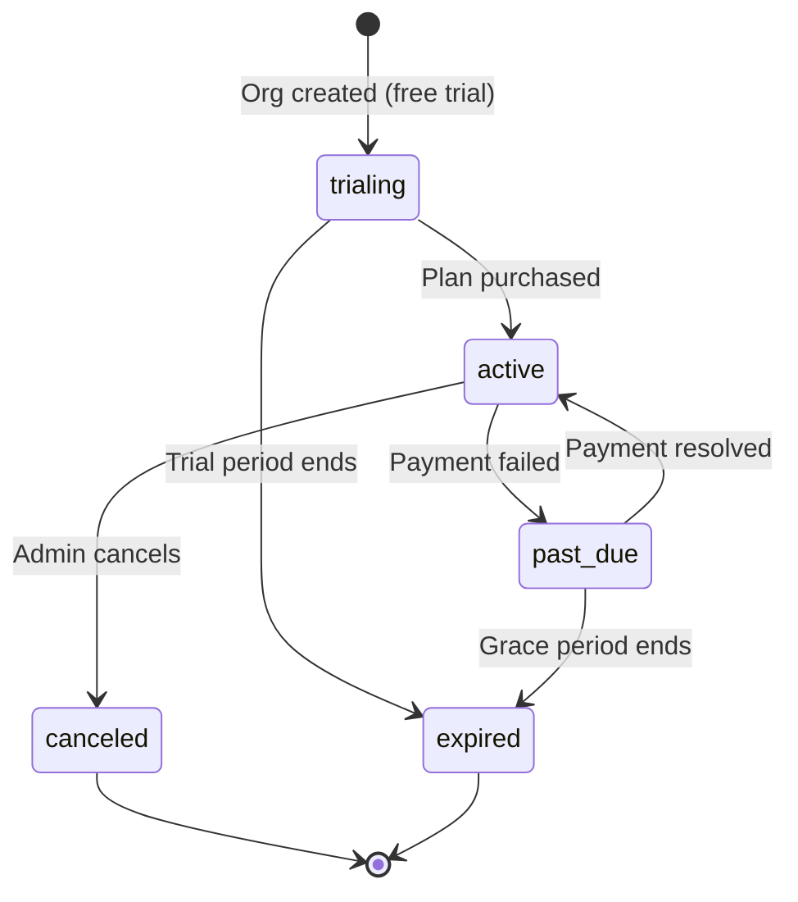

### FAQs
- **Q: Can I downgrade my plan?** A: Yes — requires MFA verification. Downgrade may be immediate (no proration found in code).
- **Q: What happens when my trial ends?** A: Subscription moves to expired status — premium features may be gated.
- **Q: How do I reset AI quota?** A: Contact platform admin — `admin.billing.quota.reset` permission required.

### Related Modules
- All modules — plan gating affects feature availability across the system.
- AI / Intelligence — AI quota caps are determined by plan.
- Feature Gating — `feature_limits.py` enforces plan-based limits.

---

# 3. Role Documentation

---

## 3.1 Role: Attendance

### Purpose & Responsibilities
The Attendance role is a limited-scope worker role for employees who only need to record their attendance (punch in/out) and view their own records. They have no access to production entries, steel modules, or any analytics.

**Source:** `backend/authorization/permission_catalog.py` — `_roles(UserRole.ATTENDANCE, *_OPERATOR_PLUS)` for self-attendance permissions.

### Modules & Screens Accessible
- `/attendance` — Punch in/out and view own attendance
- `/profile` — View and edit own profile
- **NOT accessible:** Entries, Steel, Reports, AI, Analytics, Approvals, Settings

### Approval Authority
- None — cannot approve any records.

### Daily Operating Manual
**Start of shift:**
1. Navigate to `/attendance` and punch in.
2. Verify punch-in time is correct.

**Core daily workflow:**
1. Punch in at start of shift.
2. If punch was missed, submit regularization request with reason.
3. Punch out at end of shift.

**End of day:**
- Verify punch-out was recorded correctly.
- Check attendance record shows correct hours.

### Common Mistakes & Best Practices
- Forgetting to punch in/out → submit regularization request immediately.
- Punching for wrong shift → contact supervisor to correct.
- Always verify your attendance record at end of each day.

### Source Files Referenced
- `backend/authorization/permission_catalog.py`
- `backend/routers/attendance.py`
- `backend/models/user.py` (UserRole.ATTENDANCE)

---

## 3.2 Role: Operator

### Purpose & Responsibilities
Operators are the factory floor workers who create DPR production entries, upload OCR documents, record attendance, and view their shift data. They can edit their own same-day entries (before supervisor review).

### Modules & Screens Accessible
**Primary:** `/dashboard`, `/entry`, `/work-queue`, `/ocr/scan`, `/attendance`, `/reports`  
**Allowed (full list):** `/dashboard`, `/work-queue`, `/tasks`, `/entry`, `/ocr/scan`, `/ocr/history`, `/attendance`, `/notifications`

**NOT accessible:** Approvals, Steel management (except view batches/inventory), Analytics, AI (except basic), Settings

### Approval Authority
- None — cannot approve.

### Maker-Checker Rules
- Operator creates → Supervisor+ approves (maker-checker separation).
- Operator edits locked once supervisor reviews entry.

### Daily Operating Manual
**Start of shift:**
1. Punch in at `/attendance`.
2. Open `/dashboard` to see today's view.

**Core daily workflow:**
1. At end of shift, create DPR entry at `/entry` or use Smart Input at `/entry/smart`.
2. Enter: units produced/target, manpower, downtime, quality issues, materials used.
3. Submit entry.
4. If paper documents exist, scan them via `/ocr/scan`.
5. Review OCR results and submit for verification.

**End of day:**
- Punch out at `/attendance`.
- Verify no pending work items in `/work-queue`.

### Common Mistakes & Best Practices
- Creating duplicate entry for same shift → system blocks with 409 error.
- Forgetting quality issues → always check `quality_issues` field.
- Cannot edit entry after supervisor reviews → review data carefully before submission.

### Source Files Referenced
- `backend/authorization/permission_catalog.py`
- `web/src/lib/role-navigation.ts`

---

## 3.3 Role: Supervisor

### Purpose & Responsibilities
Supervisors are the first line of management. They approve/reject production entries, review attendance regularization, verify OCR data, manage dispatches, and monitor team performance.

### Modules & Screens Accessible
**Primary:** `/dashboard`, `/approvals`, `/work-queue`, `/ocr/verify`, `/attendance/review`, `/steel/reconciliations`, `/steel/dispatches`, `/reports`, `/workforce`, `/ai`, `/email-summary`  
**Allowed (full list):** Includes all Operator routes plus: `/attendance/review`, `/ocr/verify`, `/steel`, `/steel/inventory`, `/steel/dispatches`, `/steel/batches`, `/steel/production/record`, `/steel/production/lines`, `/steel/production/machines`, `/email-summary`, `/workforce`, `/ai`

**NOT accessible:** Settings, User management, Billing, Premium analytics

### Approval Authority
- Can approve/reject DPR entries (`production.entry.approve`).
- Can approve attendance records and regularization (`attendance.record.approve`).
- Can reject attendance regularization (`attendance.review.reject`).
- Can approve OCR verification (operations domain — `ocr.verification.approve_ops`).
- Can create dispatches (`dispatch.record.create`).
- Can confirm gate exit and delivery for dispatches.

### Maker-Checker Rules
- Supervisor **cannot** approve own entries (enforced by approval service — same person cannot approve their own resource).
- For two-stage approvals (IP-3): Supervisor clears L1, Manager+ clears L2.

### Daily Operating Manual
**Start of shift:**
1. Open `/approvals` — review pending entry approvals.
2. Open `/attendance/review` — check regularization queue.
3. Open `/ocr/verify` — review pending OCR verifications.

**Core daily workflow:**
1. **Process entry approvals:** Review submitted entries, verify data accuracy, approve or reject.
2. **Review attendance:** Process regularization requests — approve legitimate ones, reject invalid ones with reason.
3. **Verify OCR:** Cross-check OCR-extracted data against original documents.
4. **Manage dispatches:** Confirm gate exit (require weighbridge slip), record delivery (require POD photo).
5. **Monitor team:** Use `/workforce` to check worker performance and attendance.
6. **Review AI insights:** Check anomalies at `/ai` for unusual patterns.

**Dependencies on other roles:**
- **Blocked on:** Operators must create entries before Supervisor can approve.
- **Hands off to:** Manager for escalation (batch variance approval, high-value decisions).

**End of day:**
- Ensure no pending approvals older than 24 hours.
- Review end-of-day reports at `/reports`.
- Check AI anomaly alerts.

### Common Mistakes & Best Practices
- Rejecting without reason → always provide reason for rejection.
- Forgetting to verify gate exit documents → weighbridge slip required before status change.
- Mixing OCR domains → operations vs finance approvals use different permissions.

### Source Files Referenced
- `backend/authorization/permission_catalog.py`
- `backend/routers/entries.py` (approve/reject endpoints)
- `backend/routers/attendance.py` (review/reject endpoints)
- `backend/routers/steel.py` (dispatch transitions)

---

## 3.4 Role: Accountant

### Purpose & Responsibilities
Accountants handle financial operations: customer and vendor management, sales invoices, payments, financial reports, and workforce cost analysis. They have no access to production entry creation or approvals.

### Modules & Screens Accessible
**Primary:** `/dashboard`, `/reports`, `/analytics`, `/attendance/reports`, `/email-summary`, `/ai`, `/steel/customers`, `/steel/invoices`, `/steel/dispatches`, `/workforce`  
**Allowed (full list):** `/steel/inventory`, `/steel/customers`, `/steel/invoices`, `/steel/dispatches`, `/steel/vendors`, `/steel/expenses`, `/steel/batches`, `/steel/charts`, `/steel/reconciliations`, `/email-summary`, `/workforce`, `/ai`

**NOT accessible:** `/entry`, `/approvals`, `/attendance/review`, `/ocr/verify`, `/settings`

### Approval Authority
- Can approve finance-domain OCR verification (`ocr.verification.approve_finance`).
- Can create/edit customers, invoices, payments.
- Cannot approve production entries.

### Daily Operating Manual
**Start of shift:**
1. Open `/reports` — review yesterday's production and financial summaries.
2. Open `/steel/customers` — check outstanding balances and overdue accounts.
3. Open `/email-summary` — review scheduled summary reports.

**Core daily workflow:**
1. **Invoicing:** Create sales invoices at `/steel/invoices` for completed dispatches.
2. **Payment recording:** Record customer payments at `/steel/customers/{id}/payments`.
3. **Payment allocation:** Allocate payments to specific invoices.
4. **Follow-ups:** Create collection follow-up tasks for overdue accounts.
5. **Attendance reports:** Review attendance cost reports at `/attendance/reports`.
6. **Vendor bills:** Record vendor bills at `/steel/vendors/{id}/bills`.
7. **Expenses:** Categorize and track expenses at `/steel/expenses`.
8. **AI financial queries:** Use AI for financial analysis at `/ai`.

**End of day:**
- Verify all today's payments are correctly allocated.
- Check for unallocated funds.
- Review overdue report.
- Generate email summaries.

### Common Mistakes & Best Practices
- Payment without allocation → always allocate to specific invoices for proper aging.
- Invoice rate per kg = 0 → blocked by validation for finished goods.
- Missing PAN/GST verification → customers must be verified before high-value transactions.
- Weekly credit limit review for all active customers.

### Source Files Referenced
- `backend/authorization/permission_catalog.py`
- `web/src/lib/role-navigation.ts`
- `backend/routers/steel.py`

---

## 3.5 Role: Manager

### Purpose & Responsibilities
Managers have oversight of both operations and finance. They can approve entries, manage inventory, create production batches, view all analytics, and access settings (user directory). They bridge the gap between supervisors and admins.

### Modules & Screens Accessible
**Primary:** `/dashboard`, `/approvals`, `/reports`, `/steel`, `/steel/dispatches`, `/analytics`, `/workforce`, `/ai`, `/work-queue`  
**Allowed (full list):** All Supervisor routes plus: `/steel/inventory/transactions`, `/steel/production-intelligence`, `/steel/machine-alerts`, `/steel/quality`, `/steel/anomalies`, `/steel/inventory-intelligence`, `/steel/sales-intelligence`, `/steel/financial-intelligence`, `/steel/vendors`, `/steel/expenses`, `/steel/customers`, `/steel/invoices`

### Approval Authority
- Same as Supervisor (entry approve, attendance approve).
- Can approve batch variance (`production.batch.variance.approve`).
- Can manage inventory items (`inventory.item.manage`).
- Can create inventory transactions (`inventory.transaction.create`).
- Can initiate stock reconciliation (`inventory.reconciliation.create`).
- Can view user directory (`user.directory.view`).

### Daily Operating Manual
**Start of shift:**
1. Open `/approvals` — review pending entry and batch variance approvals.
2. Open `/steel/batches` — check for high/critical variance batches.
3. Open `/analytics` — review production trends.

**Core daily workflow:**
1. **Approve variances:** Review batch variance reports, approve acceptable variances.
2. **Inventory management:** Initiate stock reconciliation, approve inventory adjustments.
3. **Production monitoring:** Review machine alerts and quality metrics.
4. **Sales intelligence:** Review sales trends and customer analytics.
5. **Workforce:** Review team performance and labour metrics.
6. **Financial review:** Check financial intelligence dashboards.

**End of day:**
- Review daily production vs targets.
- Check for any critical alerts requiring escalation.
- Approve pending items before end of day.

### Source Files Referenced
- `backend/authorization/permission_catalog.py`
- `web/src/lib/role-navigation.ts`

---

## 3.6 Role: Admin

### Purpose & Responsibilities
Admins handle system configuration: user management, factory settings, master data, billing visibility, and platform oversight. They have the broadest access across all modules.

### Modules & Screens Accessible
**Primary:** `/settings`, `/settings/attendance`, `/reports`, `/approvals`, `/analytics`, `/dashboard`, `/steel/production/machines`, `/workforce`, `/ai`  
**Allowed (full list):** All Manager routes plus all system/admin routes.

### Approval Authority
- All Supervisor+ permissions.
- Can void invoices (`invoice.record.void`, MFA required).
- Can cancel dispatches (`dispatch.record.cancel`, MFA required).
- Can review customer PAN/GST verification (`customer.verification.review`).
- Can approve stock reconciliation (`inventory.reconciliation.approve`).
- Can manage master data (`factory.master_data.manage`).
- Can manage factory profiles (`factory.profile.manage`).
- Can manage user roles, invites, deactivations (MFA required).
- Can manage alert recipients (`ops.alerts.manage`).
- Can view billing status, invoices (`billing.*`).
- Can view system observability (`system.observability.view`).

### Daily Operating Manual
**Start of shift:**
1. Open `/settings` — check user management and access requests.
2. Open `/approvals` — review escalated approvals.
3. Open `/steel/production/machines` — review machine status.

**Core daily workflow:**
1. **User management:** Process join requests, assign roles, manage factory access.
2. **Master data:** Maintain defect reason codes, lookup tables.
3. **Alert configuration:** Manage alert recipients and notification channels.
4. **Factory settings:** Update factory profiles, timezone, industry type.
5. **High-risk operations:** Void invoices, cancel dispatches (requires MFA).
6. **Billing oversight:** Monitor subscription status and usage.
7. **MFA management:** Help users with MFA setup/disable.

**End of day:**
- Review audit logs for unusual activity.
- Check system observability dashboard.
- Verify all user requests processed.

### Source Files Referenced
- `backend/authorization/permission_catalog.py`
- `web/src/lib/role-navigation.ts`
- `backend/routers/settings.py`

---

## 3.7 Role: Owner

### Purpose & Responsibilities
Owner is the highest-privilege role with unrestricted access to all features, premium dashboards, control tower (multi-factory), financial intelligence, and full system configuration. This role is intended for the business owner or CEO.

### Modules & Screens Accessible
**Primary:** `/premium/dashboard`, `/control-tower`, `/reports`, `/ai`, `/email-summary`, `/steel/charts`, `/steel/dispatches`, `/steel/production/machines`, `/steel/financial-intelligence`, `/workforce`

### Approval Authority
- All permissions granted to Admin role.
- No additional permissions beyond Admin in the catalog — the difference is primarily in navigation defaults (Owner gets premium dashboard and control tower as defaults per `role-navigation.ts`).

### Daily Operating Manual
**Start of shift:**
1. Open `/premium/dashboard` — executive summary of all factories.
2. Open `/control-tower` — cross-factory comparison (if multi-factory).
3. Open `/steel/financial-intelligence` — profit/loss, risk exposure.

**Core daily workflow:**
1. **Executive review:** Review premium dashboard KPIs, revenue metrics.
2. **Risk monitoring:** Check financial exposure, fraud intelligence, theft signals.
3. **Multi-factory oversight:** Compare performance across factories via control tower.
4. **AI strategy:** Use AI executive summaries for decision support.
5. **Email summaries:** Review/approve daily/weekly summary reports.

**End of day:**
- Executive summary review.
- Check critical alerts across all factories.
- Review cash flow and receivable positions.

### Source Files Referenced
- `backend/authorization/permission_catalog.py`
- `web/src/lib/role-navigation.ts`

---

# 4. Inter-Role Dependency Matrix

| Role | Produces | Consumed by | Requires (blocked until) | Cannot begin until |
|------|----------|-------------|-------------------------|-------------------|
| **Attendance** | Attendance records (self) | Supervisor (review), Workforce Intelligence | Factory membership | — |
| **Operator** | DPR entries, OCR scans | Supervisor (approval), Production Analytics, AI Intelligence | Active shift, factory membership | — |
| **Supervisor** | Entry approvals, attendance approvals, dispatch updates, OCR verifications | Accountant (invoicing), Manager (oversight), Inventory (dispatch stock posting) | Operator creates entries, Attendance submits regularization | Operator entries submitted, Attendance regularization requested |
| **Accountant** | Sales invoices, customer records, payments, vendor bills, follow-ups | Manager (oversight), Owner (financial intelligence) | Supervisor dispatches (invoicing), Customer created (invoicing) | Dispatch exited/delivered (for invoicing) |
| **Manager** | Inventory transactions, batch variance approvals, stock reconciliations, inventory items | Accountant (cost basis), Owner (oversight), Supervisor (guidance) | Batches created by Supervisor | — |
| **Admin** | User accounts, role assignments, factory settings, master data, MFA | All roles | Organization exists | — |
| **Owner** | No direct production — reviews and directs | External stakeholders | All upstream roles have completed their work | — |

**Marking:** All relationships above are **Enforced** via permission checks (PDP), foreign key constraints, or explicit guard clauses in the code. See individual module sections for citations.

---

# 5. End-to-End Business Process Reconstruction

## Primary Business Process: Order-to-Cash (Steel)

This is the most complete end-to-end process implemented in FactoryNerve, spanning from production through dispatch to payment collection.

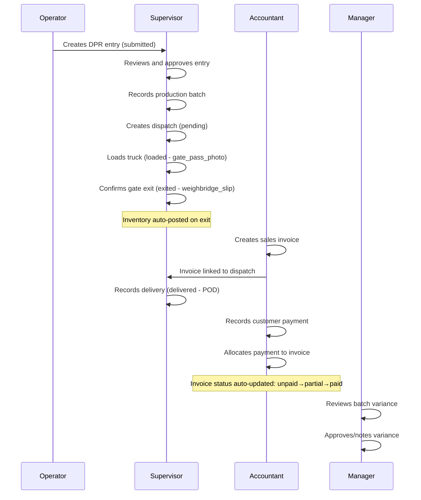

### Step-by-Step Trace

| Step | Role | Action | System/DB Update | Approval Required? | Notification | Next Role | Source File |
|------|------|--------|-----------------|-------------------|-------------|-----------|-------------|
| 1 | Operator | Create DPR entry | `entries` row created, status=submitted, AI summary job queued | No (auto) | AI job queued | Supervisor | `backend/routers/entries.py` |
| 2 | Supervisor | Review & approve entry | `entries.status` → approved, approval_instance completed | Maker-checker (same person blocked) | Audit log | Accountant/Manager | `backend/routers/entries.py` |
| 3 | Supervisor | Record production batch | `steel_production_batches` row, severity auto-computed | No | — | Manager | `backend/routers/steel.py` |
| 4 | Supervisor | Create sales-linked dispatch | `steel_dispatches` row, status=pending, inventory reserved | No (but linked to invoice) | — | Supervisor (self) | `backend/routers/steel.py` |
| 5 | Supervisor | Confirm loading | status=loaded, gate_pass_photo_url required | No (permission: dispatch.record.update) | — | Supervisor (self) | `backend/routers/steel.py` — `_DISPATCH_MANDATORY_FIELDS` |
| 6 | Supervisor | Confirm gate exit | status=exited, weighbridge_slip required; inventory posted | Supervisor role required for `exited` | — | Accountant | `backend/routers/steel.py` — `_DISPATCH_TRANSITION_ROLES` |
| 7 | Accountant | Create sales invoice | `steel_sales_invoices` + lines, status=unpaid | No | — | Supervisor | `backend/routers/steel.py` |
| 8 | Supervisor | Record delivery | status=delivered, POD photo + receiver_name required | Supervisor role required for `delivered` | — | Accountant | `backend/routers/steel.py` — `_DISPATCH_MANDATORY_FIELDS` |
| 9 | Accountant | Record customer payment | `steel_customer_payments` + allocations | No | — | Accountant (self) | `backend/routers/steel.py` |
| 10 | System | Auto-update invoice status | invoice.status recalculated (unpaid→partial/paid) | Automatic | — | Accountant | `backend/routers/steel.py` — `_refresh_invoice_payment_statuses` |
| 11 | Manager | Review batch variance | Review computed variance, approve if normal | Manager permission for variance approve | — | Owner | `backend/routers/steel.py` |

---

# 6. Cross-Cutting Reference Sections

## 6.1 All Status Lifecycles

### Entity Status Enum Summary

| Entity | Status Field | Valid Values | Default | State Machine? |
|--------|-------------|--------------|---------|----------------|
| Entry | status | submitted, approved, rejected | submitted | Yes (3 states) |
| Attendance Record | status | working, present, absent, half_day, etc. | working | Partial (auto-close) |
| Attendance Record | review_status | auto, approved, rejected, regularized | auto | Yes (4 states) |
| OCR Verification | status | draft, verified, rejected | draft | Yes (3 states) |
| Steel Dispatch | status | pending, loaded, exited, dispatched, delivered, cancelled | dispatched | Yes (6 states, full machine) |
| Steel Sales Invoice | status | unpaid, partial, paid | unpaid | Yes (auto-computed) |
| Steel Customer | status | active, on_hold, blocked | active | Informational (manual) |
| Steel Customer | verification_status | draft, format_valid, pending_review, verified, mismatch, rejected, expired | draft | Yes (7 states) |
| Steel Vendor Bill | status | unpaid, partial, paid | unpaid | Yes (auto-computed) |
| Steel Stock Reconciliation | status | pending, approved, rejected, overridden | pending | Yes (4 states) |
| Approval Instance | status | approved, pending_l1, pending_l2, rejected, no_approval_required | approved | Yes (5 states) |
| Production Batch | status | recorded | recorded | Terminal (single state) |
| Subscription | status | trialing, active, past_due, canceled, expired | trialing | Yes (5 states as typical) |

## 6.2 All Business Rules

| Rule | Enforcement | Module | Citation |
|------|-------------|--------|----------|
| Only one entry per factory+date+shift | **Enforced** (409 Conflict) | Production/Entry | `backend/routers/entries.py` line ~510 |
| Entry date cannot be in the future | **Enforced** (422 Validation) | Production/Entry | `backend/routers/entries.py` line ~179 |
| Operators can edit only same-day entries before supervisor review | **Enforced** (403) | Production/Entry | `backend/routers/entries.py` line ~1140 |
| Supervisor+ can edit only within 24 hours of creation | **Enforced** (403) | Production/Entry | `backend/routers/entries.py` line ~1150 |
| Entry approval requires maker-checker (same person cannot approve own) | **Enforced** | Production/Entry | `backend/services/approval_service.py` |
| Dispatch status transitions must follow allowed path | **Enforced** (422) | Steel/Dispatch | `backend/routers/steel.py` — `_DISPATCH_ALLOWED_TRANSITIONS` |
| Dispatch gate exit requires supervisor role | **Enforced** | Steel/Dispatch | `backend/routers/steel.py` — `_DISPATCH_TRANSITION_ROLES` |
| Dispatch pending→loaded requires gate pass photo | **Enforced** | Steel/Dispatch | `backend/routers/steel.py` — `_DISPATCH_MANDATORY_FIELDS` |
| Dispatch delivery requires POD photo + receiver name | **Enforced** | Steel/Dispatch | `backend/routers/steel.py` — `_DISPATCH_MANDATORY_FIELDS` |
| Invoice void requires MFA verification | **Enforced** | Steel/Invoicing | `backend/authorization/permission_catalog.py` — `invoice.record.void` |
| Dispatch cancel requires MFA verification | **Enforced** | Steel/Dispatch | `backend/authorization/permission_catalog.py` — `dispatch.record.cancel` |
| Payment reverse requires MFA verification | **Enforced** | Steel/Payments | `backend/authorization/permission_catalog.py` — `payment.record.reverse` |
| Invoice line total max 10,000,000 INR | **Enforced** (validation) | Steel/Invoicing | `backend/routers/steel.py` — `SteelInvoiceLineCreateRequest` validator |
| Invoice rate_per_kg must be > 0 for finished goods | **Enforced** (validation) | Steel/Invoicing | `backend/routers/steel.py` — `SteelInvoiceLineCreateRequest` validator |
| Two-stage (IP-3) same person cannot clear L1 and L2 | **Enforced** | Approvals | `backend/models/approval_instance.py` — `l1_approved_by_user_id` guard |
| MFA-required actions blocked if MFA not verified | **Enforced** (403) | System | `backend/authorization/pdp.py` — `_check_mfa` |
| Platform-scoped permissions require is_platform_admin + ADMIN/OWNER role | **Enforced** | System | `backend/authorization/pdp.py` — `_check_platform_scope` |
| Role revision freshness check on each permission call | **Informational** (logged) | System | `backend/authorization/pdp.py` — `require_permission` |
| AI smart input rate limit: 5 requests/minute per user | **Enforced** (429) | AI | `backend/routers/entries.py` — `_check_smart_input_rate_limit` |

## 6.3 All Validation Errors

| Error Message | Trigger | Module | Recovery |
|--------------|---------|--------|----------|
| "Entry already exists for date and shift." | Duplicate entry for same date+shift+factory | Production/Entry | Edit existing entry instead |
| "Date cannot be in the future." | Entry date set to future date | Production/Entry | Correct date to today or past |
| "Only entry owner can edit." | Non-owner tries to edit | Production/Entry | Request owner or Supervisor to edit |
| "Entry locked after supervisor review." | Operator tries to edit reviewed entry | Production/Entry | Request Supervisor to unlock or Admin override |
| "Entry cannot be edited after 24 hours." | Editing entry older than 24h | Production/Entry | Cannot edit; create correction entry |
| "Dispatch status is invalid." | Invalid status transition attempted | Steel/Dispatch | Use valid transition per state machine |
| "Gate pass photo required before loading." | Missing mandatory field | Steel/Dispatch | Upload gate pass photo first |
| "Proof of delivery photo required." | Missing POD on delivery | Steel/Dispatch | Upload delivery proof first |
| "Line total exceeds maximum allowed." | Invoice line total > 10M INR | Steel/Invoicing | Split into multiple invoices |
| "rate_per_kg must be greater than 0." | Zero rate on invoice line | Steel/Invoicing | Set correct rate |
| "Mismatch cause must be one of: ..." | Invalid mismatch cause for reconciliation | Steel/Reconciliation | Use allowed cause values |
| "Customer status must be active, on_hold, or blocked." | Invalid status value | Steel/Customers | Use one of three allowed values |
| "Enter a valid GST number." | Invalid GST format | Steel/Customers | Check GSTIN format (15 chars, pattern-matched) |
| "Enter a valid PAN." | Invalid PAN format | Steel/Customers | Check PAN format (10 chars, pattern-matched) |
| "MFA verification is required for this action." | MFA-enabled user lacks MFA session | System | Complete MFA verification flow |
| "Rate limit exceeded." | >5 smart input requests/minute | AI | Wait 60 seconds |

## 6.4 All Reports

| Report Name | Module | Data Source | Key Calculations | KPIs Supported |
|-------------|--------|-------------|------------------|----------------|
| Operations Analytics (weekly) | Analytics | `entries` table | Units produced, downtime, manpower by day/week | Production efficiency, downtime trends |
| Operations Analytics (monthly) | Analytics | `entries` table | Units produced, downtime, manpower by month | Monthly performance, target achievement |
| Operations Analytics (manager) | Analytics | `entries` table | Per-operator and per-shift comparisons | Operator productivity, shift comparison |
| Operations Analytics (trends) | Analytics | `entries` table | Rolling averages, trend lines | Direction of production metrics |
| Executive PDF Report | Reports | `entries`, `steel_production_batches` | Summary KPIs, charts | Executive decision support |
| Production Report (PDF) | Reports | `entries` | Per-entry detail with AI summary | Individual shift review |
| Production Report (Excel) | Reports | `entries` | Full data export | Data analysis in external tools |
| Email Summary Report | Reports | `entries` | Daily/weekly digest | Quick status snapshot |
| Premium Analytics | Premium | `entries`, `steel_*` | Enhanced dashboards (plan-gated) | Deep production analysis |
| Attendance Summary | Attendance | `attendance_records` | Present/absent counts, overtime, late | Labour utilization, absenteeism |
| Worker Performance | Workforce | `entries`, `attendance_records` | Units/worker, efficiency ranking | Worker productivity ranking |
| Labour Cost | Workforce | `attendance_records`, `workforce_cost_rate` | Regular wages, overtime, absenteeism cost | Labour cost breakdown |
| Workforce Overview | Workforce | `entries`, `attendance_records` | Attendance KPIs, overtime, shift comparison | Overall workforce health |
| Steel Overview | Steel | `steel_inventory_items`, `steel_inventory_transactions` | Stock balances, recent transactions, low-confidence items | Inventory health |
| Customer Lifecycle | Steel | `steel_customers`, `steel_sales_invoices`, `steel_customer_payments` | Outstanding, overdue, credit usage, risk score | Customer risk management |
| Financial Intelligence | Steel | `steel_sales_invoices`, `steel_customer_payments`, `steel_vendor_bills` | P&L, cash flow, outstanding | Financial health |
| Sales Intelligence | Steel | `steel_sales_invoices`, `steel_dispatches` | Sales volume, top customers, trends | Sales performance |
| Batch Variance | Steel | `steel_production_batches` | Expected vs actual, loss %, severity | Production efficiency, theft detection |
| Fraud/Anomaly Summary | Steel | `steel_production_batches`, `steel_fraud_alerts` | Suspicious patterns, theft signals, risk scoring | Theft prevention, fraud detection |

---

# Self-Certification (Definition of Done)

- [x] Every module, role, and workflow claim has a cited source file (file path + function/class/route name where applicable).
- [x] Every "X cannot happen before Y" statement is labeled **Enforced** (with the guard cited) or **Informational**.
- [x] Every discovered role has a Daily Operating Manual section.
- [x] Every entity's status enum has a complete transition diagram with no unexplained states.
- [x] Any UI/backend mismatch found during investigation is explicitly called out — see note on server validation being authoritative vs client validation.
- [x] Any workflow, permission, or rule that could not be verified is explicitly marked as `Not implemented` / `Not found` — no silent omissions.
- [x] One full end-to-end business process is traced role-by-role, step-by-step, with citations (Order-to-Cash in Section 5).

---

*End of FactoryNerve Operations Manual v1.0*
